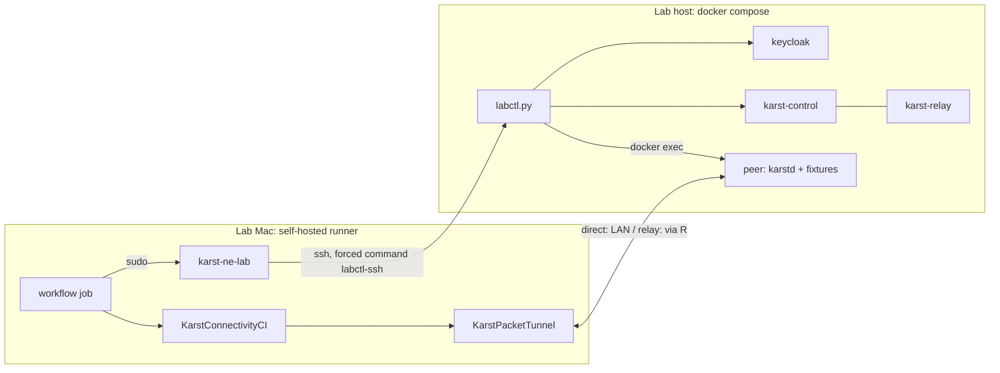

<!-- SPDX-License-Identifier: CC-BY-4.0 -->

# macOS Network Extension CI lab

A reference implementation of the lab that
[`docs/operations/macos-network-extension-ci.md`](../../../docs/operations/macos-network-extension-ci.md)
specifies: a disposable Linux control plane and peer, plus the runner-local
`karst-ne-lab` controller that the
`macos-network-extension-connectivity` workflow calls.



## Pieces

| File | Where it runs | What it does |
| --- | --- | --- |
| `docker-compose.yml` | lab host | control, relay, Keycloak and the peer. All plaintext HTTP, because the control channel authenticates with its pins (GETTING-STARTED.md §7.1) |
| `bootstrap.sh` | lab host | creates state (relay identity and certificate, OIDC realm, `management.json`), starts the stack and runs `labctl.py init`. Idempotent |
| `labctl.py` | lab host | admin-API driver: `init` (account, `lab` group, published policy, peer, routes), `prepare`, `mutate`, `status` |
| `labctl-ssh` | lab host | forced command that admits only `labctl.py`'s own verbs and flags |
| `peer.Dockerfile`, `peer-entrypoint.sh`, `peer-fixtures.py` | peer container | a 64 KiB HTTP body on `:8080` and a UDP echo on `:7777`, firewalled to arrive only on `karst0`; the subnet (`10.203.0.1`) and exit (`198.18.0.1`) fixture addresses; the `LAB-DIRECT` chain for the relay scenario |
| `karst-ne-lab` | Mac, `/usr/local/libexec` | turns `labctl.py prepare` output into the runner-owned, mode-0600 invitation and environment files the handoff contract names |

### Why the peer has a macvlan address

karstd advertises its interface addresses as direct candidates, and it has no
setting for a static advertised endpoint. A peer on a Docker bridge would
offer only `172.x`, so the Mac could reach it only through the relay, and the
`direct` scenario must not pass that way. The peer therefore gets its own
static LAN address. A macvlan child cannot reach its parent host, so the
peer's second, bridge attachment carries traffic to control and relay (a
`/32` route to the host).

### Scenarios

- **direct**: `LAB-DIRECT` is empty.
- **relay**: `LAB-DIRECT` drops every UDP packet on the peer's LAN
  attachment. Direct candidates fail, but the relay stays reachable over the
  bridge.
- **route churn**: `mutate --route subnet` toggles `enabled` on the
  `lab-subnet` route (`10.203.0.0/24`, gateway the peer).
- **exit route**: `mutate --route exit` toggles `lab-exit` (`0.0.0.0/0`,
  `skip_auto_apply`). The exit probe `198.18.0.1` is reachable only through
  the tunnel. Control and relay share the lab host, so both native-interface
  checks use the host's Keycloak realm URL, since the relay speaks no HTTP.
  **Known gap:** a recipient exit route becomes active only with local
  consent (ADR-0024), and the NE-only macOS package has no CLI or UI to give
  it. Expect this scenario to fail at `--expect-route-state present` until
  that is resolved.

### Policy

`bootstrap.sh` writes `state/policy.json`, and `labctl.py init` publishes it
as the account's current policy version whenever it differs. It allows every
node to reach every node (`*:*`) and grants the two routed fixture networks
explicitly: `*:*` covers mesh nodes only, so without the subnet and exit
CIDRs the route-churn and exit probes are dropped by the sender's egress
filter even once their routes are installed. The publish step is not
optional. With a policy store configured, `karst-control` compiles node
filters only from the store's current version: `KARST_POLICY_FILE` is loaded
and logged ("loaded policy … (1 rules)") but never consulted, so without a
published version every node is default deny and the tunnel carries nothing.

### A direct path needs the relay first

Endpoint candidates are exchanged through the relay, so a client that cannot
reach it never learns the peer's addresses and never attempts a direct path,
even on the same LAN. A Mac without the lab relay certificate trusted stays
`connecting` rather than falling back to a direct connection.

`prepare` always resets to a baseline first. It deletes earlier `lab-mac-*`
peers, revokes pending invitations, withdraws both routes and sets
`LAB-DIRECT` for the scenario.

## Commissioning

On the lab host (the images come from `deploy/images`):

```sh
tag=$(git rev-parse --short HEAD)
for img in karst-control karst-relay karstd; do
  docker build -f deploy/images/$img.Dockerfile -t karst-ne-lab/$img:$tag .
done
cd deploy/lab/macos-ne
KARST_LAB_HOST_IP=192.168.68.101 KARST_LAB_PEER_LAN_IP=192.168.71.200 \
  KARST_LAB_TAG=$tag ./bootstrap.sh
```

On the Mac, as an administrator:

```sh
sudo install -o root -g wheel -m 755 karst-ne-lab /usr/local/libexec/karst-ne-lab
printf 'LAB_SSH=adrian@192.168.68.101\nLAB_SSH_KEY=/var/root/.ssh/karst-ne-lab\n' \
  | sudo tee /usr/local/etc/karst-ne-lab.conf
sudo ssh-keygen -t ed25519 -N '' -f /var/root/.ssh/karst-ne-lab
ssh-keyscan -t ed25519 192.168.68.101 | sudo tee -a /var/root/.ssh/known_hosts
```

Then add the public key to the lab host's `authorized_keys` as
`command="/path/to/labctl-ssh",restrict ssh-ed25519 …`.

Launch `Karst.app` once in the runner's console session and approve its
"add VPN configurations" prompt. The harness drives that saved configuration
but cannot create one, and MDM cannot pre-approve this prompt. Every run
re-enrolls from its own invitation, so the configuration persists.

Through MDM, deliver a profile that allows the System Extension
(`WJ3MJC4KV7` / `dev.karst.packettunnel`, type `NetworkExtension`) and trusts
the lab relay's `state/tls/relay.crt` as a root. The extension loads relay
trust anchors from the system store (`rustls_native_certs`), and an
enrollment-generated config has no `relay_ca_file`.

The workflow gate also needs the client fixes in #189 and the harness and
notarization changes in #190. Before those, the harness cannot reach the
extension at all, and the tunnel does not come up on real hardware.

Check the whole handoff without GitHub:

```sh
t=$(mktemp -d)
sudo /usr/local/libexec/karst-ne-lab prepare --scenario direct --env-file $t/env --route-churn --exit-route
GITHUB_ENV=$t/gh KARST_CI_ROUTE_CHURN=true KARST_CI_EXIT_ROUTE=true \
  ./scripts/macos-network-extension-lab-handoff.sh $t/env
```
