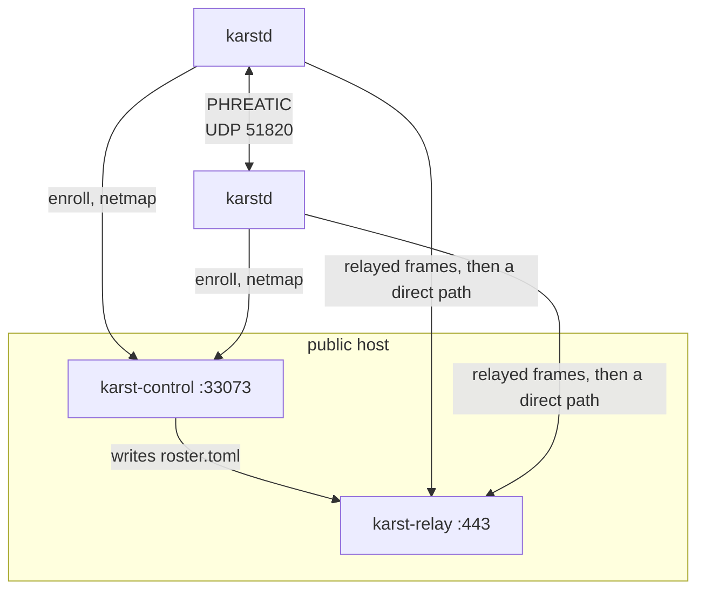

<!-- SPDX-License-Identifier: CC-BY-4.0 -->

# Getting started on Linux

How to build every Karst component from this tree and stand it up on Linux
hosts: the node agent, the relay, the coordination server, the web console and
portal, and the offline Bedrock signer.

> **Status: pre-alpha. Do not deploy this.** Nothing here has had external
> cryptographic or security review and the wire formats are still changing.
> This document exists so that Karst can be *run and reviewed*, not so that it
> can be relied on. Read the caveats in [README.md](../README.md) and
> [GitHub issues](https://github.com/karst-net/karst/issues?q=is%3Aissue) first.

**Where this walkthrough stops.** Paths A, B and C below get you a running
relay, a running coordination server, and a node that enrolls and carries
traffic. They do **not** get you a self-service front door: the console and the
setup-key API are behind an identity provider you have to wire into the
coordination server yourself (§7, §8.2). Enrolling the fleet does not wait on
that — §8.1 mints a first key with no IdP at all — but administering it from a
browser does. Said here rather than left to be discovered after the third
command. If you only want to see the datapath work,
[Path A](#4-path-a-two-nodes-and-nothing-else) needs no server at all.

---

## 1. What the pieces are, and where each one runs

| Component | Binary | Language | Runs on | Listens on |
|---|---|---|---|---|
| Node agent | `karstd` | Rust | every machine on the network | UDP 51820 |
| CLI | `karst` | Rust | beside `karstd` | a unix socket |
| Relay | `karst-relay` | Rust | a host with a public address | TCP 443, UDP 3478 |
| Coordination server | `karst-control` | Go | a host with a public address | TCP 33073 |
| Admin console | static files | TypeScript | any web server | your choice |
| User portal | static files | TypeScript | any web server | your choice |
| Offline signer | `karst-bedrock` | Rust | a machine that never touches the server | nothing |

The default deployment co-locates the relay and the coordination server on one
host — PLAN.md §5 — because a self-hoster who relays their own traffic is not
spending anyone else's.



Two files tie the relay and the server together, and having only one of them
fails silently in both directions. They are the single most common way a
deployment of Karst is broken, so they are worth learning before anything else:

| File | Written by | Read by | Says |
|---|---|---|---|
| `roster.toml` | `karst-control`, every 25 s | `karst-relay` | which nodes this relay admits |
| `relays.json` | you, once | `karst-control` | which relays nodes are told about |

With only the roster, the relay admits nobody who ever arrives — no node was
told the relay exists. With only the registry, every node dials a relay that
refuses them. Neither failure logs anything resembling its cause.

---

## 2. Prerequisites

Per host, only what that host actually runs.

**To build anything Rust** (`karstd`, `karst`, `karst-relay`, `karst-bedrock`):

```sh walkthrough=none reason="prerequisites; the workflow installs its own toolchain"
# Debian/Ubuntu
sudo apt-get install -y build-essential pkg-config protobuf-compiler
curl --proto '=https' --tlsv1.2 -sSf https://sh.rustup.rs | sh
```

The toolchain version is pinned by `rust-toolchain.toml` (1.88) and rustup will
fetch it. `protoc` is not optional: `karst-control-client` generates its gRPC
client from the same `.proto` the Go server compiles, so a build without it
fails in that crate rather than at the end.

**To build the coordination server:**

```sh walkthrough=none reason="prerequisites; the workflow installs its own toolchain"
sudo apt-get install -y gcc golang-go
```

The archive's Go is older than `server/go.mod` pins (Ubuntu 24.04 ships 1.22;
the pin is a 1.27 release candidate, because `crypto/mldsa` is a 1.27
addition) — that's fine, it does not need to match:

```sh walkthrough=none reason="an environment variable, not a step"
# GOTOOLCHAIN=auto lets the installed Go fetch and run the pinned toolchain.
export GOTOOLCHAIN=auto
```

`CGO_ENABLED=1` is required. The SQLite store is `go-sqlite3`, a cgo binding:
built with cgo off it links into a working-*looking* binary that dies at first
use with `Binary was compiled with 'CGO_ENABLED=0' … This is a stub`.

**To build the console and portal:** Node 22+ and `corepack` (pnpm 9 is pinned
by `web/package.json`). The Ubuntu archive's `nodejs` is too old (18.x on
24.04) to satisfy that; use NodeSource instead:

```sh walkthrough=none reason="prerequisites for the web builds, which no deployment path uses"
curl -fsSL https://deb.nodesource.com/setup_22.x | sudo -E bash -
sudo apt-get install -y nodejs
sudo corepack enable
```

Node bundles `corepack` but does not put it on `PATH` until `corepack enable`
runs once — that's the source of a bare `corepack: command not found`. `sudo`
is required for that step here: NodeSource installs into `/usr/bin`, owned by
root, and `corepack enable` writes shims there. On a Node install where
corepack isn't bundled at all (it stopped shipping by default from Node 25
on), install it as a package instead: `sudo npm install -g corepack && sudo
corepack enable`.

**To run `karstd` in its default TUN mode:** a kernel with `/dev/net/tun`, and
`CAP_NET_ADMIN` — in practice, root. `karstd` also runs with **no capabilities
at all** in userspace mode (§6.4), which is the option when you cannot have
root.

**For the container path only:** `docker`, `docker compose`, and `openssl`.

**To run the gate in §3:** `just`, the command runner, and `cargo-deny`:

```sh walkthrough=none reason="the release gate's own prerequisites, not the walkthrough's"
sudo apt-get install -y just
cargo +stable install cargo-deny --locked
```

`cargo-deny` has to come from the `stable` toolchain, not the pinned one
(`rustup toolchain install stable` first if you don't have it) — the advisory
database carries CVSS 4.0 scores that an older `cargo-deny` can't parse, and
it fails to load the database entirely rather than skipping the entry, so an
out-of-date tool silently stops checking advisories at all.

`just go-test` also needs a reachable Docker daemon: the coordination
server's store tests (e.g. `TestPostgresql_GetAccount_LoadsCustomDomains`)
spin up real Postgres containers via testcontainers-go. Your user has to be
in the `docker` group, not just have `docker` installed — running as your own
user without it fails with `permission denied while trying to connect to the
Docker daemon socket`:

```sh walkthrough=none reason="runner users are already in the docker group"
sudo usermod -aG docker "$USER"
```

Log out and back in (a new SSH session is enough) for the group membership to
take effect — it isn't picked up by the current shell.

`just go-lint` needs `staticcheck` on `PATH`, which nothing above installs:

```sh walkthrough=none reason="the release gate's own prerequisites, not the walkthrough's"
GOTOOLCHAIN=go1.27rc3 go install honnef.co/go/tools/cmd/staticcheck@latest
export PATH="$PATH:$(go env GOPATH)/bin"
```

Pin `GOTOOLCHAIN` to the same `go1.27rc3` release `server/go.mod` pins —
don't leave it at `auto` for this one. `honnef.co/go/tools`'s own `go.mod`
only requires `go >= 1.26.0`, so under `GOTOOLCHAIN=auto` the install is
satisfied by downloading go1.26 and building `staticcheck` against *that*
stdlib, producing a binary that then fails on every file in this repo needing
go1.27: `package requires newer Go version go1.27 (application built with
go1.26)`.

---

## 3. Build everything

From the repository root:

Node agent, CLI, relay, offline signer:

```sh walkthrough=A,B,C step=build-rust
cargo build --release \
    --package karstd --package karst-cli \
    --package karst-relay --package karst-bedrock
```

Coordination server:

```sh walkthrough=C step=build-control
cd server && CGO_ENABLED=1 go build -trimpath -o karst-control ./cmd/karst-control && cd ..
```

Console and portal:

```sh walkthrough=none reason="the console and portal are covered by the web job"
cd web && corepack pnpm install --frozen-lockfile && corepack pnpm -r build && cd ..
```

The Rust binaries land in `target/release/` as `karstd`, `karst`,
`karst-relay` and `karst-bedrock`. The web builds land in `web/console/dist`
and `web/portal/dist`.

Before trusting any of it, run the gate the CI runs:

```sh walkthrough=none reason="the release gate; each recipe is already a CI job of its own"
just check              # fmt, clippy, 874 Rust tests, cargo-deny, licenses
just go-test go-lint    # the coordination server
just test-privileged    # namespaces, TUN devices, the NAT matrix — needs sudo
```

`just test-privileged` is the one worth the wait: it stands up the whole stack
in network namespaces, twelve end-to-end topologies, each ending in a TCP
conversation under an ACL. If it passes on your machine, the datapath works on
your machine.

Installing, on each host that needs them:

```sh walkthrough=A,C step=install
sudo install -m 0755 target/release/karstd target/release/karst /usr/local/bin/
sudo mkdir -p /etc/karst
```

Alternatively build distribution packages with `nfpm` from
`packaging/nfpm/*.yaml`; they install the same binaries to `/usr/bin` along
with the systemd units in `packaging/systemd/`.

**The two sets of units are not interchangeable**, and mixing them is the one
mistake this section can cause: `packaging/systemd/` names `/usr/bin`, because
that is where the packages put the binaries, and `deploy/systemd/` names
`/usr/local/bin`, because that is where the `install` above puts them. Path C
below copies from `deploy/systemd/` throughout. Copying the packaging unit
after a local build produces a service that fails at start with a path error
naming a binary you never installed.

---

## 4. Path A: two nodes and nothing else

The shortest thing that proves the tunnel. No relay, no coordination server —
peers are listed by hand in a roster, which is what `karstd` does when its
config has no `[control]` table. Both nodes need a UDP path to each other (same
LAN, or one with a routable address).

`docs/karstd-example.toml` is the annotated version of this file; what follows
is the minimum.

**On each node**, generate the data-plane key. It is 96 bytes of hex — 64 for
the ML-KEM key, 32 for X25519 — and `karstd` refuses to read it unless it is
mode 600:

```sh walkthrough=A step=genkey
sudo sh -c 'umask 077 && karstd genkey > /etc/karst/node.key'
sudo chmod 600 /etc/karst/node.key
```

Write `/etc/karst/karstd.toml`, changing the address per node:

```toml walkthrough=A step=node-config file=/etc/karst/karstd.toml
[node]
listen = "0.0.0.0:51820"
interface = "karst0"
# HOST address with the on-link prefix length: alice is .1, the /24 is on-link.
addresses = ["10.77.0.1/24"]
private_key_file = "/etc/karst/node.key"
```

Print each node's public keys and paste them into the other's file:

```sh walkthrough=A step=pubkey
sudo karstd pubkey --config /etc/karst/karstd.toml
# kem_public_key = "…2368 hex characters…"
# dh_public_key  = "…64 hex characters…"
```

`pubkey` deliberately works before any peer is configured — a new node needs to
publish its key precisely in order to be added elsewhere. Append to alice's
file:

```toml walkthrough=A step=peer-config file=/etc/karst/karstd.toml append=1
[[peer]]
name = "bob"
kem_public_key = "…from bob's `karstd pubkey`…"
dh_public_key = "…from bob's `karstd pubkey`…"
endpoint = "192.0.2.20:51820"
# Cryptokey routing, and it cuts both ways: outbound it selects the peer,
# inbound a packet from bob sourced outside these ranges is DROPPED.
allowed_ips = ["10.77.0.2/32"]
```

`endpoint` is optional. A peer without one is never dialled but can still
connect inbound, and its address is learned from the handshake — that is the
arrangement for a peer behind NAT. At least one side of every pair needs one.

A `psk` is also optional, and its absence is reported at startup rather than
assumed. Without one the handshake still has both key families but loses the
shared secret that would survive a break of both (`spec/phreatic-v1.md` §7.3).
Supplying one makes this file as sensitive as the private key, and `karstd`
then requires mode 600 on it too. In control mode the server derives per-pair
PSKs for you, which is one of the reasons to graduate to Path B or C.

Validate, then run:

```sh walkthrough=A step=start bg=1
sudo karstd check --config /etc/karst/karstd.toml
sudo karstd --config /etc/karst/karstd.toml
```

From a second shell:

```sh walkthrough=A step=verify
sudo karst status
ping 10.77.0.2
```

`karst status` reports each peer's session state, endpoint, and whether the
path is `direct` or `relay`. A pair with no relay configured has only one
honest answer.

To run it as a service, see [Path C, §6.3](#63-the-node-agent).

---

## 5. Path B: a coordination server and a relay, with containers

One host, one `docker compose up`, a working control plane. This is the
deployment PLAN.md §5 makes the default.

Build the images and bootstrap the state:

```sh walkthrough=B step=up
docker build -f deploy/images/karst-control.Dockerfile -t ghcr.io/karst-net/karst-control:dev .
docker build -f deploy/images/karst-relay.Dockerfile   -t ghcr.io/karst-net/karst-relay:dev .

cd deploy/compose
KARST_RELAY_IP=203.0.113.7 ./bootstrap.sh     # once
docker compose up -d
```

`KARST_RELAY_IP` is the address **nodes will dial** — the host's public IP, or
`127.0.0.1` to try it on one machine. It must be an IP address and not a DNS
name: `karstd` parses it with Rust's `SocketAddr`, which does not resolve, and
a name there produces a netmap **every node rejects in full**. The name belongs
in `KARST_RELAY_SERVER_NAME`, which is what the certificate is issued for.

`bootstrap.sh` is idempotent — every step skips if its output exists — and
writes the relay identity, a self-signed certificate, `relays.json`,
`roster.toml`, an allow-all `policy.json`, and `management.json`. Full
configuration table: [`deploy/compose/README.md`](../deploy/compose/README.md).

Each node then needs four things from this deployment. Two are pins, printed
once at startup:

```sh walkthrough=B step=pins
docker compose logs control | grep 'karst: server'
# karst: server KEM pin  <base64>
# karst: server sign pin <base64>
```

One is an enrollment key, minted on the first boot because a setup key would
otherwise need an account and an account would need an identity provider
(§8.1):

```sh walkthrough=B step=bootstrap-key
cat state/bootstrap.key
```

| Node config | Where it comes from |
|---|---|
| `[control] server_kem_pin` | the `server KEM pin` log line |
| `[control] server_verify_pin` | the `server sign pin` log line |
| `[control] setup_key` | `deploy/compose/state/bootstrap.key` |
| `[control] relay_ca_file` | `deploy/compose/state/tls/relay.crt` |

> ### ⚠ The pins are logged base64 and configured in hex
>
> `karst-control` prints both pins base64; `karstd` parses both fields as hex.
> Pasting the log line verbatim fails with `server_kem_pin: field key: contains
> a non-hexadecimal character`, and a hex string of the wrong length fails with
> `server_kem_pin is N bytes, but control version 1 … uses a 1184-byte key`.
> Convert them:
>
> ```sh walkthrough=B step=pins-hex
> docker compose logs control | grep 'server KEM pin'  | tail -1 | awk '{print $NF}' | base64 -d | xxd -p -c 0
> docker compose logs control | grep 'server sign pin' | tail -1 | awk '{print $NF}' | base64 -d | xxd -p -c 0
> ```
>
> **`tail -1` is not decoration.** The pins are printed once per start and
> `docker compose logs` keeps every start, so on a server that has restarted —
> which the very next subsection asks you to do — the pipeline without it
> decodes *both* copies into one string of twice the right length. That fails
> with the second message above, about a field whose value looks perfectly
> well-formed. The pins themselves are stable across restarts, so any one line
> will do; the last is the one that matches a server running now.
>
> The relay registry is *not* affected — `relays.json` takes `identity_key` as
> base64, exactly as `karst-relay pubkey` prints it.

Both pins are mandatory fields, and `karstd` refuses to load a `[control]`
table missing either. That is deliberate: a node that pinned only the KEM key
would still connect and would silently lose forward secrecy, which is a worse
outcome than an error —
[`spec/karst-control-v1.md`](../spec/karst-control-v1.md) §9.

Two things about this deployment that are worth watching once, so that the
behavior is familiar before it happens in production:

```sh walkthrough=none reason="interactive (watch, docker compose logs -f); the runner asserts the same lease behaviour without them"
# The roster's mtime advances every 25s while its contents stay byte-identical.
watch -n5 'stat -c "%y %s" state/roster.toml'

# Stop the producer: the relay fails closed at 90s, then recovers.
docker compose stop control
docker compose logs -f relay        # "roster lease expired" after ~90s
docker compose start control        # "roster reloaded"
```

The relay treats a roster nobody is maintaining as untrustworthy. Its lease is
90 seconds and something must rewrite the file forever; `karst-control` does,
unconditionally, three times per lease.

---

## 6. Path C: bare metal, with systemd

The same three services without containers. Do them in this order — the relay's
identity is an input to the server's configuration.

### 6.1 The relay

```sh walkthrough=C step=relay-install
sudo install -m 0755 target/release/karst-relay /usr/local/bin/
sudo mkdir -p /etc/karst/tls
```

A TLS certificate. Self-signed is not a compromise here:
[`spec/ponor-v1.md`](../spec/ponor-v1.md) §4.2 declines to trust certificates
for relay identity at all — a node authenticates a relay by the ML-DSA-87 key
pinned in its netmap — so the certificate only has to get a TLS session
established. Use a CA-issued one if you prefer; it changes nothing about who the
relay is proved to be, only which certificates the hop will accept.

```sh walkthrough=C step=relay-cert
sudo openssl req -x509 -newkey rsa:4096 -sha256 -days 825 -nodes \
    -keyout /etc/karst/tls/relay.key -out /etc/karst/tls/relay.crt \
    -subj "/CN=relay.example.com" \
    -addext "subjectAltName=DNS:relay.example.com,IP:203.0.113.7"
sudo chmod 600 /etc/karst/tls/relay.key
```

`/etc/karst/relay.toml`:

```toml walkthrough=C step=relay-config file=/etc/karst/relay.toml
listen = "0.0.0.0:443"
identity_key = "/etc/karst/relay.key"     # ML-DSA-87 seed, created on first run
roster = "/etc/karst/roster.toml"         # required; no default is right
tls_cert = "/etc/karst/tls/relay.crt"
tls_key = "/etc/karst/tls/relay.key"
region = "default"

# The AVEN reflector — off unless configured, because a reflector is a UDP
# service that answers datagrams. Its own socket, never the Ponor listener's:
# AVEN needs a UDP mapping and Ponor's is TCP, which a NAT maps separately.
[reflect]
listen = "0.0.0.0:3478"
advertise = "203.0.113.7:3478"   # required whenever `listen` is not reachable as written

# Optional, and on its own listener. Bind it to a management address: sharing
# the client port would put an unauthenticated GET on the socket carrying the
# network's traffic.
[metrics]
listen = "127.0.0.1:9105"
```

Seed the roster with a placeholder so the relay starts, then validate:

```sh walkthrough=C step=relay-check
printf '# Placeholder. karst-control overwrites this every 25s.\n' | sudo tee /etc/karst/roster.toml
sudo karst-relay check --config /etc/karst/relay.toml
# relay.toml: ok
#   listen        0.0.0.0:443
#   roster        0 nodes, 0 mesh peers
#                 (no nodes admitted; every connection will be rejected)
```

Print the registry entry — this is what the coordination server publishes to
every node:

```sh walkthrough=C step=relay-pubkey
sudo karst-relay pubkey --config /etc/karst/relay.toml
# relay_id     f10dfc0d…
# identity_pk  rnKUFd9V3/L5PbvmvuWawzAMFNWcPAIkqNhyD2oP4dqg…
```

Start it:

```sh walkthrough=C step=relay-start
sudo cp deploy/systemd/karst-relay.service /etc/systemd/system/
sudo systemctl daemon-reload && sudo systemctl enable --now karst-relay
```

Run `karst-relay check` after every roster change.

### 6.2 The coordination server

```sh walkthrough=C step=control-install
sudo install -m 0755 server/karst-control /usr/local/bin/
sudo mkdir -p /etc/netbird /var/lib/netbird /var/lib/karst
```

The relay registry, `/etc/karst/relays.json` — `identity_key` is the
`identity_pk` printed above, verbatim, base64:

```json walkthrough=C step=relays-json file=/etc/karst/relays.json
{
  "relays": [
    {
      "address": "203.0.113.7:443",
      "tls_server_name": "relay.example.com",
      "identity_key": "rnKUFd9V3/L5PbvmvuWawzAMFNWcPAIkqNhyD2oP4dqg…",
      "region": "default"
    }
  ]
}
```

`address` is `IP:port`. It is validated when the server starts rather than when
a node fetches, because one malformed entry fails the *whole* netmap and a
startup error naming the field beats every node failing to apply a netmap it
just authenticated.

The packet filter, `/etc/karst/policy.json`. **An absent policy compiles to an
empty filter, which is default deny** — the symptom is a network that does not
work rather than one that works too well. This one is the opposite and is a
starting point, not a destination:

```json walkthrough=C step=policy file=/etc/karst/policy.json
{ "acls": [ { "action": "accept", "src": ["*"], "dst": ["*:*"] } ] }
```

The format rejects unknown fields, so a comment smuggled in as a key stops the
server booting. The full grammar is PLAN.md §4.3.

`/etc/netbird/management.json` — the minimum SQLite-backed configuration.
Generate `DataStoreEncryptionKey` with `openssl rand -base64 32` and the TURN
secret with `openssl rand -hex 16`:

```json walkthrough=C step=management file=/etc/netbird/management.json
{
  "Stuns": [],
  "TURNConfig": { "Turns": [], "CredentialsTTL": "12h", "Secret": "…", "TimeBasedCredentials": false },
  "Signal": { "Proto": "http", "URI": "localhost:10000" },
  "Datadir": "/var/lib/netbird",
  "DataStoreEncryptionKey": "…",
  "StoreConfig": { "Engine": "sqlite" },
  "HttpConfig": { "Address": "0.0.0.0:33071", "AuthIssuer": "", "AuthAudience": "", "AuthKeysLocation": "" }
}
```

Leave it mode 600 and writable by the daemon: it generates a store encryption
key on first boot and writes it back into this file. `AuthIssuer`,
`AuthAudience` and `AuthKeysLocation` are your OIDC provider, and are what the
console and the setup-key API need (§7, §8).

`/etc/karst/control.env`, read by the unit's `EnvironmentFile=`:

```sh walkthrough=C step=control-env file=/etc/karst/control.env
# Rewrites the relay's roster every 25s. Not optional when a relay sits beside
# this server: the admission lease expires after 90 seconds.
KARST_RELAY_ROSTER_FILE=/etc/karst/roster.toml
# Which relays every node is told about. Without it, nodes that cannot connect
# directly cannot connect at all — silently.
KARST_RELAY_REGISTRY_FILE=/etc/karst/relays.json
# Absent means an empty filter, which is DEFAULT DENY.
KARST_POLICY_FILE=/etc/karst/policy.json
# Scopes relay forwarding. One value for a single-tenant deployment; it is what
# stops a relay becoming a message bus between any two keys it has heard of.
KARST_AQUIFER=default
# The first enrollment key, minted at startup and written here (§8.1). Without
# it, a deployment with no identity provider can enroll nothing at all.
KARST_BOOTSTRAP_SETUP_KEY_FILE=/var/lib/karst/bootstrap.key
```

Start it:

```sh walkthrough=C step=control-start
sudo cp deploy/systemd/karst-control.service /etc/systemd/system/
sudo systemctl daemon-reload && sudo systemctl enable --now karst-control
```

The first start is not instant — it downloads GeoLite2 databases before it
serves anything — so give it a moment before looking for the two pins every
node needs:

```sh walkthrough=C step=control-pins
sudo journalctl -u karst-control | grep 'karst: server'
```

Notes:

- **First start needs outbound network.** The server downloads GeoLite2
  databases into its data directory.
- gRPC and HTTP share port 33073, on one listener. It is plain TCP unless you
  pass `--letsencrypt-domain` or a certificate pair; the control channel does
  not depend on that, but the REST API the console uses does.
- For a single-organization deployment, add
  `--single-account-mode-domain karst.example.com` to `ExecStart=`.
- `/var/lib/netbird` and `/etc/netbird/management.json` hold the server keys
  every enrolled node has pinned. Back them up; losing them breaks every node
  at once.

### 6.3 The node agent

```sh walkthrough=B,C step=node-install
sudo install -m 0755 target/release/karstd target/release/karst /usr/local/bin/
sudo mkdir -p /etc/karst
sudo sh -c 'umask 077 && karstd genkey > /etc/karst/node.key'
sudo chmod 600 /etc/karst/node.key
```

`/etc/karst/karstd.toml`. In control mode the overlay addresses, peers, relays
and packet filter all come from the netmap, so this file is much shorter than
Path A's:

```toml walkthrough=B,C step=node-config file=/etc/karst/karstd.toml
[node]
listen = "0.0.0.0:51820"
interface = "karst0"
private_key_file = "/etc/karst/node.key"

[control]
# http:// unless you gave karst-control a certificate (§6.2). The control
# channel carries its own ML-KEM-768 handshake and the server is authenticated
# by the pins, not by TLS — ADR-0011.
server = "http://karst.example.com:33073"
server_kem_pin = "…2368 hex characters…"     # hex, not the base64 the log prints
server_verify_pin = "…hex…"
# The node's ML-DSA-87 control identity. A 32-byte seed, CREATED ON FIRST RUN —
# do not generate it with `karstd genkey`, which produces the 96-byte
# data-plane key. Its own file, because phreatic-v1.md §4 is explicit that the
# control identity is not used by PHREATIC: a leak of one is not the other.
identity_key_file = "/etc/karst/identity.key"
# Pre-shared auth key for the first registration only (§8).
setup_key = "…"
# Without a cache the node fetches a full netmap on every start and cannot come
# up at all while the server is unreachable.
cache_file = "/var/lib/karst/netmap.cache"
# Only for a self-signed relay certificate. It narrows the extra trust to the
# relay connection instead of making that host a trust anchor for every TLS
# connection the machine makes.
relay_ca_file = "/etc/karst/relay.crt"
```

Validate and start:

```sh walkthrough=B,C step=node-start
sudo mkdir -p /var/lib/karst
sudo karstd check --config /etc/karst/karstd.toml
sudo cp deploy/systemd/karstd.service /etc/systemd/system/
sudo systemctl daemon-reload && sudo systemctl enable --now karstd
```

Enrollment then happens on its own, and takes a few seconds — the node
registers, receives a netmap, and applies the addresses and packet filter in
it. `karst status` is how you watch that land:

```sh walkthrough=B,C step=node-status
sudo karst status
```

A node that has enrolled reports its overlay `addresses` and `enforcing =
true` under `[policy]`. Both are worth knowing by sight: an empty address list
means the netmap never arrived, and `enforcing = false` on a node in control
mode means it is running with no packet filter rather than with the server's.

**`ExecStopPost=` in that unit is not decoration.** `karstd` can be told to
configure the host's DNS resolver, and that configuration must not survive the
daemon — a host left pointing at a resolver that stopped listening has every
lookup failing, which is indistinguishable from "the network is broken". The
daemon installs no signal handler (and could not survive `SIGKILL` if it did),
so the unit runs `karst dns revert` after every stop, clean or not. You can run
the same recovery by hand:

```sh walkthrough=C step=dns-revert
sudo karst dns revert --config /etc/karst/karstd.toml
```

That works with no daemon running because the daemon writes down what it
changed before it changes it: `/var/lib/karst/dns-revert` holds the original
resolver file, and the unit's `StateDirectory=karst` is what keeps it there
after a stop. The hook consumes the record on the ordinary path, so if the
command above reports nothing to revert, nothing is broken.

### 6.4 A node without root

`karstd` also runs with **no capabilities at all**, using a pure-Rust IP stack
instead of a TUN device — ADR-0012, and the release gate that proves it is
`just test-userspace`. A userspace node needs at least one attachment, and
nothing is exposed unless it is written down:

```toml walkthrough=none reason="ADR-0012 has its own gate, just test-userspace"
[node]
network_mode = "userspace"
# Outbound: a workload uses this as its SOCKS5 proxy, CONNECTing to literal
# overlay addresses.
userspace_socks5_listen = "127.0.0.1:1080"

# Inbound: peers reaching this node's overlay address on `port` are forwarded
# to `to`. Who may reach it is still decided by the ACL, exactly as in TUN mode.
[[node.userspace_publish]]
port = 8080
to = "127.0.0.1:80"
```

Host DNS integration is unavailable in this mode and is forced off rather than
reported misleadingly.

### 6.5 Kubernetes

`deploy/kubernetes/` has an operator that reconciles a `KarstNode` custom
resource into a host-networked, privileged `karstd` DaemonSet. Node
configuration goes in a Secret, not a ConfigMap — it can contain private keys.
Read [`deploy/kubernetes/README.md`](../deploy/kubernetes/README.md) first: a
`KarstNode` author is effectively a cluster administrator, and a relay deployed
there needs the same roster producer and registry entry as everywhere else.

---

## 7. The admin console and the user portal

Two apps, one design system, both AGPL-3.0-or-later.

**Against the frozen API contract**, which needs no server at all and is the
way to look at the console today:

```sh walkthrough=none reason="long-running dev servers"
just api-mock                                        # http://127.0.0.1:4010/api/karst/v1
cd web
corepack pnpm --filter @karst-net/console dev        # proxies /api to the mock
corepack pnpm --filter @karst-net/portal dev
```

The fixture is deliberately not a happy path: fifty nodes across paginated
results, two relays with different health, mixed post-quantum posture, a
pending Bedrock signing request, and an audit chain that fails verification.

**Against a real coordination server**, serve the built `dist/` directories
from any web server and proxy `/api` to `karst-control` on 33073:

```nginx walkthrough=none reason="configuration for a web server no path deploys"
location /api/ { proxy_pass http://127.0.0.1:33073; }
location /     { root /var/www/karst-console; try_files $uri /index.html; }
```

Both apps authenticate as the operator does: every `/api/karst/v1` route is
behind the management server's authorization middleware, so this only works
once `HttpConfig.AuthIssuer`, `AuthAudience` and `AuthKeysLocation` in
`management.json` name a working OIDC provider.

**Serve them from two paths on one origin**, as above — `/` for the console
and, say, `/portal/` for the portal. A second hostname means a second TLS name
and a second CORS configuration to get right, and it buys nothing: the boundary
is the API's authorization, not the browser's. A member reaching the console's
JavaScript is not a vulnerability; a member's token succeeding against an admin
route would be, and that is enforced server-side and tested as such — a Member
is refused on every one of the thirty-four admin route/method pairs, and every
mutating route is exercised against the real permissions manager by
`TestConsoleMutationsAreRefusedForAMember`. `/api/karst/v1/me/…` derives its
subject from the token and accepts no user parameter at all, so there is no
path on which one user can name another.

Checks: `just web-check` (`tsc --noEmit` plus lint, both workspaces),
`corepack pnpm --filter @karst-net/console test`, and Playwright end-to-end
suites in each app.

---

## 8. Enrolling a node

A node registers with `[control] setup_key`. That key is a NetBird setup key,
and there are two ways to get one.

### 8.1 The first key, with no identity provider

Until an identity provider is configured there is no account, without an
account there is no setup key, and without a setup key a node cannot enroll —
so the ordinary route below is closed on a deployment's first day. Point
`KARST_BOOTSTRAP_SETUP_KEY_FILE` at a path and the coordination server mints
one key at startup and writes it there:

```sh walkthrough=none reason="one line of control.env, shown beside the variable it names"
KARST_BOOTSTRAP_SETUP_KEY_FILE=/var/lib/karst/bootstrap.key
```

The compose deployment (§5) sets this already; `state/bootstrap.key` appears
on the first `docker compose up`. For §6's systemd deployment, add the line to
`/etc/karst/control.env` and read the file after the first start:

```sh walkthrough=C step=bootstrap-key
sudo cat /var/lib/karst/bootstrap.key
```

That value goes in `[control] setup_key` verbatim. Four things about it:

- **The file is the idempotence rule, not the database.** The plaintext is
  stored nowhere — the server keeps a SHA-256, exactly as it does for a key
  issued through the API — so if the file exists the server leaves it alone,
  and if you delete it the next start mints a *second* live key rather than
  reprinting the first.
- **It is reusable, unlimited, and does not expire.** Both alternatives fail in
  the dark: a usage limit refuses the deployment's Nth node against a console
  that does not exist yet, and an expiry turns a working file into a rejected
  one at a moment nothing announces.
- **It is opt-in and mode 600.** Unset the variable and the server mints
  nothing.
- **Revoke it** from the console (Auth keys) once authentication works. It is a
  standing enrollment credential for the whole deployment.

The bootstrap user lands in the account the first identity-provider user will
land in, so nodes enrolled this way are visible in the console once there is
one. That is what `TestAnIdPUserLandsInTheBootstrapAccount` pins; without it a
deployment would appear to lose its whole fleet on the day it gained a login
page.

### 8.2 Every key after that

Issued by the forked management API:

```sh walkthrough=none reason="needs an identity provider; 8.1 is the path that does not"
curl -X POST http://karst.example.com:33073/api/setup-keys \
  -H "Authorization: Bearer $TOKEN" \
  -H 'content-type: application/json' \
  -d '{"name":"first node","type":"one-off","expires_in":86400,"usage_limit":1,"auto_groups":[],"ephemeral":false}'
```

`$TOKEN` is a JWT from the identity provider configured in `management.json`.
The console's first-run view drives exactly this endpoint (Auth keys → Create
auth key) once authentication works.

Two things in the console are aspirational and will not work as shown:

- Its first-run view prints `karst up --login-server … --auth-key …`. **There is
  no `karst up`.** The CLI is deliberately an interface to a *running* daemon;
  bringing the tunnel up means running `karstd` with a configuration, which is a
  service-manager job. Put the key in `[control] setup_key` instead.
- Bedrock is an offline ceremony: the console exports node-sign requests and
  imports verified responses. It never receives an authority private key.

Once a node holds a setup key and both pins, enrollment is automatic on start:
`karstd` registers, receives a netmap, and `karst status` shows peers with
`state = established`, first over the relay and then — within seconds, if
AVEN can find a path — `transport = direct`.

---

## 9. Bedrock: the offline signer

`karst-bedrock` is a separate binary with no network dependency in its
manifest, and that is the claim the manifest exists to check. Authority keys
must be usable from a machine that never touches the coordination server, or
the offline story is theater.

```sh walkthrough=none reason="covered by scripts/test_bedrock_vertical_slice.sh"
karst-bedrock init root /media/hsm/root.key         # writes root.key and root.key.pub
karst-bedrock init authority /media/hsm/alice.key
# Make one request from three root public-key files; every root signs the same file.
karst-bedrock genesis-request genesis.json aquifer.karst. 2 \
  root-a.key.pub root-b.key.pub root-c.key.pub -- 2 authority-a.key.pub authority-b.key.pub authority-c.key.pub
karst-bedrock sign genesis.json /media/hsm/root-a.key root-a-response.json
karst-bedrock sign genesis.json /media/hsm/root-b.key root-b-response.json
karst-bedrock combine genesis.json genesis.bedrock root-a-response.json root-b-response.json
```

Upload `genesis.bedrock` through Network lock → Import root-signed genesis.
The console can then export each node-sign request; carry it to the authority
machines, use `sign`, and upload the resulting response bundle. `combine`
refuses to write a bootstrap log unless the root threshold verifies. `sign`
renders every entry as a sentence and requires a typed confirmation, not a
keypress; its signing input is recomputed from the enclosed log rather than
read from the bundle.

A node's floor is set in its own config and cannot be talked down by the server:

```toml walkthrough=none reason="a fragment, not a complete configuration"
[control]
bedrock_mode = "enforcing"   # off | advisory | enforcing
```

---

## 10. Ports and firewall

| Host | Port | Protocol | Who connects | Notes |
|---|---|---|---|---|
| Relay | 443 | TCP | every node | Ponor. Chosen so it survives networks permitting only HTTPS |
| Relay | 3478 | UDP | every node | AVEN reflector, only if `[reflect]` is configured |
| Relay | 9105 | TCP | you | metrics, if configured. Bind to a management address |
| Coordination server | 33073 | TCP | every node, console, portal | gRPC and HTTP share it |
| Node | 51820 | UDP | peers, relay | inbound is best-effort; NAT traversal is the normal case |

Never open the relay or coordination server to `0.0.0.0/0` on any port other
than the ones above.

---

## 11. Verifying it actually works

```sh walkthrough=none reason="a menu of diagnostics; each path asserts the ones it can"
sudo karst status                 # peers, session state, transport, tunnel MTU
sudo karst dns status             # KarstDNS listener, host integration, routes
sudo karst dns query db.internal  # explain the resolver path for a name
sudo karst bugreport              # a support bundle, safe to attach to an issue
```

`bugreport` reports facts about the configuration and never the configuration
itself: no PSKs, no private keys, no setup key. Attaching `karstd.toml` instead
would ship every per-pair PSK in it, and whoever pasted it would have no way to
know.

What a healthy pair looks like — relayed first, direct shortly after:

``` walkthrough=none reason="sample output"
A: endpoint = "-"                 state = "connecting"   transport = "relay"
B: endpoint = "-"                 state = "established"  transport = "relay"
…
A: endpoint = "10.99.0.2:51820"   state = "established"  transport = "direct"
B: endpoint = "10.99.0.1:51820"   state = "established"  transport = "direct"
```

Some pairs stay relayed and correctly so: symmetric NAT to symmetric NAT is not
winnable, and symmetric to port-restricted cone goes direct only if one side's
gateway answers PCP or NAT-PMP. The matrix in [README.md](../README.md) says
which is which. A node that advertised an address it is not reachable at would
be worse than one that admits it is relayed.

---

## 12. When it does not work

The failure modes below are the ones that do not announce themselves.

| Symptom | Cause | Fix |
|---|---|---|
| `server_kem_pin: field key: contains a non-hexadecimal character` | pin pasted as base64 from the log; the field is hex | `base64 -d \| xxd -p -c 0` (§5) |
| `server_kem_pin is 2368 bytes, but … uses a 1184-byte key` | the conversion ran over a log holding more than one start, so it decoded every copy of the pin into one string | add `\| tail -1` after the `grep` (§5). Exactly double the right length is the tell |
| Nodes reject the netmap entirely, no relay used | a DNS name in `relays.json` `address` | use `IP:port`; the name goes in `tls_server_name` |
| Relay logs `roster lease expired`, admits nobody after 90 s | nothing is rewriting `roster.toml` | set `KARST_RELAY_ROSTER_FILE` on the server |
| Nodes never dial a relay and never go direct | no `relays.json`, so the netmap carries no relays | set `KARST_RELAY_REGISTRY_FILE` |
| Everything enrolls; no traffic passes | no policy file — an empty filter is **default deny** | set `KARST_POLICY_FILE` |
| Relay TLS handshake fails on a node | self-signed relay certificate | point `relay_ca_file` at `relay.crt` |
| `karstd` refuses to start over a key file | key is readable by group or other | `chmod 600` — a key readable by anyone is not a key |
| Two nodes never handshake, both look healthy | mismatched `crypto_profile` | a `cnsa2` node and a `default` node cannot talk; moving a fleet between profiles is a re-keying |
| Coordination server exits with "read-only file system" | `management.json` mounted `:ro` | it writes a generated store key back on first boot |
| A peer entry fails to load after a profile change | the key's *length* is what says which profile it belongs to, so a stale entry fails loudly rather than quietly | re-run `karstd pubkey` on that node and update every roster entry naming it |
| `karst: no daemon is listening on …` | `karstd` is not running, or a different `--socket` | `systemctl status karstd` |

Everything found by review and not yet fixed is in
[GitHub issues](https://github.com/karst-net/karst/issues?q=is%3Aissue), open findings included, with severities.

---

## 13. Where to read next

| | |
|---|---|
| The implementation plan, phases 0–7 | [PLAN.md](../PLAN.md) |
| Assets, adversaries, and **what Karst deliberately does not defend** | [docs/THREAT-MODEL.md](THREAT-MODEL.md) §7 |
| Architecture decisions, each with its alternatives and costs | [docs/adr/](adr/) |
| Handshake, relay, NAT traversal, control channel, DNS, network lock | [spec/](../spec/) |
| Annotated node configuration | [docs/karstd-example.toml](karstd-example.toml) |
| The co-located deployment in detail | [deploy/compose/README.md](../deploy/compose/README.md) |
| Reporting a vulnerability, with an explicit safe harbour | [SECURITY.md](../SECURITY.md) |
