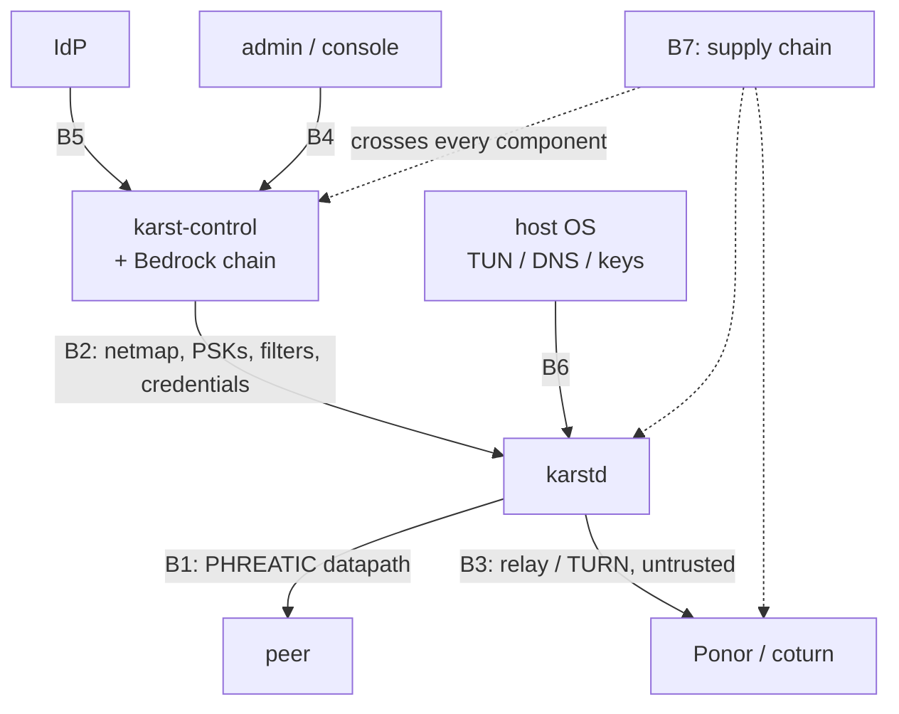

# Karst — Threat Model

- **Status:** Draft for review · Phase 0 artifact
- **Date:** 2026-08-09
- **Scope:** Karst v1 — self-hosted, single-tenant coordination server
- **Related:** PLAN.md §1, ADR-0001 through ADR-0010

---

## 1. Purpose

This document states what Karst defends, against whom, and what it deliberately
does not defend. It is the reference against which design decisions are judged,
and it is intended to be read by external reviewers as the first document
before the protocol specification.

Two rules govern it:

1. **Every mitigation names where it was decided** (an ADR) and **how it is
   validated** (a test, a model, or a review). A mitigation with neither is an
   aspiration.
2. **Accepted risks are stated as plainly as defended ones.** A threat model
   that only lists victories is marketing.

---

## 2. Assets

Ranked by consequence of loss.

| # | Asset | Consequence if lost |
|---|---|---|
| A1 | Traffic confidentiality, **including retroactively** | Total product failure — this is the reason Karst exists |
| A2 | Node static KEM and identity keys | Impersonation; decryption of that node's sessions |
| A3 | Bedrock root keys | Adversary can authorize arbitrary nodes into the network |
| A4 | PSK derivation master | Removes the diversity hedge; with a lattice break, total compromise |
| A5 | Netmap contents (PSKs, TURN credentials, packet filters) | Per-pair secrets and full network topology |
| A6 | Access-control policy integrity | Silent lateral movement inside the network |
| A7 | Identity-provider trust path | Unauthorized enrollment of users and devices |
| A8 | Availability of the datapath | Denial of service; not a confidentiality loss |
| A9 | Communication metadata (who talks to whom, when, volume) | Partially exposed by design — see §7 |

---

## 3. Adversaries

| Tier | Adversary | Capability | In scope |
|---|---|---|---|
| T1 | **Passive global collector** | Records all traffic indefinitely; decrypts later with a CRQC | **Yes — primary** |
| T2 | **Active network attacker** | Spoofs, injects, drops, replays, MITMs; classical compute only | **Yes** |
| T3 | **Malicious peer** | Holds valid credentials inside the network | **Yes** |
| T4 | **Compromised relay operator** | Controls a Ponor relay or TURN provider | **Yes** |
| T5 | **Compromised coordination server** | Full control of the control plane | **Yes** |
| T6 | **Malicious insider with admin rights** | Legitimate console access | **Partially** — auditable, not prevented |
| T7 | **Supply-chain attacker** | Compromises a dependency or build | **Yes** |
| T8 | **Endpoint compromise / root on a node** | Owns the device | **No** |
| T9 | **Real-time quantum adversary** | CRQC available *during* the connection | **No for v1 auth** |

**T1 is the design driver.** Harvest-now-decrypt-later is the only threat here
with a deadline that has already passed — traffic recorded today is already at
risk. Everything else can be patched; recorded ciphertext cannot be recalled.

**T9 is the honest limit.** Karst authenticates with ML-DSA and encapsulates
with ML-KEM, so a CRQC-in-the-moment adversary is not trivially successful —
but v1 does not claim resistance to an active adversary who already has a CRQC.

---

## 4. Trust boundaries

| ID | Boundary | Trust assumption |
|---|---|---|
| B1 | node ↔ node | Peer is authenticated but **not trusted** — ACLs enforced at both ends |
| B2 | node ↔ control server | Server is authorized to distribute policy, **not** to read traffic |
| B3 | node ↔ relay/TURN | Fully untrusted; carries ciphertext only |
| B4 | admin ↔ console | Authenticated, role-limited, fully audited |
| B5 | control server ↔ IdP | IdP is authoritative for user identity only |
| B6 | node ↔ host OS | Trusted (T8 is out of scope) |
| B7 | build/supply chain | Verified, not trusted |

---

## 5. What a compromise actually yields

The most useful summary in this document — what each adversary gets, assuming
everything else holds.

| Compromise | Yields | Does **not** yield |
|---|---|---|
| Ponor relay or TURN provider | Metadata: peer key IDs, timing, volume | Any plaintext |
| Coordination server | Policy control, netmap contents incl. PSKs, ability to misroute or deny | **Cannot decrypt traffic** (no KEM secrets); **cannot inject a node** if Bedrock is enabled (ADR-0005, §4.5) |
| Coordination server **+** full lattice break | **Everything** | — |
| PSK master alone | Removes the diversity hedge | Nothing decryptable while ML-KEM holds |
| One node's static keys | That node's sessions and impersonation of it | Other nodes' sessions (per-pair PSKs, per-session KEM) |
| Bedrock quorum (k of n roots) | Authorize arbitrary nodes | Retroactive decryption |
| Retroactive ML-KEM break, recorded traffic | Nothing, absent the PSK (ADR-0002, §2.6) | — |
| Retroactive ML-KEM break **+** netmap | Session plaintext; identity as **pseudonym only** (ADR-0005) | Raw identity keys |

The row that matters most for operators: **compromising the coordination
server does not decrypt traffic.** That property is what makes self-hosting a
meaningful security posture rather than a deployment preference, and it is why
ADR-0007 chose AGPL — so a modified server must be published.

---

## 6. Threats and mitigations

### B1 — Datapath and handshake

| Threat | Mitigation | Decided | Validated by |
|---|---|---|---|
| Harvest-now-decrypt-later (T1) | Hybrid X25519 + ML-KEM-768; PSK mixed last | ADR-0001, ADR-0002 | ProVerif model; KATs |
| ML-KEM cryptanalytic break | X25519 hybrid (classical adv.); per-pair PSK (quantum adv.) | ADR-0002, ADR-0004 | ProVerif secrecy under compromised-KEM oracle |
| ML-KEM *implementation* flaw (KyberSlash class) | Hybrid; verified `libcrux-ml-kem`; differential testing vs PQClean | ADR-0001 | CI KATs, differential tests |
| Handshake DoS via reassembly state | Per-fragment MACs; mandatory cookie under load; zero pre-validation state; 4-fragment cap; bounded per-source budget | ADR-0004 | Spoofed-source flood tests; `kani` on reassembler |
| Amplification | Never act on partial reassembly; never emit more than received; msg1 (2378 B) > msg2 (2236 B) | ADR-0004 | Asserted ratio tests in CI |
| Suite downgrade | Suite ID bound into transcript; server-published minimum suite enforced **at the node** | ADR-0006 | ProVerif downgrade case |
| PSK downgrade to all-zero fallback | Fallback modeled explicitly; lattice-only sessions flagged in console | ADR-0004, §8.1 | Verifpal + ProVerif no-downgrade property |
| Replay | Timestamp in AEAD payload; session indices; 64-bit counters | §2.2 | Protocol tests |
| Roster-membership oracle | Hint misses dropped silently, never answered | ADR-0005 | Prober test |
| Identity exposure to passive observer | `peer_id_hint` inside AEAD; degrades to pseudonymity, not identity | ADR-0005 | Model + review |
| Parser memory corruption | Rust; `#![forbid(unsafe_code)]` outside TUN/GSO with `// SAFETY:` justifications | ADR-0003 | `cargo-fuzz`, OSS-Fuzz |

### B2 — Node ↔ control server

| Threat | Mitigation | Decided | Validated by |
|---|---|---|---|
| Malicious server injects a rogue node (T5) | **Bedrock**: SLH-DSA-192s roots, k-of-n quorum countersigning; nodes refuse peers not covered by the chain | §4.5, ADR-0001 | Injection test with hostile server |
| Server equivocates about history | Hash-chained signed log replicated and verified by every node | §4.5 | Equivocation test |
| Netmap secrets at rest (A5) | Encrypted cache sealed to OS keystore; excluded from logs, traces, `karst bugreport` | §2.6 | **Phase 3 exit criterion** — automated log scan in CI |
| PSK master extraction (A4) | HSM/KMS custody where available; documented software fallback; O(1) derived, not stored | ADR-0004 | Key-custody review |
| Control-channel interception | TLS 1.3 with `X25519MLKEM768` | ADR-0001 | Config tests |
| Stale netmap → silent connectivity loss (A8) | Netmap age surfaced in `karst status`; `karst doctor` diagnoses hint misses | ADR-0005 | Phase 3 |
| Control-plane telemetry reveals direct endpoints and peer topology (A9) | Nodes report authenticated, bounded last-known path observations only; data is account-scoped, never includes credentials, and is restricted to authorized admin/auditor views | Phase 5 control API | Route × role secret/authorization scan |

### B3 — Relay and TURN

| Threat | Mitigation | Decided | Validated by |
|---|---|---|---|
| Relay reads traffic (T4) | Carries PHREATIC ciphertext only; hybrid-PQ transport as second layer | §5, ADR-0008 | Design review |
| Relay abuse / open-relay conduit | Signed-roster admission; **mandatory** strict mode for pool relays; per-key rate limits and byte accounting | ADR-0008 | Relay tests |
| Free-riding on foreign infrastructure | No DERP compatibility mode; registry rejects `derp://` | ADR-0008 | Registry validation test |
| TURN credential theft | Ephemeral HMAC credentials, time-limited, netmap-delivered; never static | ADR-0008 | Credential-expiry tests |
| Relay operator learns metadata (A9) | **Not mitigated** — disclosed at point of configuration | ADR-0008 | §7 |

### B4/B5 — Console, admin, identity

| Threat | Mitigation | Decided | Validated by |
|---|---|---|---|
| Privilege escalation via console | Table-driven RBAC matrix, centrally enforced | §4.4 | Exhaustive RBAC matrix tests |
| Deprovisioned user retains access (A7) | IdP removal expires node keys and drops sessions **within 60 s** | §4.4 | Dedicated integration test |
| Malicious admin (T6) | Not prevented; append-only hash-chained audit log, SIEM export | §4.4 | Audit-log integrity tests |
| ACL misconfiguration (A6) | Policy unit tests; console dry-run diff of affected flows; versioned history and rollback | §4.3 | Table-driven ACL suite |
| IdP compromise | Out of scope for v1 — the IdP is authoritative by construction | — | §7 |

### B6 — Host integration

| Threat | Mitigation | Decided | Validated by |
|---|---|---|---|
| DNS leak to LAN resolver | Stub resolver on 100.100.100.100; per-platform integration | §7 | Per-platform leak tests |
| Stale resolver config after VPN flap | Explicit teardown paths; `karst doctor` | §7 | Flap tests |
| Node key theft at rest | OS keystore or passphrase-derived sealing; `Zeroizing<>` in memory | ADR-0001 | Review |

### B7 — Supply chain (T7)

| Threat | Mitigation | Decided | Validated by |
|---|---|---|---|
| Malicious or vulnerable dependency | `cargo deny`, `govulncheck`, license allowlist, Dependabot, quarterly review | LICENSING.md, §11 | CI gates |
| **NetBird fork inherits upstream vulnerabilities** | Fork enters the dependency review cycle as a **first-class component, not a library** | ADR-0009 | Quarterly review; rebase discipline |
| Build tampering | Reproducible builds, signed artifacts, SBOM per release, transparency-logged releases | §11 | Release pipeline |

---

## 7. Accepted risks and non-goals

Stated plainly, because a reviewer will find them anyway.

1. **Metadata is not protected.** Relay operators, TURN providers, and on-path
   observers learn who communicates with whom, when, and how much. Only
   fixed-size padding buckets are applied. Traffic analysis is a stated
   non-goal for v1.
2. **Endpoint compromise is total.** Root on a node yields that node's keys and
   plaintext. No mitigation is claimed.
3. **Control-server compromise plus a full lattice break is a total break**,
   because the server derives the PSKs. Server compromise alone is not. This is
   the price of recovering assumption diversity at zero wire cost, and the
   alternative (Classic McEliece) was rejected for operational reasons in
   ADR-0004.
4. **A real-time quantum adversary is out of scope for v1 authentication.**
5. **The IdP is a trusted root.** Compromise of the identity provider yields
   the ability to enroll users. Bedrock limits what a *server* compromise can
   do, but does not constrain a legitimately-authenticated enrollment.
6. **A malicious admin is auditable, not prevented.** Bedrock's k-of-n quorum
   raises the bar for node injection specifically; it does not constrain
   policy changes.
7. **No FIPS 140-3 validated boundary.** Validated implementations are used
   where available (`aws-lc-rs`); no validation of our own module is pursued.
8. **No WireGuard interoperability** (ADR-0003).

---

## 8. Residual risk register

| # | Risk | Severity | Status |
|---|---|---|---|
| R1 | Fragmentation opens an unforeseen DoS vector on the pre-auth path | High | Mitigated; **external review required before GA** |
| R2 | Server compromise + lattice break = total | High | Accepted; documented in §7 and the whitepaper |
| R3 | NAT traversal underperforms, pushing more traffic through metadata-visible relays | Medium | Tracked as a KPI; ≥90% direct target |
| R4 | NetBird fork inherits an upstream vulnerability | Medium | Quarterly review; first-class dependency |
| R5 | Netmap secrets leak via logs or diagnostics | Medium | CI log scan, **continuous not one-time** |
| R6 | Metadata exposure via community relays | Medium | Opt-in with disclosure at configuration |
| R7 | Lattice cryptanalysis advances | Low / catastrophic | Hybrid + PSK + SLH-DSA root; agility layer for rapid swap |
| R8 | Agility layer itself becomes attack surface | Low | Closed allowlist; downgrade case in ProVerif |

---

## 9. Validation commitments

These are **gates, not intentions**:

- **ProVerif model verifies** — secrecy, mutual authentication, no-downgrade,
  and the PSK-absent fallback — or the protocol does not ship (§2.5).
- **External cryptographic review** of PHREATIC and its implementation in
  Phase 8. All high and critical findings must be remediated and re-tested
  before GA. No external cryptographic review has happened yet.
- **External penetration test** of the control plane and console in Phase 8.
  No external penetration test has happened yet.
- Continuous fuzzing of every parser via OSS-Fuzz.
- Spoofed-source DoS suite and amplification assertions in CI.
- Netmap secret-leakage scan in CI on every commit.

---

## 10. Review

This document is reviewed and signed off as a **Phase 0 exit criterion**, and
re-reviewed at each phase boundary and on any change to the trust boundaries in
§4. The Phase 8 external cryptographic review will establish the reviewed
baseline. Until then, the published security whitepaper must identify itself
as derived from the internally reviewed threat model and must not imply
external review.
