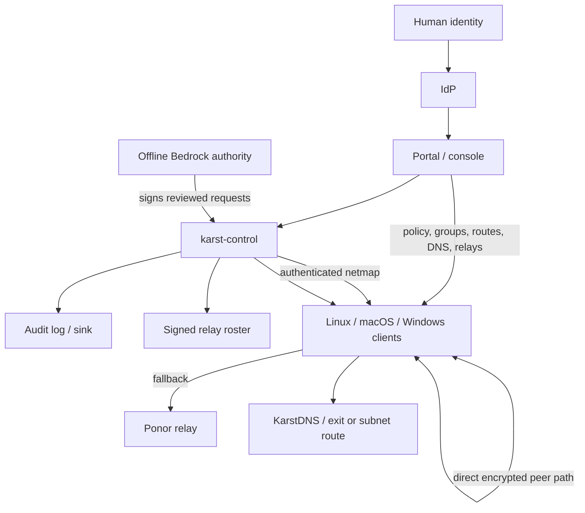

<!-- SPDX-License-Identifier: CC-BY-4.0 -->

# Karst use-case analysis

## Scope and terminology

Karst is a self-hosted, post-quantum mesh VPN. This analysis describes the
intended operating model and calls out features that are presently planned or
partially implemented. It is not a claim that every use case is production
ready; the project is pre-alpha ([README](../README.md)).

An **exit node** is not a relay. A relay carries encrypted overlay frames when
two peers cannot establish a direct path. An exit node is an enrolled client
that is deliberately permitted to forward a client's default-route traffic to
another network. The same host could run both roles, but their privileges,
configuration, and risks should be managed separately.

## System boundary and components

| Component | Runs where | Primary responsibility | Principal interactions |
| --- | --- | --- | --- |
| Linux client (`karstd` and `karst`) | Linux endpoint or gateway | Creates the overlay interface, enforces local policy, establishes peer paths, and integrates DNS. Linux is the currently documented deployment target. | Enrolls with control; receives the netmap, policy, DNS, routes, and relay registry; talks directly to peers or through a relay. |
| macOS client | macOS endpoint | Intended client role equivalent to the Linux client, using macOS networking, DNS, secure storage, and installer conventions. | Enrollment and use are the same logical flow; platform integration and release packaging are a delivery requirement. |
| Windows client | Windows endpoint | Intended client role equivalent to the Linux client, using Windows networking, DNS, secure storage, and installer conventions. | Enrollment and use are the same logical flow; installer/service operation must be suitable for a managed Windows endpoint. |
| `karst-control` | Operator-controlled coordination host | Control plane: enrollment, authenticated netmap distribution, policy, user/SSO integration, relay registry, posture, and audit. | Authenticates users and nodes; distributes configuration; records administrative activity. |
| Admin console | Browser | Administrative user interface for users, groups, policy, nodes, DNS, routes, relays, Bedrock, posture, and audit. | Calls the authenticated administrative API. |
| User portal | Browser | Self-service interface for a user’s devices, device enrollment, reachability explanation, and sessions. | Calls the authenticated portal API as the current user. |
| `karst-relay` (Ponor) | Publicly reachable relay host | Authenticated fallback forwarding, presence, rate limiting, and AVEN reflection. It carries ciphertext, not plaintext overlay traffic. | Receives its admission roster from control and accepts only registered/published clients. |
| AVEN discovery | Clients and relay reflector | NAT discovery, candidate exchange, and direct-path selection. | Starts relayed when necessary, then upgrades to a direct path when available. |
| KarstDNS | Node-local client service | Resolves mesh names and applies group-scoped global or split-DNS upstream configuration. | Receives DNS configuration in the netmap; safely applies and reverts host DNS settings. |
| Bedrock and `karst-bedrock` | Offline signer plus control plane | Network-membership lock: an offline quorum signs membership/authority state which clients verify. | Admin exports requests; offline authority operator inspects and signs; control imports the signed bundle; clients enforce their local floor. |
| IdP / SCIM provider | Organization identity system | Authenticates people and, where configured, synchronizes users and groups. | Supplies user identity to console and portal; control maps that identity to an account role and groups. |
| Exit node / subnet router | Enrolled, specially configured client | Forwards traffic between the overlay and a LAN, VPC, or Internet default route. | Is selected by route configuration and constrained by routing and access policy. |
| Audit log and audit sink | Control plane and optional external SIEM | Provides tamper-evident administrative history and export. | Records relevant administrative events; auditors inspect, verify, export, or receive events. |

### Connectivity and control-plane relationship

## Actors and identities

An actor is a person or system with a goal. An identity is the credential or
stable identifier with which Karst recognizes that actor. These must not be
treated as interchangeable: a user can own several devices, and one device
can have several non-human operators over its lifetime.

| Actor | Goal | Identity used | Authority boundary |
| --- | --- | --- | --- |
| Client user | Use private connectivity and manage their own devices. | IdP subject/session for portal; node identity for each device. | May enroll, name, view, and revoke only their own devices; receives only access granted by policy. |
| Administrator | Operate the organization’s Karst account. | IdP subject and administrator role; optionally a scoped API token for automation. | Manages users, groups, access policy, relays, DNS, routes, settings, and lifecycle actions. Actions must be audited. |
| Auditor / security reviewer | Establish what happened and whether controls are effective. | Distinct IdP subject with read/verify/export permission, not an admin credential. | Reads audit, posture, policy history, and permitted topology data; cannot change live configuration. |
| Platform / client installer | Put a supported client on an endpoint. | Local OS administrator privilege; after enrollment, the device’s node identity. | Installs software and grants only the host privileges needed for networking and DNS integration. |
| Relay operator | Provide fallback connectivity without joining the protected data plane. | Relay ML-DSA identity, pinned by clients; OS/service identity on the relay host. | Operates the relay and observes relay metadata, but has no policy-administration authority and no plaintext access. |
| Bedrock root or authority operator | Independently authorize membership-related changes. | Offline Bedrock root/authority signing key; separate human custody and approval process. | Signs only reviewed request bundles. It does not administer policy or run the online control plane. |
| Control service | Admit nodes and distribute the account configuration. | Pinned static ML-KEM public key and ML-DSA-87 server identity. | Authoritative for account configuration, but Bedrock can prevent it from silently authorizing an uncovered node. |
| Node / device | Participate in the mesh. | Locally generated, sealed ML-DSA-87 node identity; opaque node handle derived from its public identity. | Possesses only its own private material and its delivered netmap; it must not receive arbitrary account-wide secrets. |
| Relay service | Forward eligible encrypted frames. | ML-DSA relay identity and derived relay ID. | Authenticated by the client through its pinned registry identity; separate from TLS server-name validation. |

### Identity lifecycle and trust anchors

1. An IdP authenticates a person. Control maps that person to an account,
   role, and groups.
2. An administrator issues a setup key or a portal issues a short-lived,
   single-use device-enrollment key to the authenticated owner.
3. Before first contact, the client receives the setup key and both pinned
   public halves of the control-service identity. The node generates and seals
   its own identity key locally.
4. Control registers the node under its opaque handle and sends an encrypted
   netmap containing only the peers, policy, DNS, routes, and relay entries the
   node needs.
5. When Bedrock is enforcing, the node additionally requires coverage by the
   signed Bedrock chain. The node’s local configured mode is a floor: an online
   server must not be able to lower it.

The control protocol details these pins, node handles, and registration rules
in [KARST-CONTROL v1](../spec/karst-control-v1.md). In particular, a known
handle presenting a different identity key is identity substitution, not a
re-enrollment.

## Use cases

### UC-01 — Install and start a client

**Primary actors:** client user, endpoint administrator.  
**Applies to:** Linux, macOS, Windows client distributions.

**Goal:** make an endpoint capable of joining and using the mesh.

**Preconditions:** the platform has a supported signed package or installer;
the installer has the OS privileges required to create the VPN interface and,
when enabled, manage DNS. Linux is the documented current runtime and package
path; macOS and Windows are equivalent product use cases that require their
platform-specific package, driver, service, secure-store, and DNS integration.

**Main flow:**

1. The installer installs the client daemon and CLI/UI and registers a service
   that can start at boot or user login as appropriate.
2. The user or administrator supplies the control endpoint, the two control
   pins, and an enrollment credential through protected local configuration.
3. The daemon starts, creates the overlay interface (or explicitly selected
   userspace stack), seals its node identity in platform-appropriate storage,
   and attempts enrollment.
4. The daemon applies the resulting policy, routes, relay registry, and DNS
   configuration. The user verifies peer and DNS status.

**Success:** the device has a node handle, an active authenticated control
channel, and an applied netmap.  
**Failure / control:** missing pins or an invalid setup key must prevent
enrollment; failure to configure host DNS must not leave the host without its
previous resolvers. Userspace mode must not claim host DNS integration it
cannot provide.

### UC-02 — Bootstrap the control plane and relay

**Primary actor:** infrastructure administrator.  
**Supporting actors:** relay operator, DNS/TLS administrator.

**Goal:** deploy a usable self-hosted coordination service and at least one
fallback relay.

**Main flow:**

1. The administrator installs and hardens `karst-control`, configures storage,
   the public endpoint, its static KEM and signing identity, and the IdP.
2. The administrator installs `karst-relay` on a public host, protects its
   generated relay identity key, and obtains a certificate whose name matches
   the configured TLS server name.
3. The administrator records the relay’s numeric `IP:port`, TLS server name,
   public identity key, and region in the relay registry.
4. Control publishes the relay to clients in their next netmap and refreshes
   the relay admission roster. The operator monitors roster freshness and
   relay admission health.

**Success:** a newly enrolled node learns the relay and can authenticate it;
the relay admits it using the current roster.  
**Failure / control:** a DNS name in the relay `address` field invalidates the
netmap, so the address must be an IP address and port; DNS belongs only in the
TLS server-name field. A registry entry without a matching current roster
causes the relay to deny clients. Relay health should be treated as a
connectivity signal, not as evidence that payloads are readable.

### UC-03 — Add, invite, and deprovision a user

**Primary actor:** administrator.  
**Supporting actors:** IdP/SCIM service, client user.

**Goal:** grant a person an account identity and an initial least-privilege
role.

**Main flow:**

1. The administrator creates or synchronizes the user from the IdP, assigns a
   role and auto-assigned groups, and sends an invitation when applicable.
2. The user authenticates through the IdP and gains access to the portal or,
   if authorized, the console.
3. The administrator changes groups or role as job responsibilities change.
4. For suspected compromise, the administrator blocks the user immediately;
   for departure, the administrator deprovisions the user and revokes or
   deprovisions owned devices according to policy.

**Success:** the user receives only the portal and mesh access implied by role,
groups, ownership, and access policy.  
**Audit:** invitation, role/group changes, blocking, and deprovisioning are
administrative events.  
**Control:** use a separate service user and narrowly scoped token for
automation rather than a shared human administrator account.

### UC-04 — Enroll and manage a device

**Primary actors:** client user or administrator; client daemon; control.

**Goal:** associate a new device with a user/account and admit it to the mesh.

**Main flow:**

1. The user requests a short-lived single-use device key in the portal, or an
   administrator creates a setup key that may carry group assignment.
2. The credential and control pins are placed in protected client
   configuration; the daemon starts.
3. The daemon presents its freshly generated identity during registration and
   proves possession of the enrollment credential over the pinned control
   channel.
4. Control associates the node with its owner/groups, issues the encrypted
   netmap, and records the node handle and lifecycle event.
5. The user can view and rename their device, inspect explained access and
   sessions, or revoke it. An administrator can locate, update, block, or
   deprovision it when authorized.

**Success:** the device has a stable node identity and receives configuration
appropriate to its owner and groups.  
**Control:** setup keys admit new devices but are not long-lived device
identity. Revoking a key stops future enrollments; revoking a device must drop
that device’s session and remove it from future maps.

### UC-05 — Grant and validate connectivity permissions

**Primary actor:** administrator.  
**Supporting actors:** client users, control, clients.

**Goal:** allow only intended source groups to reach intended destination
groups, protocols, and ports.

**Main flow:**

1. The administrator defines groups that express ownership or function (for
   example, engineering, production, and gateways).
2. The administrator writes an explicit default-deny access policy that grants
   named flows, then validates, previews, and tests it.
3. Control versions the policy and compiles/distributes the result in client
   netmaps.
4. Clients enforce the resulting stateful packet filter. A user can consult
   portal reachability explanations; administrators inspect versions and roll
   back deliberately when needed.

**Success:** allowed traffic reaches only its specified destination/ports and
all other traffic is denied.  
**Control:** saving requires the version that was read, preventing silent
last-write-wins policy replacement; policy changes and rollbacks are audited.

### UC-06 — Configure DNS and private service discovery

**Primary actor:** administrator.  
**Supporting actors:** client user, KarstDNS, upstream DNS operator.

**Goal:** let eligible clients resolve mesh names and organization-approved
global or split-DNS names without leaking mesh-zone queries to a LAN resolver.

**Main flow:**

1. The administrator sets the mesh zone and creates nameserver groups with
   upstreams, optional split domains, search domains, and distribution groups.
2. Control projects only the enabled DNS configuration that applies to each
   client into its netmap.
3. KarstDNS answers mesh records locally, forwards only matching split-domain
   queries to their designated upstreams, and uses global/preserved upstreams
   for other names.
4. The client installs DNS configuration transactionally using the platform’s
   supported mechanism and restores prior DNS state on stop, failure, or when
   DNS management is disabled.

**Success:** `host.mesh-zone` resolves from the authenticated netmap and split
queries take their intended path.  
**Control:** an unknown mesh name is authoritative NXDOMAIN, never a forwarded
query; a failed split route is SERVFAIL, not fallback to a global resolver.
Forwarded DNS is not inherently encrypted, so resolver placement and transport
are a separate privacy decision.

### UC-07 — Configure a subnet router or exit node

**Primary actor:** administrator.  
**Supporting actors:** gateway client operator, client users.

**Goal:** make an approved non-mesh subnet or default route reachable through
one or more enrolled gateway clients.

**Main flow:**

1. The gateway operator installs and enrolls a client on a host that can reach
   the target LAN, VPC, or Internet egress and enables forwarding according to
   the host platform’s security model.
2. The administrator places gateway nodes in a routing group, defines the
   target CIDR and route metric, and distributes that route only to authorized
   recipient groups.
3. For an exit-node use case, the configured default-route prefixes
   (`0.0.0.0/0` and/or `::/0`) are distributed only after an explicit user or
   client-selection experience exists; it must not silently become the default
   path for every client.
4. The gateway forwards traffic; masquerading is enabled unless the target
   network has return routes to the overlay. Access policy still governs which
   mesh clients may reach the gateway and destination.

**Success:** only selected clients can reach the selected destination through
the gateway, with a usable return path.  
**Control:** an exit node sees destination metadata and carries user traffic;
it deserves stronger operations and monitoring than an ordinary endpoint. A
relay must never be mistaken for an exit node.

### UC-08 — Establish and maintain peer connectivity

**Primary actors:** two enrolled clients.  
**Supporting actors:** control, AVEN, relay.

**Goal:** carry policy-authorized traffic over the best viable encrypted path.

**Main flow:**

1. Each client authenticates to control and receives the other’s identity,
   route/policy information, pairwise material, and relay options in its
   encrypted netmap.
2. The clients attempt AVEN discovery and a direct PHREATIC path.
3. If direct connectivity is not available, they use an authenticated Ponor
   relay path. They continue probing and upgrade to direct connectivity when a
   safe candidate succeeds.
4. Clients report bounded, authenticated last-known path observations to
   control; control exposes them as telemetry, not as proof of current state.

**Success:** traffic is encrypted end-to-end and passes only when policy
allows it; a direct path is preferred but not required.  
**Control:** relay/TURN operators can learn peer identifiers, timing, and
volume, but not overlay plaintext. Some NAT pairs remain correctly relayed.

### UC-09 — Govern Bedrock network membership

**Primary actors:** administrator and independent offline Bedrock authority
operators.

**Goal:** make membership authorization require deliberate, independently
held offline authority when the network lock is enforcing.

**Main flow:**

1. The administrator configures roots, authorities, quorum, and a rollout
   mode (`off`, `advisory`, or `enforcing`).
2. Control produces an unsigned request bundle for membership/authority
   changes. The administrator exports it instead of asking an online server to
   sign it.
3. Offline authority operators inspect the human-readable request and sign it
   with separately protected keys.
4. The administrator imports the signed response; control verifies and records
   it in the Bedrock chain. Clients receive the new signed state in the netmap.
5. Before enabling enforcing mode, the administrator acknowledges the exact
   server-calculated set of nodes that would be cut off and resolves any
   unexpected coverage gap.

**Success:** enforcing clients reject peers not covered by the required signed
chain, even if an online control server is compromised.  
**Control:** root/authority key custody is separate from console admin access;
the console does not hold or use Bedrock private keys. Bedrock does not replace
ordinary user authorization or packet policy.

### UC-10 — Monitor, investigate, and prove administrative activity

**Primary actors:** auditor, security administrator.  
**Supporting systems:** audit log, optional SIEM/audit sink, posture and path
telemetry.

**Goal:** answer who changed what, assess mesh health and cryptographic
posture, and detect or investigate abnormal activity without turning observers
into administrators.

**Main flow:**

1. The auditor filters the append-only, hash-chained audit log by actor and
   action, verifies its chain, and exports it or forwards events to an approved
   sink.
2. The auditor examines policy history, Bedrock-log verification, node posture,
   session posture, relay admission freshness, and last-known path observations.
3. A security administrator uses that evidence to block a user, deprovision a
   node, remove a relay, or roll back a policy under the appropriate change
   process.
4. The auditor records the evidence and confirms that the remediation action
   itself appears in the audit trail.

**Success:** investigators can establish an ordered, verifiable history and
separate observed telemetry from asserted configuration.  
**Control:** audit access is read/verify/export only. The audit chain makes a
malicious administrator’s actions evident; it does not itself prevent an
authorized administrator from making a harmful change.

## Authorization model summary

| Capability | Client user | Administrator | Auditor | Relay operator | Bedrock authority |
| --- | --- | --- | --- | --- | --- |
| Use policy-granted mesh connectivity | Yes | Yes, if also a user/client | No need | No | No |
| Enroll/manage own device | Yes | May do so | No | No | No |
| Manage all users, groups, policy, DNS, routes, relays | No | Yes | No | Only relay host itself | No |
| Read/verify/export audit and posture | Own session/access only | As permitted | Yes | Relay-local metrics only | Bedrock artifacts only |
| Operate fallback relay | No | Can register it | No | Yes | No |
| Sign Bedrock authorization | No | Exports/imports only | May review | No | Yes, offline |

## Operational acceptance criteria

- Each client platform has a supportable install, upgrade, uninstall, service,
  secure-key-storage, TUN/userspace, and DNS-revert story. The current
  [getting-started guide](GETTING-STARTED.md) documents the Linux path; macOS
  and Windows should not be represented as equivalent until these are tested.
- A node never enrolls on a setup key alone: it must have both pinned control
  public keys, and a local node identity must be protected at rest.
- User ownership, administrator authority, node identity, relay identity, and
  Bedrock signing authority remain distinct in data model, UI, and audit.
- Every reachability expansion—user group, access policy, route, exit route,
  DNS group, relay registry, or Bedrock-mode change—has a reviewable,
  versioned/audited change path and a safe rollback or removal path.
- Monitoring preserves the stated trust boundary: relay and path telemetry is
  operationally useful but not a claim of payload inspection or real-time
  truth. See the [threat model](THREAT-MODEL.md) for the full disclosure of
  relay metadata and administrator-risk limits.
