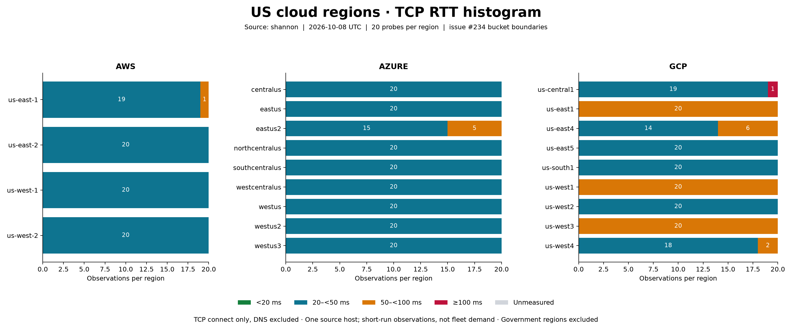

# US regional anchor RTT — 2026-10-08

Measured from `shannon`, 23:29:16–23:29:57 UTC. All **440/440** TCP
connection attempts succeeded across 22 public commercial US regions.



| Provider | <20 ms | 20–<50 ms | 50–<100 ms | ≥100 ms | Unmeasured |
|---|---:|---:|---:|---:|---:|
| AWS | 0 | 79 | 1 | 0 | 0 |
| Azure | 0 | 175 | 5 | 0 | 0 |
| GCP | 0 | 111 | 68 | 1 | 0 |

Lowest median per provider: AWS `us-west-2` **25.7 ms**, Azure
`westcentralus` **24.2 ms**, GCP `us-south1` **25.5 ms**. GCP
`us-central1` had one **349.4 ms** observation; its median was **36.5 ms**.
Every sample, including that outlier, is retained.

## Method and code inspected

Issue [#234](https://github.com/karst-net/karst/issues/234) tracks the work.
The client implementation is
[`anchor_probe.rs`](../../../bins/karstd/src/anchor_probe.rs);
aggregation and bucket boundaries are in
[`histogram.go`](../../../server/management/internals/karst/regionallow/histogram.go).
The client measures RTT; the server creates the per-anchor histogram.

The [measurement harness](../anchor-rtt-us.py) extracts and compiles the
client's actual `anchor_hostname`, Azure helpers, `probe`, and `rtt_ms`
functions with its timeout and port constants. It times TCP connect to the
first DNS result on port 443, excluding DNS and without TLS or HTTP.
The timeout is one second; DNS has the OS resolver's timeout. The harness
also bounds each child process at 30 seconds, aborting the run if exceeded.
Integer milliseconds are truncated exactly as in the client before bucketing.
The bucket named `over_100ms` in the server includes **exactly 100 ms**.

Each region received 20 probes in serial passes, with one second between
passes and the starting region rotated. This short experiment deliberately
uses a faster cadence than the daemon's 15-minute production interval.
No daemon configuration or server telemetry was changed.

Public commercial regional coverage was checked against the
[AWS region list](https://docs.aws.amazon.com/global-infrastructure/latest/regions/aws-regions.html),
[Azure region list](https://learn.microsoft.com/en-us/azure/reliability/regions-list),
and [GCP Storage locations](https://docs.cloud.google.com/storage/docs/locations).
Government partitions and local zones are outside this run's scope.

These are repeated observations from one host, not a distribution across
clients or a long-term SLA measurement. Provider totals also have different
region counts, so they are not equally weighted performance comparisons.
TCP latency to an anchor does not measure application response time or
prove where traffic terminates; the ADR's GCP verification from two distant
vantage points remains outside this single-host measurement.

## Artifacts and reproduction

- [Raw observations](raw.csv), including timestamps and endpoint hostnames.
- [Per-region statistics and bucket counts](summary.csv).
- [Run metadata](metadata.json), including commit and source hash.
- Histogram: [PNG](histogram.png) and [SVG](histogram.svg).

With Rust and Python 3 + matplotlib installed, from the repository root:

```sh
python3 docs/measurements/anchor-rtt-us.py --samples 20 --output /tmp/anchor-rtt-new-run
```

The output directory must not already exist, preserving earlier results.
