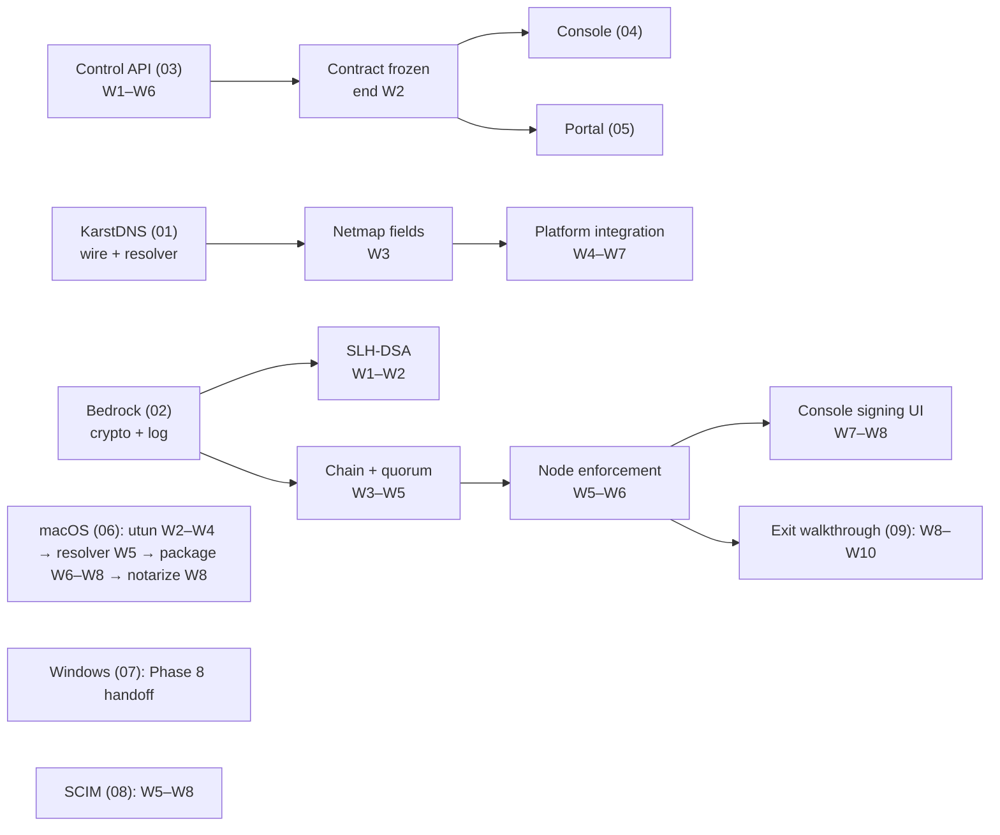

# Phase 5 — KarstDNS, Bedrock, admin console

**10 weeks · W1 = week of 2026-10-19 · W10 = week of 2026-12-21.**
Anchored on PLAN.md §10's 2026-08-10 start, Phase 4 running ten weeks from it.

These notes are local planning material. They expand PLAN.md's seven-line
Phase 5 block into something a team can start on Monday of W1. Where they
disagree with PLAN.md, PLAN.md is the plan of record and these notes are the
draft; where they disagree with the tree, the tree is right and these notes are
stale.

## 0. Re-baseline — 2026-08-27 use-case review

The original inventory below is historical. The tree now contains a Linux
KarstDNS implementation; Bedrock key/log/status/enforcement primitives and an
offline signer; a Karst-specific administrative API; console and portal;
policy, posture, relay, audit, and self-service-device flows. Phase 5 is no
longer "build all of these from nothing." Its product-critical remaining work
is:

1. Turn the console and portal into verified real-server workflows: the setup
   and portal instructions now use `karstd` configuration rather than the
   nonexistent `karst up`. Portal-issued one-time keys have a Karst-owned,
   hashed owner binding that registration consumes only after the inherited
   manager accepts the key; real registration, device visibility, key
   issuance, and self-revocation are covered together. The matching console
   test creates and invites a member, enrolls that member's Linux peer, and
   proves administrator deprovisioning deletes the peer as well as the user.
2. Audit operations are complete: JSON/CSV exports select the required server
   format; configured webhook/TLS-syslog sinks drain through a durable retrying
   outbox; and the console exports an offline authority-signed audit anchor
   that the server imports and verifies. Automated anchoring remains deferred
   pending a capability-scoped Bedrock authority design.
3. Deliver the macOS client, including platform DNS, key storage, lifecycle,
   installer, signing, upgrade, and uninstall. Linux is the only currently
   documented supported client platform. Windows has the same implementation
   gap, but PLAN.md now schedules its delivery in Phase 8; retain
   [07-windows-client.md](07-windows-client.md) as the Phase 8 handoff plan.

   **Reviewed 2026-08-30 and all but done.** W2–W7 shipped: `utun`, addressing
   and routes, a two-daemon pair suite, `/etc/resolver` with revert and crash
   recovery, resume detection, and a `.pkg` with install and uninstall verified
   on a real runner. Two things remain and only one of them is engineering.
   The resolver **search list** is Phase 6 — it needs a held-open
   `SCDynamicStore`, and the cheap alternatives either evaporate when the child
   process exits or delete the search domains DHCP supplied; the daemon and
   `karst dns status` now state the limitation rather than leaving it to be
   discovered. **Signing and notarization are blocked on Apple Developer
   Program enrollment and nothing else** — `scripts/build-macos-pkg.sh` signs,
   notarizes and staples the moment credentials exist, and `--require-signing`
   makes their absence fatal on a tag. That is the one item on this list whose
   critical path runs through paperwork rather than through the team, and it is
   the phase's highest-likelihood risk in §5.
4. Deliver SCIM/group-sync deprovisioning and Linux packages.

Managed subnet routing and exit nodes are explicitly excluded: there is no
current product model for gateway selection, default-route consent, forwarding,
or node-attribute permissions. They remain Phase 6 work.

| File | Workstream | Owner role | Weeks |
|---|---|---|---|
| [01-karstdns.md](01-karstdns.md) | KarstDNS resolver, split DNS, platform integration | Rust ×2 | W1–W7 |
| [02-bedrock.md](02-bedrock.md) | SLH-DSA roots, quorum, hash-chained log, client enforcement | Crypto + Rust + Go | W1–W8 |
| [03-control-api.md](03-control-api.md) | The REST surface the console consumes | Go ×2 | W1–W6 |
| [04-admin-console.md](04-admin-console.md) | `karst-console`, eleven views | Frontend ×2 | W2–W10 |
| [05-user-portal.md](05-user-portal.md) | `karst-portal` | Frontend ×1 | W7–W9 |
| [06-macos-client.md](06-macos-client.md) | `utun`, LaunchDaemon, signed + notarized pkg | Rust ×1 | W2–W8 |
| [07-windows-client.md](07-windows-client.md) | Wintun, service, MSI, driver signing — Phase 8 handoff | Rust ×1 | Phase 8 |
| [08-scim-and-groups.md](08-scim-and-groups.md) | SCIM 2.0, group sync, deprovisioning | Go ×1 | W5–W8 |
| [09-exit-criteria.md](09-exit-criteria.md) | The acceptance walkthrough and the docs it reads | SRE + all | W8–W10 |

---

## 1. What Phase 5 actually is

Phases 0–4 built a protocol and proved it moves packets. **Phase 5 is the first
phase whose deliverable is a product rather than a mechanism**, and the exit
criterion says so in as many words:

> a non-expert admin can install the server, connect three nodes across Linux
> plus one completed non-Linux client platform and two NATs, write an ACL,
> enable network lock, and deprovision a user — entirely from the console and
> installers, following only the published docs.

The following was the original phase rationale. Its claim that the console,
network lock, and all enrollment surfaces do not exist is superseded by §0;
non-Linux installers and a non-expert walkthrough remain dependencies. Phase 4
said when it shipped the compose artifact ("*What is left is enrollment, and it is
Phase 5's*", PLAN.md §10 Phase 4).

The phase therefore has an unusual shape for this project: **the protocol work
is the smaller half.** Two of the ten weeks of Rust are new protocol (KarstDNS
on the wire, Bedrock verification in the node); the rest is platform
integration and packaging, which is fiddly, un-glamorous, and historically the
place where schedule goes to die.

## 2. Historical state of the tree at the start of the phase (superseded)

Verified against the working tree on 2026-08-22, commit `de4febb`. Retained for
planning provenance only; see §0 for the 2026-08-27 implementation baseline.

| Thing Phase 5 needs | State today | Where |
|---|---|---|
| `karst-dns` crate | **Five lines.** A `lib.rs` with a doc string and `#![forbid(unsafe_code)]`, no dependencies | `crates/karst-dns/` |
| DNS names in the netmap | Present — `dns_name` on self and every peer, and part of the version hash | `karst_control.proto` fields 3/5, `netmap.go:355` |
| DNS *configuration* in the netmap | **Absent.** No nameservers, no search domains, no split-DNS routes, no MagicDNS toggle | — |
| Resolver config on the node | Absent. `karstd` never touches `/etc/resolv.conf`, `resolved`, or NRPT | — |
| Bedrock | **Named, not built.** Three comments anticipate it; no key type, no log, no verification | `identity.go:16`, `audit.go:24`, `channel.go:317` |
| SLH-DSA | Not present in `karst-crypto` — the crate has ML-KEM and nothing else in `src/` | `crates/karst-crypto/src/{kem,lib}.rs` |
| ML-DSA-65 | Present and used for the control channel and relay identity | `karst-noise`, `channel_mldsa_test.go` |
| REST API for a console | **Fork surface only.** NetBird's `/api/peers`, `/api/users`, `/api/groups`, `/api/dns/…` exist; nothing exposes Karst nodes, PSK epochs, crypto posture, relays, or Bedrock | `server/management/server/http/handlers/`, `openapi.yml` (14 373 lines) |
| Web workspace | **Manifest only.** `web/package.json`, a pnpm workspace naming `console`, `portal`, `packages/*` — none of which exist | `web/` |
| macOS / Windows datapath | `karst-tun` is Linux-gated: `linux.rs`, plus a `userspace.rs` that is platform-independent by construction | `crates/karst-tun/src/lib.rs:41` |
| Linux packaging | **Absent.** No systemd unit, no `.deb`, no `.rpm`, no `nfpm` config — a PLAN.md §9 *Phase 2* deliverable. Everything has run from containers and compose | [09](09-exit-criteria.md) §2 |
| Netmap push | **Poll only.** `control.rs:55` refreshes every 60 s, "a poll rather than a server push, for now", and `service.go` only ever speaks in reply | [08](08-scim-and-groups.md) §2 |
| Code-signing certificates | **Not acquired.** PLAN.md §12 says to start this in Phase 3; it did not happen | — |

Two of these are worth flagging now rather than in their own file.

**The certificates are the long pole and they are already late.** PLAN.md §12
carries "Windows driver signing / macOS notarization delays" as a Medium/Medium
risk whose mitigation is "start certificate acquisition in Phase 3, not Phase
5". Phase 3 is closed and no certificate was acquired. An EV code-signing
certificate for the Windows kernel-mode path is a two-to-six week identity
verification with a hardware token shipped physically; Apple's Developer
Program enrollment for an organization is one to four weeks on a D-U-N-S number
lookup. **Both must be started in W1 as paperwork, in parallel with everything
else, or W8's packaging work has nothing to sign.** See
[06](06-macos-client.md) §7 and [07](07-windows-client.md) §8.

**Two exit-criterion dependencies are missing and neither is Phase 5 work on
paper.** There is no Linux package, so the criterion's "install … from the
installers" has nothing to install on the one OS that has worked since Phase 2
— one engineer-week, W6, [09](09-exit-criteria.md) §2. And the 60-second
deprovisioning requirement in PLAN.md §4.4 cannot be met while the netmap is a
60-second poll, so the server-initiated push the stream was designed for
becomes load-bearing here — a Go week plus half a Rust week in W6,
[08](08-scim-and-groups.md) §2. Both were found by tracing the criterion into
the tree rather than by reading the plan, and both are cheap now and expensive
in W9.

**The console has no API to call.** PLAN.md §8 specifies eleven admin views and
a "generated OpenAPI client" without saying what generates it. The fork's
OpenAPI document describes NetBird's object model — peers keyed by WireGuard
public key, no PSK epoch, no negotiated suite, no relay registry, no Bedrock.
Six of the eleven views have no backing endpoint at all. That is a Go
workstream of its own and it is the critical path for the whole frontend; it is
[03-control-api.md](03-control-api.md) and it starts in W1.

## 3. Dependency graph

Three hard ordering constraints, and everything else can float:

1. **The API contract must be frozen at the end of W2.** Not implemented —
   frozen, as an OpenAPI document that generates a TypeScript client against a
   mock server. Two frontend engineers idle for eight weeks otherwise, and they
   are 25% of the team.
2. **The netmap DNS fields must land in W3.** They change the netmap version
   hash construction, which invalidates `spec/vectors/karst-control-v1.json`
   and forces a coordinated Rust + Go change. Doing that once, early, is
   cheap; doing it in W8 alongside packaging is how a release slips.
3. **Bedrock node enforcement must precede the exit walkthrough by three
   weeks.** "Enable network lock" in the exit criterion means a node *refuses*
   an uncovered peer. That is a fail-closed path, and fail-closed paths that
   have been exercised for less than a fortnight are how a phase ships a
   network that cannot be joined.

## 4. Staffing against PLAN.md §10's team

§10 assumes 3 Rust, 2 Go, 2 frontend, 1 security/crypto, 1 SRE/release.

| Person | W1–W3 | W4–W7 | W8–W10 |
|---|---|---|---|
| Rust 1 | KarstDNS resolver core | KarstDNS Linux integration | Exit walkthrough support |
| Rust 2 | macOS `utun` | macOS resolver + pkg | Notarization, installer |
| Rust 3 | Windows Phase 8 design handoff | Available for Phase 5 gaps | Available for Phase 5 gaps |
| Crypto | SLH-DSA into `karst-crypto` | Bedrock chain, quorum, log | Bedrock node enforcement, review |
| Go 1 | Control API contract | Control API implementation | Bedrock server side |
| Go 2 | Netmap DNS fields | SCIM 2.0 | Group sync, deprovision test |
| Frontend 1 | Design system, shell | Machines/Users/Groups/ACL | Crypto posture, Bedrock UI |
| Frontend 2 | Component library, auth | Keys/DNS/Relays/Audit | Portal |
| SRE | Certificate paperwork, CI for web | Installer CI, signing infra | Exit walkthrough, docs |

The two items from §2 land on top of this: Linux packaging is SRE's W6 (which
is why installer CI sits in the same block), and netmap push is Go 1's W6 with
Rust 1 pairing for half of it. Both are real additions to an already-full
schedule, and the honest accounting is that they consume most of the slack that
W9–W10 was carrying.

**The crypto engineer is oversubscribed and this is the staffing risk.**
Bedrock is a new signature algorithm, a new log format, a new quorum
mechanism, and a fail-closed enforcement path in the datapath, carried by one
person across eight weeks with no second reader who has the context to catch a
mistake. Either Rust 1 pairs on the node-side enforcement from W5 (which
pushes KarstDNS platform integration a week right), or Bedrock's console UI
slips to Phase 6 and the phase exits with a CLI-driven network lock. **Take the
first option**; the exit criterion names the console explicitly.

## 5. Risks specific to this phase

| Risk | Likelihood | Impact | Mitigation |
|---|---|---|---|
| macOS signing/notarization not in hand by W7 | **High** — nothing started | **High** — no completed non-Linux installer, exit criterion unreachable | Start Apple enrollment W1 day 1; treat as SRE's first task ahead of any CI work. Windows signing is Phase 8 work. |
| API contract churn after W2 | Medium | High — frontend rework | Freeze as OpenAPI + mock server; changes after W2 go through an explicit amendment with both frontend engineers in the room |
| Platform DNS integration exceeds estimate | **High** — it always does | Medium | The Linux mechanisms are implemented; budget macOS resolver work with its client. Windows NRPT is Phase 8 work. |
| Bedrock single-reader risk | Medium | **High** — a flaw in a fail-closed crypto path | Pair Rust 1 from W5; Phase 6's internal review takes Bedrock as its second subject after PHREATIC |
| W9–W10 fall across the holidays | **Certain** | Medium | Weeks of 2026-12-14 and 2026-12-21 will lose people. Plan ten weeks of work into eight and treat W9–W10 as the buffer that a phase this packaging-heavy will need anyway |
| Console scope inflation | Medium | Medium | Eleven views in §8.1 is the *specified* scope, not the achievable one. [04](04-admin-console.md) §2 ranks them; the bottom three ship read-only |

## 6. What this phase does not do

Recording these so they are decisions rather than omissions discovered in W9.

- **No mobile.** Phase 7, per §9.
- **No SSH policy.** The `"ssh"` block in the HuJSON schema stays a parsed,
  ignored no-op; Phase 6.
- **No FreeBSD.** Phase 6, best-effort.
- **No TURN.** Slipped from Phase 4 to Phase 6 on 2026-08-20 and stays there.
- **No datapath sharding, no ≥ 1 Gbps absolute measurement.** Phase 7.
- **No external review.** Phase 8 since 2026-08-21.
- **No DNS-over-HTTPS or DNS-over-TLS upstream.** The stub resolver forwards
  in plaintext to the configured upstream, exactly as the host resolver would
  have. Encrypting the upstream hop is a real feature and it is not this
  phase's; note it in the KarstDNS spec as out of scope so nobody assumes it.
