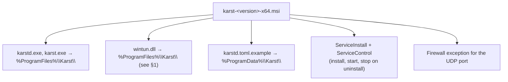

# Windows client

**PLAN.md §9 · W2–W9 · Rust 3.**

The longest of the three client ports and the one with an unresolved licensing
question at the front of it. Start W1 with §1, not with code.

## 1. The Wintun license question — resolve before writing a line

> **Re-baselined 2026-08-27.** There is no Karst Windows client datapath,
> service, installer, key store, or NRPT integration. Existing `server/client`
> Windows installer assets belong to the inherited NetBird client and must not
> be counted as a Karst implementation. PLAN.md at the time scheduled this
> work in Phase 8, not as a Phase 5 exit dependency.
>
> **Superseded 2026-09-04.** Pulled forward into Phase 6 as a firm requirement
> before public beta opens — see
> [phase-6/10-windows-client.md](../phase-6/10-windows-client.md) for the
> current status, schedule, and risk framing, and PLAN.md §9/§10 for the
> updated plan of record. §§1-9 below are unchanged and still the
> implementation reference; only the phase and schedule sections (§10-§11)
> are superseded.

PLAN.md §9 says "Wintun, Windows service, MSI, WinTUN driver signing". Wintun
is WireGuard's userspace-facing TUN driver for Windows, distributed as a signed
DLL with the driver embedded, and **it is GPL-licensed**.

That matters here more than it would in most projects. ADR-0007 chose
`MIT OR Apache-2.0` for the Rust tree specifically to keep GPLv2 kernel-datapath
and iOS App Store options open, and `deny.toml` exists as a CI gate rather than
a review convention precisely because "a GPL dependency reaching the MIT/Apache
crates would compromise both".

The distinction that probably saves it: `deny.toml` gates *Cargo dependencies*,
and Wintun would not be one. The DLL is loaded at runtime through
`LoadLibrary`, ships as a separate file next to `karstd.exe`, and is not
linked, statically or otherwise. That is the arrangement other permissively
licensed VPN clients ship on Windows, and it is a defensible reading of mere
aggregation.

**It is still a lawyer's call and not an engineer's.** Actions for W1:

1. Read Wintun's license text as shipped, not as remembered.
2. Get a written answer on distributing the unmodified DLL alongside an
   MIT/Apache binary in one MSI.
3. Record the answer as **ADR-0015, "Windows TUN provider"**, because this is
   exactly the class of decision ADR-0007 exists to make legible.

If the answer is no, the alternatives are all bad: write and sign a WFP callout
or NDIS filter driver (a quarter of work plus WHQL), or ship Windows in
userspace mode only (ADR-0012's stack works on Windows, needs no driver, and
gives up kernel routing — an honest fallback that would let the exit criterion
be met while the real answer lands in Phase 6). **Have the fallback decided
before W2 rather than discovered in W6.**

## 2. Good news: there is no driver to sign

PLAN.md §12 carries "Windows driver signing" as a risk with a Phase 3
mitigation that did not happen. **Using Wintun, we do not sign a driver.** The
DLL ships with WireGuard's own WHQL-signed driver embedded; we distribute it
unmodified.

What we do need is an ordinary code-signing certificate for `karstd.exe`,
`karst.exe`, and the MSI. That is a materially smaller problem than an EV
driver-signing arrangement with a hardware token and a Partner Center account,
and the risk register should be corrected to say so — see §8.

## 3. The device

New `crates/karst-tun/src/windows.rs`. The integration point already exists:
`bins/karstd/src/run.rs:77` has a `Device` enum dispatching `recv_segments`
between `Tun` and `Userspace`, read from a dedicated blocking thread
(`run.rs:386`). Wintun becomes a third arm with the same shape.

Wintun's I/O model is not a file descriptor:

- `WintunCreateAdapter` / `WintunOpenAdapter`, then `WintunStartSession` with a
  ring capacity (a power of two, 128 KiB–64 MiB; 4 MiB is a sane default).
- Receive: `WintunReceivePacket` returns a pointer into the ring, or `NULL`
  with `ERROR_NO_MORE_ITEMS`; then `WaitForSingleObject` on the handle from
  `WintunGetReadWaitEvent`. Release with `WintunReleaseReceivePacket`.
- Send: `WintunAllocateSendPacket`, copy in, `WintunSendPacket`.

So the blocking-read thread maps cleanly, and the shutdown path does not:
there is no fd to close to wake the thread. Use a second event and
`WaitForMultipleObjects` so the shutdown signal is a first-class wake reason.
A daemon that cannot stop without being killed is a service that fails its
uninstall, and the uninstall is part of the exit criterion.

No AF-family prefix (unlike macOS) and no offload. Packets are bare IP, which
is what the datapath wants.

**Unsafe policy.** `sys.rs`'s discipline transfers: one module carrying the
`allow`, one thin total wrapper per FFI call, each with its safety argument
written out. Use `windows-sys` (MIT OR Apache-2.0) for the Win32 declarations
rather than hand-declaring them — the ABI surface here is much larger than
Linux's handful of `ioctl` codes, and hand-rolled struct layouts are how a
memory-safety bug gets in.

## 4. Addressing and routing

The IP Helper API: `CreateUnicastIpAddressEntry`, `CreateIpForwardEntry2`,
`SetInterfaceDnsSettings`. All available through `windows-sys`.

Unlike macOS ([06](06-macos-client.md) §2), do **not** shell out to `netsh`
here. On Windows the API is well-documented, stable, and directly callable,
while `netsh` output parsing is locale-dependent — it returns localised text on
a non-English install, and a self-hoster in Germany is not a hypothetical.

Set the interface metric low enough that mesh routes win, and set
`SkipAsSource` on the tunnel address so Windows does not pick it as the source
for off-mesh traffic.

## 5. Service

`karstd.exe` registers with the Service Control Manager and runs as
`LocalSystem`. Use the `windows-service` crate (MIT/Apache) for the dispatcher
boilerplate rather than writing the `ServiceMain` state machine.

- Config: `%ProgramData%\Karst\karstd.toml`. **Set the ACL explicitly at
  install time** — `%ProgramData%` is world-readable by default and the config
  references key material paths.
- Keys and the netmap cache: `%ProgramData%\Karst\state\`, Administrators and
  SYSTEM only. The netmap cache holds per-pair PSKs; `.gitignore` blocks
  `netmap-cache*` for a reason and the same care applies on disk at runtime.
- Logs: `%ProgramData%\Karst\logs\`, rotated. The Windows Event Log gets
  start, stop, and fatal errors only — an operator looks there first, and it
  is not where a packet log belongs.
- Handle `SERVICE_CONTROL_STOP`, `SERVICE_CONTROL_SHUTDOWN`, and
  `SERVICE_CONTROL_POWEREVENT` (resume from suspend → force endpoint
  rediscovery, same requirement as macOS).

## 6. DNS via NRPT

The Name Resolution Policy Table is the correct mechanism and it is a registry
write:

```
HKLM\SOFTWARE\Policies\Microsoft\Windows NT\DNSClient\DnsPolicyConfig\{GUID}
    Name              = ".aquifer.karst."     (REG_MULTI_SZ, leading dot = suffix)
    GenericDNSServers = "100.100.100.100"
    ConfigOptions     = 0x8                   (DNS servers specified)
    Version           = 1
```

One rule per domain: the mesh zone plus each split-DNS route. Then notify the
DNS client so the change takes effect without a reboot
(`DnsFlushResolverCache`, and a group-policy refresh notification).

Write the rules under a GUID we generate and record, so revert is an exact
delete of our own keys rather than a scan-and-guess. Persist the rule GUIDs to
the revert file **before** writing them, per [01](01-karstdns.md) §7.1 — a
crash between "wrote the NRPT rule" and "recorded that we wrote it" leaves a
machine whose DNS points at a resolver that is not running, and on Windows that
survives a reboot.

Also set per-interface DNS on the tunnel adapter via
`SetInterfaceDnsSettings`, because some resolvers and some applications bypass
NRPT.

**Test on a domain-joined machine if at all possible.** Group Policy also
writes NRPT rules, and the interaction between a GPO-managed table and ours is
the kind of thing that only shows up in an enterprise and always shows up in an
enterprise.

## 7. MSI

WiX (v4 or v5) producing a single per-machine MSI:



Requirements that are easy to miss and expensive to add later:

- **Upgrade codes and versioned components**, so v2 upgrades v1 instead of
  installing beside it.
- **Uninstall must remove the NRPT rules and the adapter**, not just the
  files. Test uninstall as carefully as install; a VPN client that leaves a
  broken resolver behind after removal is the worst possible last impression.
- **Do not delete `%ProgramData%\Karst\state\` on uninstall** without asking —
  it contains the node key. Prompt, or leave it and say so.
- ARM64 is out of scope for Phase 5. Say so in the docs; Windows on ARM users
  will otherwise file the issue.

## 8. Signing — start in W1

Since mid-2023 every OV and EV code-signing certificate must have its private
key on FIPS-140-2 hardware, which means either a shipped USB token or a cloud
signing service.

| Option | Lead time | Notes |
|---|---|---|
| **Azure Trusted Signing** | Days, if the org qualifies | Cheapest and CI-friendliest. Requires a verified organization with three years of history — check this in W1, it is a hard gate |
| OV certificate on a hardware token | 1–3 weeks | Token ships physically. Awkward in CI; needs a self-hosted signing runner or a manual release step |
| EV certificate | 2–6 weeks | Immediate SmartScreen reputation, which OV has to earn over weeks of downloads |

**Check the Azure Trusted Signing eligibility in W1 and fall back to EV if the
organization is too young.** SmartScreen matters for this project's audience:
an unsigned or reputation-less installer shows "Windows protected your PC" to
exactly the non-expert admin the exit criterion is about.

Sign `karstd.exe`, `karst.exe`, and the MSI, with a timestamp, and verify with
`signtool verify /pa /v` on a machine that has not seen the artifact.

## 9. Testing

| Level | What | Where |
|---|---|---|
| Unit | Ring accounting, packet framing, NRPT rule encode/decode, revert-file round trip | `crates/karst-tun/src/windows.rs`; runs on any Windows runner |
| Integration | Create a real adapter, assign an address, send and receive | `windows-latest` GitHub runner — runners are administrators, so this works |
| Loopback | Two `karstd` instances, two adapters, one machine, TCP under an ACL | `bins/karstd/tests/windows_pair.rs`, the counterpart to `two_nodes.rs` |
| Cross-platform | Windows ↔ Linux over a real NAT | `scripts/two-host-test.sh`, extended. **The seam already exists**: the macOS work gave it a `uname -s` probe per host and a branch per differing command, so Windows is a third case rather than a rewrite — see [06](06-macos-client.md) §8 for what macOS needed and why the dangerous differences were the flags that exist on both systems and mean different things. Expect the Windows list to be longer and blunter, since the target is a shell under MSYS/Git-Bash or an `ssh` to PowerShell and neither spells `ping`, `route` or process listing the way either Unix does |
| Manual | Install, upgrade, uninstall, SmartScreen, domain-joined NRPT, sleep/wake | W9–W10 walkthrough |

Add a `windows` job to CI for the unit and integration tiers on every push;
signing on tags only.

## 10. Historical Phase 5 schedule (superseded — see [phase-6/10-windows-client.md](../phase-6/10-windows-client.md) §2 for the current one)

| Week | Work |
|---|---|
| W1 | Wintun license answer, ADR-0015, signing-certificate route decided |
| W2 | `windows.rs`: adapter, session, ring I/O, shutdown event |
| W3 | Addressing, routes, IP Helper; `local_addresses`, `default_gateway` |
| W4 | `karstd` runs end to end on Windows; loopback pair test |
| W5 | Service: SCM, lifecycle, power events, ACLs, Event Log |
| W6 | NRPT, per-interface DNS, revert, domain-joined testing |
| W7 | MSI: install, service, firewall, upgrade codes |
| W8 | Uninstall correctness, upgrade path, CI job |
| W9 | Signing, SmartScreen check, clean-machine verification |

Windows runs one week longer than macOS. It is the port with the licensing
question, the unfamiliar I/O model, and the fussiest installer, and pretending
it fits in the same seven weeks would just move the slip to W10 where it
collides with the walkthrough.

## 11. Exit criteria (now Phase 6's beta gate, unchanged — see [phase-6/10-windows-client.md](../phase-6/10-windows-client.md) §2.3)

1. A signed MSI installs on a clean Windows 11 machine with no SmartScreen
   block, and the service starts on boot.
2. The node enrolls from the console's auth key and reaches a peer across a NAT.
3. Mesh names resolve through NRPT; a split-DNS route resolves internally.
4. Uninstall removes the service, the adapter, the firewall rule, and every
   NRPT rule, and leaves DNS working.
5. `SIGKILL`-equivalent (`taskkill /F`) followed by a reboot leaves DNS
   working, from the revert file.
6. Upgrading from the previous MSI replaces rather than duplicates.
