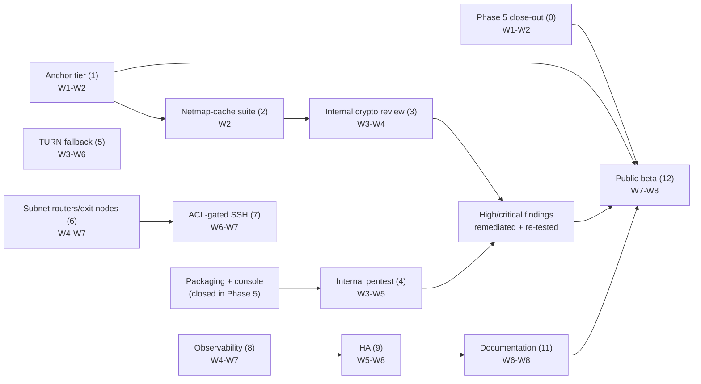

# Phase 6 — Hardening and beta

**8 weeks · W1 = week of 2026-09-07 · W8 = week of 2026-10-26.**
Anchored on Phase 5's actual 2026-09-02 close, not on the original Dec 2026
schedule — see PLAN.md §10's Phase 5 entry and
[phase-5/00-overview.md](../phase-5/00-overview.md) for why the anchor moved.

This file is written the way [phase-5/00-overview.md](../phase-5/00-overview.md)
was: a re-baseline against what is actually in the tree, not a restatement of
PLAN.md §10's seven-bullet Phase 6 block. Where the two disagree, PLAN.md is
the plan of record and this is the draft; where either disagrees with the
tree, the tree is right.

## 0. Carried from Phase 5 — close these first, not as background work

Three items were red at Phase 5's gate and moved here in writing, per
[phase-5/09-exit-criteria.md](../phase-5/09-exit-criteria.md) §6 and PLAN.md's
Phase 5 entry. None of them are Phase 6 scope on paper — they are Phase 5's
unfinished business, carried forward rather than dropped, and they come
before anything below.

1. ~~**Deprovisioning timing (GitHub issues [#72](https://github.com/karst-net/karst/issues/72) and [#73](https://github.com/karst-net/karst/issues/73)).**~~ **Closed 2026-09-02, W1,
   ahead of the W1–W2 budget below** — the persistent-connection lifecycle,
   push/response discriminator, server-side subscription, and `testserver`
   wiring all landed together rather than being staffed and re-estimated
   separately as this item originally called for.
   `a_revoked_peer_loses_its_session_inside_the_deprovisioning_budget` now
   measures 2.0 s, against the 48.9 s this item opened with and reliably under
   the 30 s CI gate — [phase-5/08-scim-and-groups.md](../phase-5/08-scim-and-groups.md)
   §2 and GitHub issues [#72](https://github.com/karst-net/karst/issues/72) and [#73](https://github.com/karst-net/karst/issues/73) have the full account, including one bug the fix
   itself introduced and caught before landing (a held connection's `node_id`
   going stale) and one pre-existing gap it exposed (any `handler.Handle`
   error ending the whole session, harmless under the old one-shot-connection
   model and not under this one). **Not closed by this item:** GitHub issue [#75](https://github.com/karst-net/karst/issues/75),
   opened deliberately rather than folded in — the push fan-out still computes
   a `SyncResponse` a Karst node discards, and fixing that means a forked-code
   decision this item's scope did not call for.
2. **The outsider-run walkthrough.** Has not happened at all. CI's
   `getting-started-walkthrough.sh` runs the published docs mechanically and
   is a regression guard; it is not the unaided, unaccompanied, no-repo-access
   run [phase-5/09-exit-criteria.md](../phase-5/09-exit-criteria.md) §3
   specifies. Run it against the tree as it stands, timeboxed at 30 minutes to
   first node connected per §3's rules. **W1.** Every deviation is a numbered
   GitHub issue, following the same discipline as the rest of the record. Do not let
   this slip behind item 1 — it needs a person, not an engineer, and can run
   in parallel.
3. **`scripts/release-manifest.sh` is wired to nothing.** The portal's
   download page reads it; nothing populates it, so self-hosters following the
   published docs have no artifacts to link to. Small, and blocks the
   walkthrough from completing cleanly if item 2 runs before this is fixed —
   sequence it first if item 2's runner reaches the download step. **W1.**

Container-image signing is *not* on this list — it closed 2026-08-30 with
real evidence (`v0.0.0-signing-test.1`: digest, signature, and a passing
`cosign verify` against the exact workflow/tag/OIDC-issuer identity for all
three images). Do not re-open it here.

## 1. Re-baseline — what Phase 6's seven PLAN.md bullets actually meet in the tree

PLAN.md §10's Phase 6 block was written assuming Phase 5's product surfaces
would exist and named seven workstreams against them. Checked against the
tree at Phase 5's close:

| Workstream | PLAN.md says | What's actually there |
|---|---|---|
| Capability-scoped anchor tier | New wire-format work, ADR-0016 | **Design-complete, zero implementation.** ADR-0016 is Proposed, not built in either language. Two verifier gaps GitHub issue [#61](https://github.com/karst-net/karst/issues/61) flagged as "should not wait" — `anchor` entry `audit_seq` monotonicity and wiring `VerifyAnchored` into the audit status endpoint — were recommended *for Phase 5* and did not happen: `verify.go:287` still assigns `st.Anchor = a` unconditionally, and `VerifyAnchored` (`bedrock/anchor.go:149`) has no caller outside its own file. Both are now first-week Phase 6 work, not carryover — they were never scheduled elsewhere. |
| Internal cryptographic review | Self-review against spec/models/vectors | **Nothing formal started.** The material to review against is real (Verifpal + 9 ProVerif models in CI, `spec/vectors/`, `kani` on the reassembler), but no review pass, checklist, or writeup exists yet. |
| Internal penetration test | Against a deployment from published artifacts | **Nothing started.** Deliberately deferred until packaging (closed 2026-08-28) and the console (closed in Phase 5) both existed — they now do, so there is a real target to test against for the first time. |
| TURN fallback | Client alloc/permissions/channel binding, server credential minting, coturn in the matrix | **Zero code.** `grep -rl TURN\|coturn` across `crates/`, `bins/`, `server/` returns nothing but planning docs. Fully greenfield, exactly as ADR-0008 reserved it. |
| Subnet routers, exit nodes, advertised routes, ACL-gated SSH | New product surface | **Half-inherited.** NetBird's fork surface already carries generic route/firewall plumbing (`server/route/route.go`, `routes_handler.go`, `firewall_rule.go`, `networkmap_components_correctness_test.go`) — but as [phase-5/00-overview.md](../phase-5/00-overview.md) §0 already ruled, *generic prefix routing is not a managed exit-node feature*. Gateway selection, default-route consent, forwarding, and ACL/node-attribute permissions are unbuilt on top of it. The `"ssh"` HuJSON block is still a parsed no-op (`karst-control-v1.md`'s schema note), unenforced anywhere. |
| Observability | Prometheus, OTel traces, diagnostics bundle, `karst bugreport` | **Partially inherited, partially real, partially absent.** The control server already exports Prometheus-style metrics inherited from NetBird — eleven `*_metrics.go` files (`grpc_metrics`, `store_metrics`, `http_api_metrics`, `updatechannel_metrics`, `idp_metrics`, `accountmanager_metrics`, `ephemeral_metrics`, `app_metrics`, plus the reverseproxy and wsproxy managers' own). None of it is Karst-object-aware — no Bedrock chain depth, no PSK epoch age, no relay-registry size, no netmap-push latency (the very thing item 0.1 needs a number for). `opentelemetry` is in `server/go.mod` but `grep -rn "otel.Tracer\|StartSpan"` finds zero call sites — there are no traces, only the inherited metrics. `karst bugreport` is real and already exercised (it's the vehicle for the PSK leak-scan in Phase 3/4's exit criterion), but scoped narrowly to secret-leak auditing — Phase 6's "per-node diagnostics bundle" is a broader ask than what exists. |
| HA | Control-server horizontal scaling, Postgres replication, backup/restore, tested RTO/RPO | **The easy 10% is done, the hard 90% is not.** `gorm.io/driver/postgres` is already wired as a single-instance store option (`NewPostgresqlStoreFromSqlStore` exists and is tested), so Postgres itself is not new. Replication, horizontal scaling of `karst-control` itself, backup/restore runbooks, and any DR drill are all unbuilt — `deploy/compose/` has no Postgres service today. |
| Documentation | Install guide, ops manual, security whitepaper, migration guide | **Unbuilt.** `docs/` holds `GETTING-STARTED.md`, `THREAT-MODEL.md`, and `USE-CASE-ANALYSIS.md`. None of the four Phase 6 docs exist as separate artifacts; the closest thing to an ops manual is scattered across `deploy/compose/README.md` and the `justfile`. |

**One thing PLAN.md's own §10 Phase 6 bullets omit and its §9 platform table
commits to:** FreeBSD `tun` support is scheduled "6 (best-effort)" in §9's
platform table but does not appear anywhere in §10's Phase 6 bullet list.
That is a real gap between two sections of the plan of record, not something
this file is introducing — see §2 below, which adds it as a bounded,
explicitly best-effort line rather than leaving it to be noticed in W8.

## 2. Workstreams and weeks

| # | Workstream | Scope | Owner role | Weeks |
|---|---|---|---|---|
| 0 | Phase 5 close-out | §0 above: netmap push, outsider walkthrough, release-manifest | Go 2, SRE, an outside runner | W1–W2 |
| 1 | Capability-scoped anchor tier | ADR-0016's wire format in both languages: `karst-bedrock-v1 anchor` context string and key kind, the optional trailing block in `genesis`/`authority-list`, the concatenated signer-index space, regenerated `spec/vectors/bedrock-v1.json` including rejected cases, `karst-bedrock` support for the new key kind, the scheduler giving `AnchorDue` a caller. Plus the two verifier gaps from §1's table: `audit_seq` monotonicity and `VerifyAnchored` wired into the audit status endpoint | Crypto + Go 1 | W1–W2 |
| 2 | Netmap-cache suite mechanism | GitHub issue [#58](https://github.com/karst-net/karst/issues/58)'s one remaining gap: the encrypted netmap cache hardcodes ChaCha20-Poly1305 and ML-KEM-768 with **no suite mechanism at all** — unlike the data plane (done) and the control channel (dispatch mechanism landed via ADR-0015 item 4). Sequence with #1: both are flag days for existing deployments, and two flag days cost more than one | Rust 1 | W2 |
| 3 | Internal cryptographic review | Structured self-review of PHREATIC against `spec/phreatic-v1.md`, the Verifpal/ProVerif models, and the vector suite, written up with the [GitHub issue tracker](https://github.com/karst-net/karst/issues?q=is%3Aissue)'s existing discipline. Must start *after* #1 and #2 land — reviewing before the newest signing tier and the newest suite dispatch exist means reviewing a system that will have changed under the review. **Started 2026-09-02, first pass done, all seven findings and §14 item 10 closed** — [`phreatic-review-findings.md`](../../phreatic-review-findings.md). §9.1's cookie mechanism (GitHub issue [#76](https://github.com/karst-net/karst/issues/76)): `Engine` holds a rotating `CookieSecret`, checks `mac2` when `mac1` fails, and answers an over-threshold fragment with a real `CookieReply`; spec gap filled at §13.10; covered end to end in `bins/karstd/tests/cookie.rs`. The formal models' suite `0x0002` gap (GitHub issue [#78](https://github.com/karst-net/karst/issues/78)), both tools: `spec/models/phreatic-nodh.vp` (6/6, Verifpal) and `spec/models/phreatic-nodh.pv` (4/4, ProVerif 2.05 — installed locally via `opam` to actually run it, cross-checked against `phreatic.pv`'s documented result first), both wired into `just verify` and CI. §7.3's PSK epoch grace period (GitHub issue [#77](https://github.com/karst-net/karst/issues/77)): the wire format and Go server already carried `psk_previous` — the gap was `config.rs` dropping it at the netmap→roster boundary and `engine.rs` discarding the offered epoch; both fixed, with a `peer_public_at_epoch` helper enforcing accept-n-or-n-1-reject-else, and new coverage for a *fresh* handshake landing during a genuine epoch disagreement (the established-session-survives-a-rearm case was already covered, this scenario was not). `karst-crypto` primitive-level reading (GitHub issue [#79](https://github.com/karst-net/karst/issues/79)): `ml-kem`, `ml-dsa`, `x25519-dalek` and `aes` each gate their own zeroize-on-drop behind a Cargo feature nothing in the graph had turned on — every KEM/signing/DH secret and every live `TransportSession`'s AEAD key schedule was being freed unzeroized; fixed in `Cargo.toml` alone, with compile-time `needs_drop`/`ZeroizeOnDrop` assertions guarding against regression. §14 item 10's adversarial reading of §13.8 (GitHub issue [#81](https://github.com/karst-net/karst/issues/81), Finding 6): confirmed the removal is sound for `mac1` and the transport path, but found it wasn't for `mac2` — above `LOAD_THRESHOLD`, an eavesdropper who had observed one legitimate `mac2`'d fragment could force the exact ML-KEM decapsulation the cookie mechanism exists to gate, without learning the cookie itself. Fixed same-day: `HandshakeInit`/`HandshakeResponse` fragments now cover the payload in the MAC (spec §13.11), closing the gap; `CookieReply`/`TransportData` keep §13.8's original construction, since the CPU cost that motivated it was measured against the transport path, not the bounded 2-3-fragment handshake path. Found while grounding that review, and fixed same-day: `reassembly_id` was a sequential per-`Session` counter seeded at 0, not the CSPRNG draw §5 requires (GitHub issue [#80](https://github.com/karst-net/karst/issues/80), Finding 5) — every peer pair's first handshake attempt carried the same value fleet-wide, which combined with `mac1`'s already-documented forgeability enabled a spoofing-only, zero-observation DoS against a targeted pair's handshake. Now drawn from a per-call CSPRNG seed via `derive_reassembly_id`; `TransportData`'s own counter deliberately left alone (never reaches the reassembler's slot matching — always a single datagram). The constant-time/DH-call-site reading (GitHub issue [#82](https://github.com/karst-net/karst/issues/82), Finding 7): no timing side channel — `karst-crypto`'s AEAD/KEM wrappers delegate every secret comparison to `aes-gcm`/`ml-kem`, both already constant-time — but `x25519_dalek::SharedSecret::was_contributory()`, the crate's own constant-time check against a low-order DH public key forcing a predictable output, was never called at any of `karst-noise`'s six `diffie_hellman()` sites. Traced through the actual construction rather than assumed: five of the six legs turned out to already be covered by §13.4's full-header transcript binding against a network attacker (a substituted wire-carried ephemeral key already fails the handshake's own confirmatory AEAD tag for an unrelated reason), so the fix there is defense in depth; the sixth — a netmap-sourced peer static key, bound by no such transcript property — was a real gap. Fixed uniformly across all six call sites regardless. Remaining: item 9's rekey transition table | Crypto + a second reader (Rust 1, per §4) | W3–W4 |
| 4 | Internal penetration test | Control plane and console, against a deployment stood up from published `.deb`/`.rpm`/container artifacts — not a lab rig. First real chance to run this: packaging and the console both closed during Phase 5 | SRE + all | W3–W5 |
| 5 | TURN fallback | Client-side allocation, permissions, channel binding, credential refresh; control-server ephemeral credential minting; `coturn` added to the NAT matrix as a 14th topology. Arrives with the co-located relay path already automatic and lossless (thirteen `karstd` topologies), so this buys ADR-0008 interoperability, not connectivity | Rust 2 + Go 2 | W3–W6 |
| 6 | Subnet routers and exit nodes | Gateway selection, default-route consent, forwarding controls, ACL/node-attribute permissions — the product layer NetBird's inherited route/firewall plumbing (§1) does not provide. Console surface for route advertisement and gateway choice | Rust 1 + Go 1 + Frontend 1 | W4–W7 |
| 7 | ACL-gated SSH | Stop treating the `"ssh"` HuJSON block as a no-op: policy enforcement in the datapath/agent, and a console surface to author it | Go 2 | W6–W7 |
| 8 | Observability | Karst-object-aware Prometheus metrics (Bedrock chain depth, PSK epoch age, relay-registry size, netmap-push latency — closing the loop on #0's own measurement problem); OTel traces, which do not exist at all today; broaden `karst bugreport` from a leak-scan bundle into a general per-node diagnostics bundle | SRE + Rust 3 | W4–W7 |
| 9 | HA | Control-server horizontal scaling; Postgres replication (the driver exists, replication does not); backup/restore runbooks; a **tested** RTO/RPO, meaning an actual failover drill, not a document describing one | SRE | W5–W8 |
| 10 | FreeBSD, best-effort | `tun` device support only — no packaging, no installer commitment, matching §9's "(best-effort)" qualifier that §10's bullet list dropped. Cut first if the schedule is tight; it is the one item on this list with no exit-criterion dependency | Rust 3 | W7 (if capacity allows) |
| 11 | Documentation | Install guide, operations manual (this phase's HA runbooks feed it directly), security whitepaper (crypto lead signs off, per [phase-5/09-exit-criteria.md](../phase-5/09-exit-criteria.md) §7's deferred README rewrite), migration guide from WireGuard/Tailscale | All, SRE-owned | W6–W8 |
| 12 | Public beta with design partners | Opens once #3 and #4's high/critical findings are remediated and re-tested | SRE + all | W7–W8, 30-day stability bar runs past the phase boundary |

## 3. Dependency graph

Two hard ordering constraints, both already in PLAN.md and restated here
because they are the ones a compressed 8-week schedule is most likely to
violate under pressure:

1. **The anchor tier (#1) must land before the internal review (#3).**
   Reviewing PHREATIC before the newest Bedrock signing tier exists means the
   review's findings are stale the moment the tier ships. Sequence #2 (the
   netmap-cache suite mechanism) with #1 for the same reason the plan already
   gives: two flag days cost more than one, and nothing about them conflicts.
2. **The anchor tier (#1) must land before the public beta (#12) opens.**
   The first `authority-list` entry carrying anchor keys permanently excludes
   every node that has not upgraded — an append-only log has no way to
   retract it, and a later entry setting `s = 0` does not help a node that
   cannot parse what came before. The window between Phase 5's installers
   settling and this phase's beta opening is the cheapest this will ever be;
   after GA it is not affordable at all.

TURN (#5), subnet routing (#6→#7), and observability (#8→#9) are independent
of each other and of the crypto-review chain — they can run in parallel
across three different owner roles, which is why the staffing in §4 spreads
them that way rather than serializing.

## 4. Staffing against PLAN.md §10's team

§10 assumes 3 Rust, 2 Go, 2 frontend, 1 security/crypto, 1 SRE/release.

| Person | W1–W2 | W3–W5 | W6–W8 |
|---|---|---|---|
| Rust 1 | Anchor tier's Go-adjacent Rust half (#1) | Second reader on the internal crypto review (#3) | Subnet routers (#6) |
| Rust 2 | Available — pull forward TURN design | TURN fallback (#5) | TURN fallback (#5) |
| Rust 3 | Available | Observability instrumentation (#8) | FreeBSD `tun` (#10), if capacity allows; else observability (#8) continues |
| Crypto | Anchor tier (#1), netmap-cache suite (#2) | Internal cryptographic review (#3) | Security whitepaper sign-off (#11); review remediation |
| Go 1 | Anchor tier's server half (#1) | Subnet routers' server half (#6) | Subnet routers (#6) |
| Go 2 | Phase 5 close-out: the netmap push (#0.1) | Netmap push continued if #0.1's re-estimate ran long; else TURN's server credential minting (#5) | ACL-gated SSH (#7) |
| Frontend 1 | Available — console audit from Phase 5's read-only ranks 10–12 | Subnet routing console surface (#6) | ACL-gated SSH console surface (#7) |
| Frontend 2 | Available | Internal pentest support (#4) — the console is a named target | Documentation review, beta onboarding flow |
| SRE | Outsider walkthrough (#0.2), release-manifest (#0.3) | Internal pentest (#4), HA design (#9) | HA implementation (#9), documentation (#11), beta logistics (#12) |

**The crypto engineer is oversubscribed again, and the mitigation PLAN.md
already named is the one to take.** Phase 5's staffing table flagged this
exact risk and resolved it by pairing Rust 1 on Bedrock's node-side
enforcement from W5; PLAN.md's Phase 6 risk table independently proposes
"Phase 6's internal review takes Bedrock as its second subject after
PHREATIC" with the same pairing. Both point at Rust 1 as the second reader
for §2's internal crypto review — that is now written into the table above
rather than left as a risk to rediscover.

## 5. Risks specific to this phase

| Risk | Likelihood | Impact | Mitigation |
|---|---|---|---|
| Deprovisioning fix (#0.1) re-estimate runs past W2 | Medium | Medium — delays nothing downstream directly, but it is the one Phase-5 gate item with teeth | Go 2 is dedicated to it alone through W2; do not pull them onto TURN until it closes or is re-estimated with a real number |
| Crypto engineer single-reader risk carries into Phase 6 | Medium | **High** — a flaw in a fail-closed path (the anchor tier is the newest one) | Rust 1 pairs from W1 on the anchor tier and again as second reader on the internal review (§4) |
| ADR-0016 flag-day ships before every node can parse it | Low if sequenced per §3, **High** if the beta opens early | **High** — permanently excludes unupgraded nodes from an append-only log | Hold the line in §3's ordering constraint 2; do not let TURN or subnet-routing schedule pressure move the beta date ahead of the anchor tier |
| TURN interoperability testing needs a real `coturn` instance | Medium | Medium | Stand up `coturn` in CI's NAT matrix infrastructure in W3, not W6 — the same lesson Phase 5 learned from packaging: nothing found the packaging defects until something actually ran the install |
| HA's RTO/RPO becomes a document instead of a drill | Medium | Medium — an untested DR runbook is a false sense of safety | The exit line for #9 is "tested", not "documented"; schedule an actual failover in W8, not a writeup of one |
| Console frontend capacity: 2 engineers, 2 new surfaces (#6, #7) plus pentest support (#4) plus beta onboarding | Medium | Medium | Same lesson as Phase 5's eleven-view ranking — rank subnet-routing and SSH console surfaces now, and be willing to ship one of them CLI/API-only for the beta if W6–W7 is tight |
| Public beta needs design partners actually lined up | Medium | Medium — a beta with no participants is not a beta | Start recruiting in W1, not W7; this is the same lead-time lesson PLAN.md already learned twice from the external crypto reviewer booking |

## 6. What this phase does not do

Recording these now so they are decisions rather than omissions found in W8,
matching Phase 5's own §6:

- **No external cryptographic review or penetration test.** Both are Phase 8,
  after GA. This phase's review and pentest are internal and must not be
  reported as substitutes — PLAN.md §12 already raises this risk and Phase 5's
  README rewrite (deferred, [phase-5/09-exit-criteria.md](../phase-5/09-exit-criteria.md)
  §7) will need to keep saying so.
- **No mobile.** Phase 7.
- **No Windows.** Phase 8; [phase-5/07-windows-client.md](../phase-5/07-windows-client.md)
  is the handoff plan and this phase does not touch it.
- **No datapath sharding, no ≥ 1 Gbps absolute measurement.** Phase 7.
- **No CNSA 2.0 profile as a selectable suite (`KARST_3`/suite 3).** Phase 7,
  per PLAN.md §13 Q6. This phase's crypto work (#1, #2) closes gaps in suites
  that already exist; it does not add a new one.
- **FreeBSD gets `tun` only, best-effort, no installer.** §2 item 10. Full
  platform parity is not a Phase 6 claim.

## 7. Exit criteria — draft

- All three carried-forward items in §0 closed: deprovisioning measured
  reliably under 30 s in CI, one outsider walkthrough completed with its
  findings recorded, `release-manifest.sh` populated.
- ADR-0016 implemented in both languages against shared vectors; the two
  verifier gaps (`audit_seq` monotonicity, `VerifyAnchored` wiring) closed.
- Internal cryptographic review and internal penetration test complete, with
  every high/critical finding remediated and re-tested — not merely filed.
- TURN interoperates with a real `coturn` instance in the NAT matrix.
- Subnet routers and exit nodes: an admin can advertise a route, a client can
  consent to a default route, and an ACL can gate both — from the console.
- ACL-gated SSH: the `"ssh"` block is enforced, not parsed and ignored.
- HA: a documented backup/restore runbook exists **and has been exercised**;
  an RTO/RPO figure is reported from that exercise, not asserted.
- Install guide, operations manual, security whitepaper (crypto lead signed
  off), and migration guide all published.
- 30 days of public beta with design partners, against a stated stability bar,
  with no unremediated high/critical finding open at the end of it.
- The README status line — deferred at Phase 5's close pending exactly these
  items — gets its rewrite, with the crypto lead signing off on the wording.
