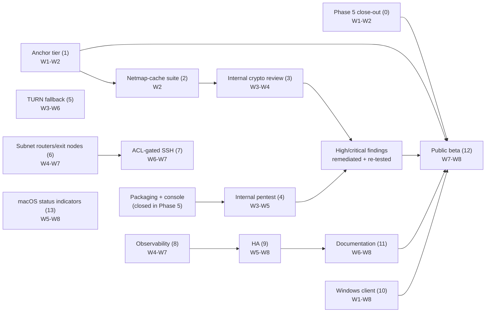

# Phase 6 — Hardening and beta

**8 weeks.**
Sequenced from Phase 5's actual close, not the original static schedule — see
PLAN.md §10's Phase 5 entry and
[phase-5/00-overview.md](../phase-5/00-overview.md) for why the anchor moved.

This file is written the way [phase-5/00-overview.md](../phase-5/00-overview.md)
was: a re-baseline against what is actually in the tree, not a restatement of
PLAN.md §10's seven-bullet Phase 6 block. Where the two disagree, PLAN.md is
the plan of record and this is the draft; where either disagrees with the
tree, the tree is right.

## 0. Carried from Phase 5 — close these first, not as background work

Three items were red at Phase 5's gate and moved here in writing, per
[phase-5/09-exit-criteria.md](../phase-5/09-exit-criteria.md) §6 and PLAN.md's
Phase 5 entry. None of them are Phase 6 scope on paper — they are Phase 5's
unfinished business, carried forward rather than dropped, and they come
before anything below.

1. ~~**Deprovisioning timing (GitHub issues [#72](https://github.com/karst-net/karst/issues/72) and [#73](https://github.com/karst-net/karst/issues/73)).**~~ **Closed 2026-09-02, W1,
   ahead of the W1–W2 budget below** — the persistent-connection lifecycle,
   push/response discriminator, server-side subscription, and `testserver`
   wiring all landed together rather than being staffed and re-estimated
   separately as this item originally called for.
   `a_revoked_peer_loses_its_session_inside_the_deprovisioning_budget` now
   measures 2.0 s, against the 48.9 s this item opened with and reliably under
   the 30 s CI gate — [phase-5/08-scim-and-groups.md](../phase-5/08-scim-and-groups.md)
   §2 and GitHub issues [#72](https://github.com/karst-net/karst/issues/72) and [#73](https://github.com/karst-net/karst/issues/73) have the full account, including one bug the fix
   itself introduced and caught before landing (a held connection's `node_id`
   going stale) and one pre-existing gap it exposed (any `handler.Handle`
   error ending the whole session, harmless under the old one-shot-connection
   model and not under this one). **Not closed by this item:** GitHub issue [#75](https://github.com/karst-net/karst/issues/75),
   opened deliberately rather than folded in — the push fan-out still computes
   a `SyncResponse` a Karst node discards, and fixing that means a forked-code
   decision this item's scope did not call for.
2. **The outsider-run walkthrough.** Has not happened at all. CI's
   `getting-started-walkthrough.sh` runs the published docs mechanically and
   is a regression guard; it is not the unaided, unaccompanied, no-repo-access
   run [phase-5/09-exit-criteria.md](../phase-5/09-exit-criteria.md) §3
   specifies. Run it against the tree as it stands, timeboxed at 30 minutes to
   first node connected per §3's rules. **W1.** Every deviation is a numbered
   GitHub issue, following the same discipline as the rest of the record. Do not let
   this slip behind item 1 — it needs a person, not an engineer, and can run
   in parallel.
3. **`scripts/release-manifest.sh` is wired to nothing.** The portal's
   download page reads it; nothing populates it, so self-hosters following the
   published docs have no artifacts to link to. Small, and blocks the
   walkthrough from completing cleanly if item 2 runs before this is fixed —
   sequence it first if item 2's runner reaches the download step. **W1.**

Container-image signing is *not* on this list — it closed 2026-08-30 with
real evidence (`v0.0.0-signing-test.1`: digest, signature, and a passing
`cosign verify` against the exact workflow/tag/OIDC-issuer identity for all
three images). Do not re-open it here.

## 1. Re-baseline — what Phase 6's seven PLAN.md bullets actually meet in the tree

PLAN.md §10's Phase 6 block was written assuming Phase 5's product surfaces
would exist and named seven workstreams against them. Checked against the
tree at Phase 5's close:

| Workstream | PLAN.md says | What's actually there |
|---|---|---|
| Capability-scoped anchor tier | New wire-format work, ADR-0016 | **Done, W1.** Landed whole in `fdb81ab` (2026-09-02), ahead of this table's original read of the tree. ADR-0016 is now `Accepted and fully implemented`, both languages, against shared vectors including rejected cases; the scheduler has `AnchorDue`→`PrepareAnchor`→sign→import wired to `KARST_BEDROCK_ANCHOR_KEY_FILE`; the two verifier gaps GitHub issue [#61](https://github.com/karst-net/karst/issues/61) (closed) flagged are both closed — `verify.go` now enforces `audit_seq` monotonicity, and `VerifyAnchored` has a real caller at `api/nodes.go:1796`, surfaced as `contradicts_anchor` through to the console's audit view. `go test ./management/internals/karst/bedrock/...` and `cargo test -p karst-bedrock` both pass. |
| Internal cryptographic review | Self-review against spec/models/vectors | **Nothing formal started.** The material to review against is real (Verifpal + 9 ProVerif models in CI, `spec/vectors/`, `kani` on the reassembler), but no review pass, checklist, or writeup exists yet. |
| Internal penetration test | Against a deployment from published artifacts | **Done.** Not a lab rig — a deployment stood up from published, cosign-verified artifacts (tag `v0.0.0-pentest.1`), with `turing`/`lovelace` enrolled as real nodes and a real browser click-through from outside the LAN — [`04-pentest.md`](04-pentest.md). Five findings: [#84](https://github.com/karst-net/karst/issues/84) (console had no OIDC/session login at all) and [#87](https://github.com/karst-net/karst/issues/87) (a cloned node identity ran a fully accepted parallel session, undetected) fixed and closed, #87 re-verified live; [#85](https://github.com/karst-net/karst/issues/85), [#86](https://github.com/karst-net/karst/issues/86), [#88](https://github.com/karst-net/karst/issues/88) remain open as non-blocking hardening/documentation follow-ups. |
| TURN fallback | Client alloc/permissions/channel binding, server credential minting, coturn in the matrix | **Zero code.** `grep -rl TURN\|coturn` across `crates/`, `bins/`, `server/` returns nothing but planning docs. Fully greenfield, exactly as ADR-0008 reserved it. |
| Subnet routers, exit nodes, advertised routes, ACL-gated SSH | New product surface | **Half-inherited.** NetBird's fork surface already carries generic route/firewall plumbing (`server/route/route.go`, `routes_handler.go`, `firewall_rule.go`, `networkmap_components_correctness_test.go`) — but as [phase-5/00-overview.md](../phase-5/00-overview.md) §0 already ruled, *generic prefix routing is not a managed exit-node feature*. Gateway selection, default-route consent, forwarding, and ACL/node-attribute permissions are unbuilt on top of it. The `"ssh"` HuJSON block is not merely unenforced — `policy.go`'s `Document.Parse` decodes with `DisallowUnknownFields`, so a document containing an `"ssh"` key is rejected outright (a `400`, not silent acceptance). [Corrected 2026-09-04](07-acl-gated-ssh.md#1-what-already-exists-and-one-correction-to-the-overview) from an earlier "parsed no-op" reading; either way it is unenforced. |
| Observability | Prometheus, OTel traces, diagnostics bundle, `karst bugreport` | **Partially inherited, partially real, partially absent.** The control server already exports Prometheus-style metrics inherited from NetBird — eleven `*_metrics.go` files (`grpc_metrics`, `store_metrics`, `http_api_metrics`, `updatechannel_metrics`, `idp_metrics`, `accountmanager_metrics`, `ephemeral_metrics`, `app_metrics`, plus the reverseproxy and wsproxy managers' own). None of it is Karst-object-aware — no Bedrock chain depth, no PSK epoch age, no relay-registry size, no netmap-push latency (the very thing item 0.1 needs a number for). `opentelemetry` is in `server/go.mod` but `grep -rn "otel.Tracer\|StartSpan"` finds zero call sites — there are no traces, only the inherited metrics. `karst bugreport` is real and already exercised (it's the vehicle for the PSK leak-scan in Phase 3/4's exit criterion), but scoped narrowly to secret-leak auditing — Phase 6's "per-node diagnostics bundle" is a broader ask than what exists. |
| HA | Control-server horizontal scaling, Postgres replication, backup/restore, tested RTO/RPO | **The easy 10% is done, the hard 90% is not.** `gorm.io/driver/postgres` is already wired as a single-instance store option (`NewPostgresqlStoreFromSqlStore` exists and is tested), so Postgres itself is not new. Replication, horizontal scaling of `karst-control` itself, backup/restore runbooks, and any DR drill are all unbuilt — `deploy/compose/` has no Postgres service today. |
| Documentation | Install guide, ops manual, security whitepaper, migration guide | **Unbuilt.** `docs/` holds `GETTING-STARTED.md`, `THREAT-MODEL.md`, and `USE-CASE-ANALYSIS.md`. None of the four Phase 6 docs exist as separate artifacts; the closest thing to an ops manual is scattered across `deploy/compose/README.md` and the `justfile`. |

**Re-scoped 2026-09-04: Windows moves from Phase 8 into this phase as a firm
beta-blocking requirement, and FreeBSD's best-effort `tun` line is cut to make
room.** PLAN.md §9's platform table and §10's Phase 6/Phase 8 bullets are
updated to match (Windows: 8 → 6; FreeBSD: 6 (best-effort) → dropped,
unscheduled). [phase-5/07-windows-client.md](../phase-5/07-windows-client.md)
was written as a Phase 8 handoff carrying an unresolved Wintun/GPL licensing
question and its own 9-week estimate; folding that into an 8-week phase where
no engineer was previously dedicated to it is a real compression, not a
formality — see [10-windows-client.md](10-windows-client.md) for what's
being pulled forward as-is versus reworked, and §5 below for the risk this
adds.

## 2. Workstreams and weeks

| # | Workstream | Scope | Owner role | Weeks |
|---|---|---|---|---|
| 0 | Phase 5 close-out | §0 above: netmap push, outsider walkthrough, release-manifest | Go 2, SRE, an outside runner | W1–W2 |
| 1 | Capability-scoped anchor tier | **Done, W1** (`fdb81ab`). ADR-0016's wire format in both languages: `karst-bedrock-v1 anchor` context string and key kind, the optional trailing block in `genesis`/`authority-list`, the concatenated signer-index space, regenerated `spec/vectors/bedrock-v1.json` including rejected cases, `karst-bedrock` support for the new key kind, the scheduler giving `AnchorDue` a caller. Plus the two verifier gaps from §1's table: `audit_seq` monotonicity and `VerifyAnchored` wired into the audit status endpoint — both closed | Crypto + Go 1 | W1–W2 |
| 2 | Netmap-cache suite mechanism | **Done, W1** (`4e4062b`, landed the same day Phase 6 opened). GitHub issue [#58](https://github.com/karst-net/karst/issues/58) (closed): the netmap cache now uses the shared AES-256-GCM implementation with an explicit versioned cipher-suite header, fail-closed on legacy unversioned caches and unknown suites. Tests cover suite selection, round trips, wrong keys, tampering, truncation, legacy-format rejection, unknown-suite rejection | Rust 1 | W2 |
| 3 | Internal cryptographic review | Structured self-review of PHREATIC against `spec/phreatic-v1.md`, the Verifpal/ProVerif models, and the vector suite, written up with the [GitHub issue tracker](https://github.com/karst-net/karst/issues?q=is%3Aissue)'s existing discipline. Must start *after* #1 and #2 land — reviewing before the newest signing tier and the newest suite dispatch exist means reviewing a system that will have changed under the review. **Started 2026-09-02, first pass complete: all eight findings closed, and every §14 item this pass could resolve on paper (5, 7, 9, 10)** — [`phreatic-review-findings.md`](../../phreatic-review-findings.md). §9.1's cookie mechanism (GitHub issue [#76](https://github.com/karst-net/karst/issues/76)): `Engine` holds a rotating `CookieSecret`, checks `mac2` when `mac1` fails, and answers an over-threshold fragment with a real `CookieReply`; spec gap filled at §13.10; covered end to end in `bins/karstd/tests/cookie.rs`. The formal models' suite `0x0002` gap (GitHub issue [#78](https://github.com/karst-net/karst/issues/78)), both tools: `spec/models/phreatic-nodh.vp` (6/6, Verifpal) and `spec/models/phreatic-nodh.pv` (4/4, ProVerif 2.05 — installed locally via `opam` to actually run it, cross-checked against `phreatic.pv`'s documented result first), both wired into `just verify` and CI. §7.3's PSK epoch grace period (GitHub issue [#77](https://github.com/karst-net/karst/issues/77)): the wire format and Go server already carried `psk_previous` — the gap was `config.rs` dropping it at the netmap→roster boundary and `engine.rs` discarding the offered epoch; both fixed, with a `peer_public_at_epoch` helper enforcing accept-n-or-n-1-reject-else, and new coverage for a *fresh* handshake landing during a genuine epoch disagreement (the established-session-survives-a-rearm case was already covered, this scenario was not). `karst-crypto` primitive-level reading (GitHub issue [#79](https://github.com/karst-net/karst/issues/79)): `ml-kem`, `ml-dsa`, `x25519-dalek` and `aes` each gate their own zeroize-on-drop behind a Cargo feature nothing in the graph had turned on — every KEM/signing/DH secret and every live `TransportSession`'s AEAD key schedule was being freed unzeroized; fixed in `Cargo.toml` alone, with compile-time `needs_drop`/`ZeroizeOnDrop` assertions guarding against regression. §14 item 10's adversarial reading of §13.8 (GitHub issue [#81](https://github.com/karst-net/karst/issues/81), Finding 6): confirmed the removal is sound for `mac1` and the transport path, but found it wasn't for `mac2` — above `LOAD_THRESHOLD`, an eavesdropper who had observed one legitimate `mac2`'d fragment could force the exact ML-KEM decapsulation the cookie mechanism exists to gate, without learning the cookie itself. Fixed same-day: `HandshakeInit`/`HandshakeResponse` fragments now cover the payload in the MAC (spec §13.11), closing the gap; `CookieReply`/`TransportData` keep §13.8's original construction, since the CPU cost that motivated it was measured against the transport path, not the bounded 2-3-fragment handshake path. Found while grounding that review, and fixed same-day: `reassembly_id` was a sequential per-`Session` counter seeded at 0, not the CSPRNG draw §5 requires (GitHub issue [#80](https://github.com/karst-net/karst/issues/80), Finding 5) — every peer pair's first handshake attempt carried the same value fleet-wide, which combined with `mac1`'s already-documented forgeability enabled a spoofing-only, zero-observation DoS against a targeted pair's handshake. Now drawn from a per-call CSPRNG seed via `derive_reassembly_id`; `TransportData`'s own counter deliberately left alone (never reaches the reassembler's slot matching — always a single datagram). The constant-time/DH-call-site reading (GitHub issue [#82](https://github.com/karst-net/karst/issues/82), Finding 7): no timing side channel — `karst-crypto`'s AEAD/KEM wrappers delegate every secret comparison to `aes-gcm`/`ml-kem`, both already constant-time — but `x25519_dalek::SharedSecret::was_contributory()`, the crate's own constant-time check against a low-order DH public key forcing a predictable output, was never called at any of `karst-noise`'s six `diffie_hellman()` sites. Traced through the actual construction rather than assumed: five of the six legs turned out to already be covered by §13.4's full-header transcript binding against a network attacker (a substituted wire-carried ephemeral key already fails the handshake's own confirmatory AEAD tag for an unrelated reason), so the fix there is defense in depth; the sixth — a netmap-sourced peer static key, bound by no such transcript property — was a real gap. Fixed uniformly across all six call sites regardless. §14 item 9's rekey/simultaneous-open transition table (GitHub issue [#83](https://github.com/karst-net/karst/issues/83), Finding 8): the pair kept both handshakes a simultaneous open produces (GitHub issue #39, landed before this review) but never converged them, paying a second AEAD attempt per inbound datagram indefinitely. Spec §8.1 gives the state machine and a static-key tie-break both ends compute identically with no extra round trip; `Session::handle_response` applies it, and the losing side corrects itself on the peer's first authenticated transport message rather than on an unconfirmed re-dial, per §12.6's existing discipline — a deliberate part of the rule, not a residual gap. This workstream's first pass is done; remaining Phase 6 work moves to the other workstreams below | Crypto + a second reader (Rust 1, per §4) | W3–W4 |
| 4 | Internal penetration test | **Done** — [`04-pentest.md`](04-pentest.md). Against a real deployment from published, cosign-verified artifacts (tag `v0.0.0-pentest.1`), not a lab rig: Keycloak + Caddy with TLS and OIDC discovery verified end to end, `control`/`relay` re-pulled and verified at the pentest tag, `turing`/`lovelace` powered on via Redfish and enrolled as real nodes, a real browser click-through confirmed working from outside the LAN. Scope covered: the authorization boundary (owner vs. plain member), `/me/*` IDOR resistance, token validation (`alg=none`, tampered signature, cross-client audience confusion), CORS, a console XSS-sink static pass, node-enrollment abuse from a rogue actor (garbage/revoked setup keys, malformed pins — all fail closed), and duplicate-identity/concurrent-session testing. Findings: [#84](https://github.com/karst-net/karst/issues/84) (console had no login flow, found before the pentest itself could start) and [#87](https://github.com/karst-net/karst/issues/87) (**the most significant finding** — a cloned node identity ran a fully accepted parallel session with zero detection or eviction) both fixed and closed, #87 re-verified live against the real deployment; [#85](https://github.com/karst-net/karst/issues/85) (no first-admin bootstrap path for a domain-matched OIDC deployment), [#86](https://github.com/karst-net/karst/issues/86) (CORS policy unconditionally `AllowAll()`), and [#88](https://github.com/karst-net/karst/issues/88) (no enrollment rate-limiting, not exploitable given UUIDv4 setup-key entropy) remain open as non-blocking hardening/documentation follow-ups. Also found: `karstd`'s control-channel client has no TLS support at all (§8 of the pentest doc) — a real architectural constraint worth its own documentation note, not a finding against this deployment specifically | SRE + all | W3–W5 |
| 5 | TURN fallback | **Done.** [GitHub issue #92](https://github.com/karst-net/karst/issues/92)'s five items all closed. Server-side: `KarstTurnServer` (`karst_control.proto` field 16), the `turncred` package (HMAC-SHA1 TURN-REST minting via `hmac.TimedHMAC`) and its DB-backed `Store`, wired into `NetmapHandler`/`bootstrap.Install`/`karst-control`, plus `/turns` admin CRUD and a console surface mirroring the relay registry's. Client: `bins/karstd/src/turn.rs` holds this node's own RFC 8656 allocation (`webrtc-rs`'s `turn`/`stun` crates) on a dedicated socket, driven by a `run.rs` worker mirroring the relay worker; `disco.rs` advertises it as a candidate appended last per `spec/aven-v1.md` §7.8 and primes a permission for every address in a peer's `CallMeMaybe` on receipt. `Shape::TurnOnly`, `aquifer.rs`'s 14th topology, runs a real `coturn` end to end — two ordinary cone NATs with the direct leg deliberately blocked, forcing the pair through TURN — and it is what actually found two bugs no unit test did: priming toward a private candidate address crashes coturn's whole session, and reaching a peer's TURN candidate over the shared socket (rather than this node's own allocation) gets silently dropped at the peer's address-keyed lookup. Both fixed; `Engine::via`/`Transport::Turn` and the spec updated to match. CI installs `coturn` for the privileged aquifer job. Deployment: an opt-in `coturn:` compose service (`bootstrap.sh --turn`). NetBird's legacy `TURNConfig`/`token_mgr.go` path: `karst-control` now fatals on an actually-active legacy turn block rather than running two uncoordinated credential paths side by side. Arrives with the co-located relay path already automatic and lossless (thirteen other `karstd` topologies), so this buys ADR-0008 interoperability, not connectivity | Rust 2 + Go 2 | W3–W6 |
| 6 | [Subnet routers and exit nodes](06-subnet-routers-and-exit-nodes.md) | Gateway selection, default-route consent, forwarding controls, ACL/node-attribute permissions — the product layer NetBird's inherited route/firewall plumbing (§1) does not provide. Console surface for route advertisement and gateway choice | Rust 1 + Go 1 + Frontend 1 | W4–W7 |
| 7 | [ACL-gated SSH](07-acl-gated-ssh.md) | The `"ssh"` HuJSON block as a second, independent authorization gate over TCP/22 — policy enforcement in the datapath/agent, and a console surface to author it | Go 2 | W6–W7 |
| 8 | [Observability](08-observability.md) | **Done, W4–W7.** All four server metrics (Bedrock chain depth, PSK epoch age, relay-registry size, netmap-push latency — closing the loop on #0's own measurement problem) live on `/metrics`; the three named OTel trace spans, real when an operator points `OTEL_EXPORTER_OTLP_TRACES_ENDPOINT` at a collector; `karstd`'s `Command::Metrics` IPC verb and opt-in loopback-only HTTP listener; `karst bugreport` broadened with control-session health, Bedrock chain state, and per-relay/TURN reachability. Exit demonstration run against `v0.0.0-observability.1`, published and cosign-verified — [08-observability-exit-demo.md](08-observability-exit-demo.md); two of its six steps (Bedrock anchor age, PSK epoch rotation) could not be exercised live in one session (a root ceremony and a 24h wall-clock boundary respectively) and are covered instead by the passing deterministic tests, noted there | SRE + Rust 3 | W4–W7 |
| 9 | [HA](09-ha.md) | **Done, W5–W8, all items closed.** `control_sessions` (Postgres-backed, `LISTEN`/`NOTIFY`) makes duplicate-identity eviction and netmap push fan-out correct across replicas — confirmed against real Postgres in-process tests and, live, by cloning a node's identity across two real `karst-control` processes on two real hosts and watching eviction fire. `deploy/compose/ha/` gives a real two-host topology, now including a checked-in load-balancer front end (`deploy/compose/ha/loadbalancer/`); `scripts/pg-{promote,backup,restore}.sh` are real and were run, not just written. Exit demonstration against `shannon`/`turing`/`lovelace` (not published artifacts — no `v0.0.0-ha.*` tag exists yet, built from source instead; see the exit-demo doc) — [09-ha-exit-demo.md](09-ha-exit-demo.md): **RTO ≈ 45s**, **RPO ≈ 38.5s**, both measured, not asserted, per `docs/operations/ha.md`. Two real bugs found and fixed running that drill: `pg-promote.sh` needed `-u postgres`; RPO is bounded by WAL segment-completion absent `archive_timeout`, now documented with a fix available. §7.6 (automatic client failover through a shared load-balanced entry point) was reattempted 2026-09-04 against the now-shipped load balancer, a fresh node, no other chaos in flight: **measured client failover ≈ 13.7s**, zero operator intervention, `policy.enforcing` never dropped. Two more real bugs found and fixed getting that re-run started: the overlay's `KARST_RELAY_ROSTER_FILE` had no `KARST_AQUIFER`, fatal at startup unconditionally; and `postgres` published no host port, so the other host's replica could not reach the primary at all | SRE | W5–W8 |
| 10 | [Windows client](10-windows-client.md) | **Pulled forward from Phase 8, firm requirement before beta opens (#12).** Swapped in for FreeBSD's best-effort `tun` line, which is cut from this phase entirely (§6) — no exit-criterion dependency was riding on it. Full port: the Wintun/GPL licensing question resolved (ADR-0015) or the ADR-0012 userspace fallback taken instead, device + service + NRPT DNS + MSI (unsigned Karst artifacts permitted; paid signing deferred to Phase 8 on 2026-09-05), reusing [phase-5/07-windows-client.md](../phase-5/07-windows-client.md)'s technical plan | Rust 3 | W1–W8 |
| 11 | [Documentation](11-documentation.md) | Install guide, operations manual (this phase's HA runbooks feed it directly), security whitepaper (crypto lead signs off, per [phase-5/09-exit-criteria.md](../phase-5/09-exit-criteria.md) §7's deferred README rewrite), migration guide from WireGuard/Tailscale | All, SRE-owned | W6–W8 |
| 12 | Public beta with design partners | Opens once #3 and #4's high/critical findings are remediated and re-tested, **and #10's Windows client exit criteria are met** | SRE + all | W7–W8, 30-day stability bar runs past the phase boundary |
| 13 | [macOS client status indicators](13-macos-status-indicators.md) | Visual connectivity and throughput indicators for the macOS client. Not a beta gate — the macOS client (Phase 5, done) has no GUI today, only a headless `LaunchDaemon` and `karst status`; this is new menu-bar surface, not a tweak to an existing one. **Started 2026-09-04.** Rust side done and tested (`cargo test -p karstd`, no root needed): `PeerStatus::tx_bytes`/`rx_bytes` (cumulative, over the existing `Command::Status` verb); and a genuine gap the original plan missed, found while building this — the admin control socket is `0700`/root-owned by design (it can issue `Command::Down`), so a per-user `LaunchAgent` cannot reach it at all. Fixed with a second, unprivileged, status-only listener (`karstd --status-socket PATH`, off by default) rather than by loosening the admin one. A first-draft Swift menu-bar app exists at `packaging/macos/KarstStatus/` against that socket, covering icon states and the accessibility (no color-only state) requirement in design, and it is now built, signed, and installed as a second component in the one `.pkg` (`scripts/build-macos-pkg.sh`, `packaging/macos/Distribution.xml`) — verified end to end via PR #105's `macos-package` CI job on a real `macos-14` runner with this org's actual Developer ID certificates, including finding and fixing a real `pkgbuild` bug (it was silently skipping the app's install; see the plan doc). **Still not verified to actually run**: the CI runner has no console GUI session, so nothing has shown the `NSStatusItem` render or polled a live `karstd`, and `--status-socket` is deliberately not yet turned on in the shipping `dev.karst.karstd.plist` pending that confirmation | Rust 2 + Frontend 2 | W5–W8 (if capacity allows) |

## 3. Dependency graph

Two hard ordering constraints, both already in PLAN.md and restated here
because they are the ones a compressed 8-week schedule is most likely to
violate under pressure:

1. **The anchor tier (#1) must land before the internal review (#3).**
   Reviewing PHREATIC before the newest Bedrock signing tier exists means the
   review's findings are stale the moment the tier ships. Sequence #2 (the
   netmap-cache suite mechanism) with #1 for the same reason the plan already
   gives: two flag days cost more than one, and nothing about them conflicts.
2. **The anchor tier (#1) must land before the public beta (#12) opens.**
   The first `authority-list` entry carrying anchor keys permanently excludes
   every node that has not upgraded — an append-only log has no way to
   retract it, and a later entry setting `s = 0` does not help a node that
   cannot parse what came before. The window between Phase 5's installers
   settling and this phase's beta opening is the cheapest this will ever be;
   after GA it is not affordable at all.

TURN (#5), subnet routing (#6→#7), observability (#8→#9), and the Windows
client (#10) are independent of each other and of the crypto-review chain —
they can run in parallel across different owner roles, which is why the
staffing in §4 spreads them that way rather than serializing. The Windows
client is the one exception worth naming here rather than just in §5: it is
independent in the dependency-graph sense, but it is also the newest hard
gate on #12, so slipping it is not absorbed the way slipping the
best-effort item it replaced would have been.

## 4. Staffing against PLAN.md §10's team

§10 assumes 3 Rust, 2 Go, 2 frontend, 1 security/crypto, 1 SRE/release.

| Person | W1–W2 | W3–W5 | W6–W8 |
|---|---|---|---|
| Rust 1 | Anchor tier's Go-adjacent Rust half (#1) | Second reader on the internal crypto review (#3) | Subnet routers (#6) |
| Rust 2 | Available — pull forward TURN design | TURN fallback (#5) | TURN fallback (#5) closed ahead of this row; stretch capacity to macOS status indicators (#13) if #5 leaves no loose ends |
| Rust 3 | Windows client (#10): Wintun/GPL license answer, ADR-0017; paid signing deferred to Phase 8 (fall back to ADR-0012 userspace mode by end of W2 if the license answer is no) | Windows client (#10): device/session, service (SCM lifecycle, power events), addressing; observability instrumentation (#8) already landed W2–W4, ahead of this row, so this slot is Windows-only rather than split | Windows client (#10): NRPT DNS, MSI, uninstall/upgrade correctness, CI; signing in Phase 8 |
| Crypto | Anchor tier (#1), netmap-cache suite (#2) | Internal cryptographic review (#3) | Security whitepaper sign-off (#11); review remediation |
| Go 1 | Anchor tier's server half (#1) | Subnet routers' server half (#6) | Subnet routers (#6) |
| Go 2 | Phase 5 close-out: the netmap push (#0.1) | Netmap push continued if #0.1's re-estimate ran long; else TURN's server credential minting (#5) | ACL-gated SSH (#7) |
| Frontend 1 | Available — console audit from Phase 5's read-only ranks 10–12 | Subnet routing console surface (#6) | ACL-gated SSH console surface (#7) |
| Frontend 2 | Available | Internal pentest support (#4) — the console is a named target | Documentation review, beta onboarding flow, macOS status indicators design (#13) |
| SRE | Outsider walkthrough (#0.2), release-manifest (#0.3) | Internal pentest (#4), HA design (#9) | HA implementation (#9), documentation (#11), beta logistics (#12) |

**The crypto engineer is oversubscribed again, and the mitigation PLAN.md
already named is the one to take.** Phase 5's staffing table flagged this
exact risk and resolved it by pairing Rust 1 on Bedrock's node-side
enforcement from W5; PLAN.md's Phase 6 risk table independently proposes
"Phase 6's internal review takes Bedrock as its second subject after
PHREATIC" with the same pairing. Both point at Rust 1 as the second reader
for §2's internal crypto review — that is now written into the table above
rather than left as a risk to rediscover.

## 5. Risks specific to this phase

| Risk | Likelihood | Impact | Mitigation |
|---|---|---|---|
| Windows client (#10) compressed from a 9-week Phase 8 estimate into 8 weeks, with an unresolved Wintun/GPL licensing question at the front of it, now gating public beta (#12) | High | **High** — beta cannot open at all without this closing, and the licensing answer is a lawyer's call this plan cannot force on a schedule | Get the Wintun license answer and ADR-0015 in W1 exactly as [10-windows-client.md](10-windows-client.md) specifies; if the answer is no (or is late), take the ADR-0012 userspace-mode fallback immediately rather than absorbing the slip in place — it gives up kernel routing but meets the beta gate, with the kernel path following after |
| Deprovisioning fix (#0.1) re-estimate runs past W2 | Medium | Medium — delays nothing downstream directly, but it is the one Phase-5 gate item with teeth | Go 2 is dedicated to it alone through W2; do not pull them onto TURN until it closes or is re-estimated with a real number |
| Crypto engineer single-reader risk carries into Phase 6 | Medium | **High** — a flaw in a fail-closed path (the anchor tier is the newest one) | Rust 1 pairs from W1 on the anchor tier and again as second reader on the internal review (§4) |
| ADR-0016 flag-day ships before every node can parse it | Low if sequenced per §3, **High** if the beta opens early | **High** — permanently excludes unupgraded nodes from an append-only log | Hold the line in §3's ordering constraint 2; do not let TURN or subnet-routing schedule pressure move the beta date ahead of the anchor tier |
| TURN interoperability testing needs a real `coturn` instance | Medium | Medium | Stand up `coturn` in CI's NAT matrix infrastructure in W3, not W6 — the same lesson Phase 5 learned from packaging: nothing found the packaging defects until something actually ran the install |
| HA's RTO/RPO becomes a document instead of a drill | Medium | Medium — an untested DR runbook is a false sense of safety | The exit line for #9 is "tested", not "documented"; schedule an actual failover in W8, not a writeup of one |
| Console frontend capacity: 2 engineers, 2 new surfaces (#6, #7) plus pentest support (#4) plus beta onboarding | Medium | Medium | Same lesson as Phase 5's eleven-view ranking — rank subnet-routing and SSH console surfaces now, and be willing to ship one of them CLI/API-only for the beta if W6–W7 is tight |
| Public beta needs design partners actually lined up | Medium | Medium — a beta with no participants is not a beta | Start recruiting in W1, not W7; this is the same lead-time lesson PLAN.md already learned twice from the external crypto reviewer booking |

## 6. What this phase does not do

Recording these now so they are decisions rather than omissions found in W8,
matching Phase 5's own §6:

- **No external cryptographic review or penetration test.** Both are Phase 8,
  after GA. This phase's review and pentest are internal and must not be
  reported as substitutes — PLAN.md §12 already raises this risk and Phase 5's
  README rewrite (deferred, [phase-5/09-exit-criteria.md](../phase-5/09-exit-criteria.md)
  §7) will need to keep saying so.
- **No mobile.** Phase 7.
- **No FreeBSD.** Cut, not merely deprioritized — swapped out for the Windows
  client (§1, §2 item 10) to make room in an 8-week phase. It carried no
  exit-criterion dependency, so nothing else here regresses. Picking it back
  up is a future-phase call, unscheduled as of this rewrite.
- **No datapath sharding, no ≥ 1 Gbps absolute measurement.** Phase 7.
- **No CNSA 2.0 profile as a selectable suite (`KARST_3`/suite 3).** Phase 7,
  per PLAN.md §13 Q6. This phase's crypto work (#1, #2) closes gaps in suites
  that already exist; it does not add a new one.
- **Windows is now in scope (§2 item 10) but only to phase-5/07-windows-client.md's
  §11 exit bar.** ARM64 Windows, an App Store/`NEPacketTunnelProvider`-style
  sandboxed variant, and anything beyond that file's six exit criteria are
  still out of scope for this phase.

## 7. Exit criteria — draft

- All three carried-forward items in §0 closed: deprovisioning measured
  reliably under 30 s in CI, one outsider walkthrough completed with its
  findings recorded, `release-manifest.sh` populated.
- ADR-0016 implemented in both languages against shared vectors; the two
  verifier gaps (`audit_seq` monotonicity, `VerifyAnchored` wiring) closed.
- Internal cryptographic review and internal penetration test complete, with
  every high/critical finding remediated and re-tested — not merely filed.
- TURN interoperates with a real `coturn` instance in the NAT matrix.
- Subnet routers and exit nodes: an admin can advertise a route, a client can
  consent to a default route, and an ACL can gate both — from the console.
- ACL-gated SSH: the `"ssh"` block is enforced, not parsed and ignored.
- HA: a documented backup/restore runbook exists **and has been exercised**;
  an RTO/RPO figure is reported from that exercise, not asserted.
- **Windows client, firm requirement — beta does not open without this.**
  [phase-5/07-windows-client.md](../phase-5/07-windows-client.md) §11's six
  functional criteria all met: MSI installs on a clean machine and
  the service starts on boot; a node enrolls and reaches a peer across a NAT;
  mesh names resolve through NRPT and split-DNS; uninstall removes the
  service, adapter, firewall rule, and every NRPT rule cleanly; a hard kill
  followed by reboot leaves DNS working from the revert file; upgrading from
  the previous MSI replaces rather than duplicates. Paid artifact signing is
  deferred to Phase 8 (2026-09-05 cost decision); unsigned Karst artifacts and
  installation prompts must be documented, and no-warning SmartScreen behavior
  is not a beta gate.
- Install guide, operations manual, security whitepaper (crypto lead signed
  off), and migration guide all published.
- 30 days of public beta with design partners, against a stated stability bar,
  with no unremediated high/critical finding open at the end of it.
- The README status line — deferred at Phase 5's close pending exactly these
  items — gets its rewrite, with the crypto lead signing off on the wording.
