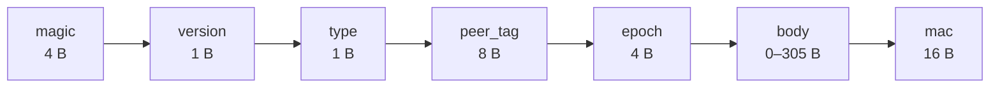
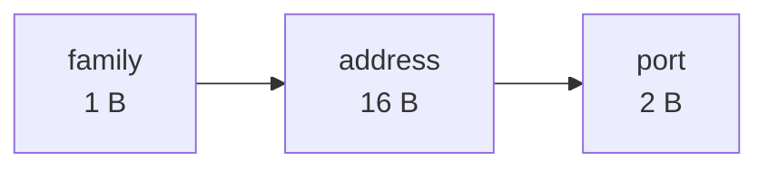
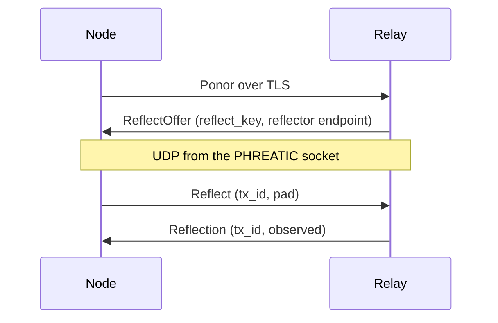

<!-- SPDX-License-Identifier: CC-BY-4.0 -->
# AVEN v1 — Path Discovery Protocol

- **Status:** Draft 0.1 — Phase 4 deliverable, not yet modeled, not externally reviewed
- **Date:** 2026-08-14
- **License:** CC-BY-4.0 with an irrevocable, royalty-free grant to implement
  in software under any license. Independent implementations are wanted.

> **Implementable.** §4–§8 are stable enough to build against and match
> `crates/karst-disco/`. §12 lists what remains open, and the list is long:
> this is the first draft of the hardest unglamorous part of a mesh VPN.
>
> All four ProVerif queries verify (§11), against an attacker that holds **a
> different peer's disco key** — because an aquifer is not a trust boundary
> (PLAN.md §1.1).
>
> §7.4 is what the model found, and draft 0.1 did not have it: a `Ping` is
> authenticated, so it cannot be forged — which is true, and is not the same as
> saying a genuine one cannot be *replayed*.

---

## 1. Introduction

AVEN finds and maintains a **direct path** between two Karst nodes that begin
by talking through a relay, and chooses which of several working paths to use.
It is the protocol behind `karst-disco` (PLAN.md §6).

An *aven* is a shaft connecting a cave system upward to the surface; cavers
look for them to find a way out. The naming follows ADR-0010's rule that
invented proper nouns get themed names and standard technical terms do not.

### 1.1 What AVEN does

| | |
|---|---|
| **Candidate gathering** | Local interface addresses, server-reflexive addresses learned from peers and relays, and addresses a peer reports observing |
| **Path probing** | Small authenticated `Ping`/`Pong` pairs to each candidate |
| **Reflexive discovery** | A `Pong` reports the source address the `Ping` appeared to come from — the STUN function, without a STUN server |
| **Candidate exchange** | `CallMeMaybe` over the relay, so both ends probe at once |
| **Path selection** | Continuous measurement with hysteresis, preferring direct over relay and IPv6 over IPv4 |

### 1.2 What AVEN does not do

- **It carries no user data.** Only probes and candidate lists. A working path
  is handed to PHREATIC; AVEN never sees a tunnelled packet.
- **It derives no keys.** Its authentication key comes from the netmap (§5).
- **It does not decide whether two nodes may talk.** That is the ACL's job,
  enforced by the packet filter at both ends (PLAN.md §4.3).
- **It is not confidential.** Probes are authenticated, not encrypted. §9
  states exactly what an observer learns, which is more than nothing.
- **It does not do port mapping.** UPnP-IGD, NAT-PMP and PCP are gateway
  protocols, not this one; they gather candidates that AVEN then probes.

---

## 2. Conventions

The key words MUST, MUST NOT, SHOULD, SHOULD NOT and MAY are to be interpreted
as in RFC 2119. `‖` is concatenation. Integers are **big-endian**. Lengths are
in bytes.

---

## 3. Cryptographic suite

Suite `0x0001` (`KARST_1`), as `phreatic-v1.md` §3. AVEN uses only the hash
half, which that registry's renumbering (`phreatic-v1.md` §3.1) did not change:

| Role | Algorithm | Size |
|---|---|---|
| Message authentication | HMAC-SHA-512, truncated to 16 bytes | key 32 B, tag 16 B |
| Key derivation | HKDF-SHA-512 | — |

Truncation to 16 bytes matches `phreatic-v1.md` §9.2's fragment MAC. No AEAD
and no signature: a probe is a few dozen bytes sent many times a minute, and
4627 bytes of ML-DSA per probe would make the discovery traffic larger than the
traffic it exists to find a path for.

---

## 4. Sharing a socket with PHREATIC

AVEN datagrams travel on **the same UDP socket** as PHREATIC, to and from the
same ports. This is not an optimization and MUST NOT be changed to a separate
port: a path is only useful if it is the path PHREATIC will actually use, and a
NAT binding proven on one port says nothing about another.

That makes demultiplexing a real problem, and it has no free answer.

**A magic prefix is a hint, not a decision.** A datagram whose first four bytes
are `0x4B 0x41 0x56 0x4E` (`KAVN`) SHOULD be tried as AVEN first. But
`phreatic-v1.md` §5 begins every datagram with `reassembly_id`, which is drawn
from a CSPRNG, so roughly one PHREATIC datagram in 2³² begins with the magic by
chance. A receiver MUST therefore fall through to PHREATIC when AVEN parsing or
authentication fails, and MUST fall through to AVEN when PHREATIC's `frag_mac`
fails.

Reserved bits are not an alternative. `phreatic-v1.md` §2 makes reserved fields
**ignored on receipt rather than rejected**, deliberately, so that adding a
suite later is not a flag day — which means no reserved-bit pattern makes a
datagram invalid PHREATIC, and none can be borrowed as a discriminator.

**What actually separates the two protocols is that both are authenticated.** A
PHREATIC datagram offered to AVEN fails AVEN's MAC; an AVEN datagram offered to
PHREATIC fails `frag_mac`. Each is a 16-byte tag, so a cross-protocol
acceptance requires a forgery rather than a coincidence. The magic exists only
so that the common case costs one MAC rather than two.

Cost, stated plainly: an attacker sending junk can force **two** MAC
computations per datagram instead of one. That is a factor of two on work the
receiver was already doing, not a new amplification class.

---

## 5. Keys and identifiers

### 5.1 The per-pair disco key

```
disco_key(A, B, epoch) = HKDF-SHA-512(
        master, "karst-disco-v1" ‖ min(A,B) ‖ max(A,B), epoch, 32)
```

Derived by the coordination server and shipped in the netmap, exactly as the
per-pair PSK is (PLAN.md §2.6). `A` and `B` are node IDs (`ponor-v1.md` §5.1).

**It is a separate derivation from the PSK, not the PSK itself.** Both come
from the same master, so this is not assumption diversity — it is blast-radius
containment. A disco key is used on far more packets, by code that runs before
any session exists, and it must not be the value that also gates the data
plane's key schedule.

**An absent disco key means no discovery, ever.** A node holding no disco key
for a peer MUST NOT probe that peer and MUST NOT accept probes from it; the
pair stays on the relay. There is deliberately no unauthenticated mode and no
zero-key fallback, and this is the one place where §2.6's zero-PSK fallback is
**not** mirrored — connectivity survives without discovery, because the relay
carries it, so nothing is bought by relaxing here. Unauthenticated probing
would let an attacker tell a node where to send its traffic, which is the whole
of what this protocol decides.

The netmap therefore carries one more secret, reinforcing PLAN.md §2.6's
encryption-at-rest requirement.

### 5.2 The sender tag

A datagram names its sender by an 8-byte **tag**, never by a node ID:

```
peer_tag(sender, epoch) = HMAC-SHA-512(
        disco_key, "aven-tag-v1" ‖ epoch ‖ sender_id)[0..8]
```

A receiver precomputes the tag for each peer it holds a disco key for and looks
up by it: one map lookup, then one MAC verification. Without a tag the receiver
would have to try every peer's key against every unmatched datagram, which at
200 peers is a 200× amplifier any unauthenticated source could pull.

The tag is not a node ID and MUST NOT be treated as one, and it is 8 bytes
rather than 32 for a second reason: `phreatic-v1.md` §4 keeps identity off the
wire, and putting a node handle in cleartext on every probe would give back
what ADR-0005 spent a design decision buying. An observer without the disco key
sees an opaque value that changes every epoch. Within an epoch it is linkable —
that is the accepted cost, and it matches PHREATIC's stated posture of
degrading to pseudonymity rather than to identification.

`sender_id` is bound into the derivation so that the two directions of a pair
have different tags. Without it both ends would present the same value and
neither could tell its own probes from its peer's.

### 5.3 The reflect key

A node and a **relay** share no per-pair disco key — a relay is not a peer and
has no netmap entry pairing it with anyone. §7.6 needs one anyway, so the relay
mints it:

```
reflect_key  — 32 bytes from a CSPRNG, per Ponor connection
reflect_tag  = HMAC-SHA-512(reflect_key, "aven-reflect-v1")[0..8]
```

The relay generates `reflect_key` and sends it in `ReflectOffer`
(`ponor-v1.md` §6.1, §7.7) — inside the TLS session, after the Ponor handshake.
That is what makes it a secret shared with a **specific, authenticated** relay:
§4.2 pins the relay by an ML-DSA-87 key from the netmap, so by the time this
frame is read the node knows who minted it. No new trust anchor is introduced
and no new key exchange is run.

**Its lifetime is the Ponor connection, and that is the whole of the rotation
story.** When the connection closes the relay forgets the key and the node
discards it. A reconnect mints a fresh one. There is deliberately no expiry
field, no refresh message and no epoch: the connection *is* the epoch, both ends
already agree on when it ends, and every additional lifetime mechanism would be
a second opinion about that.

**The tag derives from the key rather than being sent alongside it**, matching
`ponor-v1.md` §5.1's rule that identifiers are computed from the material they
name. A tag transmitted separately can disagree with its key, and the failure
mode of that disagreement is a node whose reflections are silently dropped with
nothing in any log to explain it.

`reflect_tag` binds no sender id, unlike §5.2, because there is no second
direction to disambiguate: only the node sends `Reflect` and only the reflector
sends `Reflection`, and the type byte already separates them. It binds no epoch
because the key is already per-connection and random, so it rotates whenever the
connection does — which is the property §5.2 spends an epoch to obtain.

A receiver MUST test an inbound tag against its own `reflect_tag` **before**
consulting the §5.2 peer table, and a reflect key MUST NOT be entered in that
table. The two derivations use different labels, so a collision needs a
birthday event rather than a confusion; the ordering rule exists so that the
code has one place to look rather than two lookups whose precedence is
unstated.

---

## 6. Datagram format



Header is 18 bytes. `mac` is HMAC-SHA-512 truncated to 16, keyed by the pair
disco key, over **everything preceding it** — magic, version, type, tag, epoch
and body. Verified in constant time.

A receiver MUST reject a datagram longer than **339** bytes — the largest
legal one, a sixteen-candidate `CallMeMaybe` — before doing anything else, and MUST reject one whose length does not match what its type
requires.

### 6.1 Message types

| Type | Name | Body | Total |
|---|---|---|---|
| `0x01` | `Ping` | `tx_id` (12) | 46 |
| `0x02` | `Pong` | `tx_id` (12) ‖ `observed` (19) | 65 |
| `0x03` | `CallMeMaybe` | `count` (1) ‖ `count` × `endpoint` (19) | 54..339 |
| `0x04` | `Reflect` | `tx_id` (12) ‖ `pad` (19) | 65 |
| `0x05` | `Reflection` | `tx_id` (12) ‖ `observed` (19) | 65 |

`tx_id` is 12 bytes and MUST be drawn from a CSPRNG.

`Reflect` and `Reflection` are keyed by a §5.3 reflect key, not a disco key, and
their `epoch` field MUST be zero — a receiver MUST reject a non-zero one. There
is no epoch to name: the reflect key's lifetime is a connection, not a netmap
version. Rejecting rather than ignoring keeps one encoding of each datagram,
the same rule §6.2 applies to an IPv4 tail.

`pad` MUST be nineteen zero bytes and a receiver MUST reject any other value.
**It is exactly the width of the `observed` endpoint the answer will carry**, so
the request reserves the space its own reply occupies and the two datagrams are
the same size. §7.6 is why that matters.

`count` MUST be between 1 and **16**. A node with more than sixteen candidates
sends its best sixteen; a receiver MUST reject a larger count rather than
truncating, because a truncating receiver and a non-truncating sender disagree
about what was said.

### 6.2 Endpoint encoding

Nineteen bytes, fixed:



`family` is `0x04` or `0x06`. An IPv4 address occupies the first four bytes and
the remaining twelve MUST be zero; a receiver MUST reject a non-zero tail
rather than ignoring it, so there is no covert channel in the padding and no
two encodings of one address.

Fixed width rather than variable costs twelve bytes per IPv4 candidate and buys
a parser with no length arithmetic in it. On a protocol whose datagrams are
parsed before authentication, that is the right side of the trade.

---

## 7. Probing

### 7.1 What a `Pong` proves

**A `Pong` confirms the endpoint its `Ping` was sent *to*, not the address the
`Pong` arrived *from*.**

This is the most important rule in the protocol and the easiest to get wrong.
A sender MUST record the endpoint each outstanding `tx_id` was sent to, and on
receiving a matching `Pong` MUST mark *that* endpoint reachable — regardless of
the datagram's source address. An implementation that instead trusts the source
address can be walked to any address an on-path attacker likes, by copying a
genuine `Pong` and re-sending it from somewhere else.

A `tx_id` MUST be accepted **once**. A second `Pong` bearing a spent `tx_id` is
discarded.

Outstanding `tx_id`s MUST expire — five seconds is RECOMMENDED — and the number
of them MUST be bounded per peer. They are state allocated in response to a
peer's behavior, which makes them worth counting.

### 7.2 Reflexive addresses

`Pong.observed` is the source address the `Ping` appeared to arrive from. A
node collects these as candidates to advertise. This is the STUN function, and
it needs no STUN server: any peer already exchanging probes can answer, and so
can a relay.

A node MUST NOT treat a reported reflexive address as a path to itself and
MUST NOT use it for anything but advertisement. A peer that lies here causes
its counterpart to advertise a candidate that does not work, which wastes
probes and nothing else — but only because nothing is trusted to it beyond
advertisement.

**An explicit port mapping learned from the node's own gateway outranks every
reflexive tier, and it is still not a path.** PCP and NAT-PMP let the gateway
say which external port it has reserved for this node's datapath socket, which
is stronger evidence than any peer or reflector can supply: the gateway is
holding that port open on purpose rather than reporting a side effect of other
traffic. That does not license any stronger conclusion. A mapped address MAY be
advertised and probed exactly like any other candidate, and MUST NOT be treated
as authenticated, safe to bind, or otherwise privileged.

**Reflexive addresses MUST NOT displace a node's own interface addresses in an
advertisement, and a node MUST bound how many it carries.** The list a node
sends goes to *every* peer, so without this rule one peer supplying sixteen
fabricated `observed` values decides what this node tells everybody else about
itself. An interface address is something a node observed; a reflexive address
is something it was told. Where the two compete for the same sixteen slots, the
observed one wins.

Where several peers report reflexive addresses, a node SHOULD prefer the
address reported by the most of them. A node behind a single NAT hears the same
mapping from every peer that answers it, so agreement is evidence and one
dissenting peer is outvoted. With a single peer there is nothing to
cross-check against, which is why this orders the list rather than deciding
admission to it.

**A reflexive address learned from a §7.6 reflector outranks one learned from a
peer, and both sit below the node's own explicit mapping and interface
addresses.** The four tiers are four grades of evidence, and the ordering is
the grading: an explicit mapping is the gateway naming the port it is keeping
open on purpose; an interface address is something this node observed directly;
a reflector's report comes from a party the netmap already names and the node
already trusts to carry its traffic; a peer's `Pong.observed` comes from a
party §1.1 explicitly allows to be malicious. A reflector is not trusted *more*
than it needs to be — it can still only cause a wasted advertisement, because
§7.2's first rule holds for it too: no reported address is ever a path.

Counting still applies within the reflector tier. A node connected to two
relays hears the same mapping from both when its NAT has endpoint-independent
mapping, and hears two different ones when it does not — and that disagreement
is a signal in its own right, discussed in §7.6.

**A candidate that cannot answer is still worth probing, and this is the reason
§7.5's backoff sends four probes rather than one.** A probe leaves the local
NAT addressed to the candidate's host, which is what installs that host in the
local NAT's filter — and the filter is what decides whether the *peer's* probe
is admitted, on whatever source port the peer's own NAT chose. So a node behind
a symmetric NAT, whose every advertised address is a mapping toward somebody
else and therefore a dead letter, is nonetheless reached directly by a peer
whose NAT restricts by address rather than by port: the peer's useless probe
opened the door that the node's probe then walked through.

Implementations MUST NOT, therefore, suppress a probe on the grounds that the
candidate is unlikely to be reachable. The probe's second effect does not
depend on its first succeeding. `bins/karstd/tests/aquifer.rs` exercises
exactly this pairing, and it is the reason a symmetric NAT is disqualifying
only against another port-restricted one.

### 7.3 Candidate exchange

`CallMeMaybe` is sent **over the relay**, which is what makes simultaneous open
possible: both ends learn each other's candidates at nearly the same moment and
begin probing together, so both NATs see an outbound packet before either sees
an inbound one.

It MAY also be sent on an established direct path when candidates change — a
node that acquires a new interface should not have to wait for a relay round
trip to say so.

### 7.4 Answering a probe at most once — the flaw modeling found

**A responder MUST answer each `tx_id` at most once**, within a bounded window
per peer. **A prober MUST use a fresh `tx_id` for every probe, including
retransmissions** — which it needs anyway, or a retransmitted probe's round-trip
measurement is meaningless.

Recorded because draft 0.1 had neither rule and the reasoning that omitted them
was plausible. A `Ping` is authenticated, so a forged one is impossible; that is
true, and it is not the same as saying a *genuine* one cannot be reused.

ProVerif's answer to `inj-event(BAnswered(tx)) ==> inj-event(APinged(tx))` was
`is false`, with the note that the **non-injective form is true**. In words: the
responder answered a `Ping` the prober really did send — more than once. An
attacker that captures one `Ping` can replay it indefinitely, from any address,
and the responder answers each copy to wherever the copy came from.

That is a **reflector**, and it needs no key: 46 bytes in, 65 bytes out. The
amplification factor of 1.4 is small enough that this is not a serious
bandwidth attack, and saying so is part of reporting it accurately. What makes
it worth fixing anyway is that it is free to fix, that it lets an unauthenticated
attacker spend a peer's probe budget under someone else's name, and that a
reflector in a protocol that runs on an open UDP port on every node in a network
is not a thing to ship knowingly.

The window is bounded, so the guarantee is **at most once within the window**
rather than at most once ever. An unbounded cache would be a memory-exhaustion
vector reachable by the same replay it exists to stop, which would be trading
one flaw for a worse one.

### 7.5 Rates

| | |
|---|---|
| Probe a new candidate | Immediately on learning it, then backing off: 100 ms, 300 ms, 900 ms, then give up |
| Keep a chosen path alive | Every **5 seconds** |
| Re-probe alternatives | Every **30 seconds** |
| `CallMeMaybe` | On change, at most once every **5 seconds** per peer; and while no direct path is confirmed, repeated every **30 seconds** |
| `Reflect` | On acquiring a reflect key, then every **10 seconds** while any peer lacks a direct path; not at all when every peer has one |

These are RECOMMENDED, not normative.

`Reflect` is repeated for the same reason `CallMeMaybe` is, and for one more: a
NAT rebinds. A mapping learned at connect time and never refreshed becomes a
candidate that used to be true, which is worse than no candidate at all,
because a stale address consumes an advertisement slot and a peer's probe
budget. Stopping when every peer is direct is the §7.5 rule above applied
unchanged — the purpose is served, and a node with nothing to discover should
not be talking to a reflector.

**Ten seconds is a figure about NATs, not about this protocol, and the obvious
thirty is wrong.** Linux's `nf_conntrack_udp_timeout` is 30 seconds and consumer
NATs are commonly at or below that, so refreshing every 30 seconds races the
timeout: the binding survives some intervals and is rebuilt with a different
external port on others. The node then advertises an address it is no longer
sending from, and its peers probe a port nothing is listening on. This was
measured rather than reasoned — the first implementation used 30 seconds and a
packet capture showed the mapped port moving between reflections on an otherwise
idle flow.

The rule generalises: **a reflexive address is only true for as long as the
binding that produced it is alive**, and nothing tells the node how long that
is. An implementation SHOULD refresh at well under the shortest timeout it
expects to meet rather than at the timeout itself. What is normative: a node MUST rate-limit
probes per peer, and MUST NOT emit more probe traffic to a peer than that peer
has authenticated itself to it — an unauthenticated source must never be able to
make a node send more than it received.

**A node MUST NOT advertise only on change.** An advertisement is a datagram
and datagrams are lost; a peer that missed the only one ever sent — because it
had not yet been given the disco key, because it restarted, because the relay
was briefly unavailable — would never learn where its counterpart is, and the
pair would remain on the relay indefinitely. Draft 0.1 said "on change" alone
and two implementations of it did exactly that: one end reached a direct path
and the other never did, because the advertisement it needed had been sent
before it existed.

Repetition MAY stop once a direct path is confirmed, and SHOULD, since the
purpose is served. This is the same argument §7.5 already makes for re-probing
alternatives — telling a peer where you are and asking where it is are the two
halves of one job, and only one of them was being repeated.

---

### 7.6 Server-reflexive discovery

§7.2's reflexive mechanism has a bootstrap problem, and it is not a corner case.

A node behind a NAT learns its mapped address from `Pong.observed` — which
requires a `Ping` to have crossed, which requires the peer to have known an
address to send it to. When **both** nodes are behind NATs, neither has one:
every address either can name is private and unroutable from the other side.
The reflexive mechanism needs a working path in order to bootstrap a working
path, so the pair never leaves the relay. That is two laptops on two home
networks, which is the ordinary deployment and not an exotic one.

The relay cannot fill the gap as it stands. Ponor has no frame for an observed
address, and — the part that is easy to miss — **it speaks TCP, and a NAT maps
TCP and UDP separately**. The address a relay observes on its Ponor connection
is not the address AVEN needs, and an implementation that reported it would
supply a confidently wrong candidate.

**A reflector is a UDP service that answers `Reflect` with the source address it
saw.** A relay MAY run one; §7.6 does not require it, and a node MUST work
without one, staying on the relay exactly as it does today.



**The node MUST send `Reflect` from the socket PHREATIC and AVEN already
share.** This is §4's rule reaching one hop further: a NAT binding proven on one
socket says nothing about another, so a reflection gathered from a fresh socket
would report a mapping no peer can use. It is the single most important
implementation requirement in this section and the easiest to violate, because
opening a socket for the purpose is the obvious way to write it.

The reflector MUST answer to the **source address of the `Reflect`**, and MUST
NOT answer to any address it holds for that node from any other source. That is
the opposite of §7.1's rule for `Pong` and it is not a contradiction: a `Pong`
answers a question about *the peer's* address, where trusting the source lets an
attacker redirect a probe; a `Reflection` answers a question about *the sender's
own* address, where the source is the entire content of the answer.

A node MUST match a `Reflection` to an outstanding `Reflect` by `tx_id`, MUST
accept each `tx_id` at most once, and MUST use a fresh `tx_id` per request —
§7.1 and §7.4 apply here unchanged.

#### Amplification

A UDP service that answers unauthenticated packets is a DDoS amplifier, and this
one is answered by every relay in a public pool. The analysis is therefore part
of the design rather than a review note.

| Attacker | Result |
|---|---|
| Off-path, no key | **Nothing.** No valid MAC, no answer. Cost to the reflector is one map lookup on a tag miss, or one HMAC on a tag hit. |
| Holds a captured `Reflect` | Replays it from its own address and is told its own address. Request and reply are both 65 bytes, so the factor is **1.0** — a reflector, not an amplifier. |
| Captured `Reflect` + source spoofing | Directs one 65-byte datagram at a victim per replay. Still factor 1.0, and it needs a capture *and* spoofing capability. |
| Holds a `reflect_key` (a member) | Bounded by the per-key rate limit below. |

The equal-size property is what the `pad` field buys, and it is worth saying
plainly why the obvious alternative was rejected: a 46-byte request answered by
a 65-byte reply — the natural encoding, and exactly `Ping`/`Pong`'s shape —
gives a factor of 1.4, which is small, and *small is not the same as one*. An
amplification factor above 1.0 on a service every relay operates is a
contribution to somebody else's attack; nineteen bytes of padding removes the
class rather than shrinking it. §7.4's reflector was tolerable to discover and
fix at 1.4 because it was a defect; shipping one deliberately is a different
decision.

A reflector MUST rate-limit per `reflect_key`. RECOMMENDED: **one per second
sustained, burst of five.** It MUST NOT answer a `Reflect` whose tag names no
key it currently holds — which, by §5.3, means no live Ponor connection.

#### What it does not solve

A server-reflexive address is the mapping toward **the reflector**. Under
endpoint-independent mapping — full-cone, address-restricted and port-restricted
NATs — that is the same mapping every peer sees, and the address works. Under a
**symmetric** NAT it is the mapping toward the relay and nothing else, and no
peer can use it.

So this section closes the NAT-to-NAT case for the common NAT types and does
**not** close symmetric-to-symmetric, which needs port prediction (PLAN.md §6).
A node that hears two different mappings from two reflectors has learned that
its NAT is symmetric; a node that hears one from each has learned that it is
not. Both are worth knowing and neither is worth guessing, which is why §7.2
counts reports rather than taking the first.

---

### 7.7 Reaching a symmetric NAT from a cone — **not adopted**

§7.6 closes the NAT-to-NAT case wherever mapping is endpoint-independent. It
leaves the pairing that is both common and hard: one node behind a **symmetric**
NAT, the other behind a **port-restricted cone**. A CGNAT subscriber talking to
somebody on an ordinary home router is exactly this.

**AVEN does not attempt it.** This pairing falls back to the relay, as
symmetric-to-symmetric does (§12.4). The section is kept rather than deleted
because the reasoning cost a great deal to acquire and the next person to
propose the technique deserves it.

**§7.2's mapped-address tier reaches the same pairing when the cone's router
serves PCP or NAT-PMP**, which ordinary home routers do — and that is the
answer this specification recommends for it. The mapping's *inbound* half is
what matters here, and it is not what makes §7.2's tier valuable elsewhere: a
cone's external port is already stable, so the hard side is already probing a
correct address, and the only obstacle is that the cone refuses a source port it
has never sent to. An explicit mapping installs an endpoint-independent
translation, which removes that refusal; the probe then lands and the cone
adopts the source it arrived from (§7.6), which is the symmetric side's mapping
toward it specifically. Measured end to end at 37 seconds. It is the same
mechanism §7.2 offers a symmetric NAT, doing a different job.

#### What was tried

The published method is a random port search: the side behind endpoint-dependent
mapping (the **hard** side) opens *N* sockets toward the one address the other
(the **easy** side) is reachable at, each earning a distinct external mapping;
the easy side sends *M* probes to the hard side's external address at random
ports, from the socket §4 already shares with PHREATIC, so the hard side's
filter is satisfied and only the port has to collide.

It was specified, implemented, and measured against Linux's symmetric modes in
a three-namespace fixture, where it behaves exactly as the arithmetic says:
`docs/measurements/hard-easy-2026-08-19.md` records 20% against 22% predicted,
60% against 64%, and 95% against 98%.

#### Why it is not worth its cost

**The arithmetic is much worse in the product than in the fixture**, for four
reasons that are properties of the protocol rather than of the implementation.

*`N` is live mappings, not sockets opened.* A mapping lives about as long as the
NAT's UDP timeout — thirty seconds on Linux, often less. The live set is
`S × ⌊L/T⌋` for *S* sockets a round, lifetime *L*, interval *T*; a socket opened
four rounds ago holds a mapping three timeouts dead.

*Only the hard side's search mappings are targets.* It also sends probes, and
those create mappings that accept a reply solely from the random port they were
aimed at. Half its external ports are dead targets.

*A node does not know which side it is.* Nothing in AVEN tells a node whether
its own NAT has endpoint-dependent mapping — §7.6's two-reflector test would,
and most nodes have one relay. So it must fund both roles from one budget,
halving *N* and *M* together and quartering the per-round chance.

*And the budget is not elastic.* §7.5 limits probe traffic so that "any node can
point every one of its peers at a third party" stays false, and §7.2 already
ranks a peer's claims last because §1.1 allows it to lie. Concentrating the
whole allowance on one unverifiable address is the most this protocol can
responsibly spend there.

`P(round) = 1 − (1 − N/K)^M` over `K = 64511` usable ports:

| Budget/round | *T* | Role known | *N* | *M* | Per round | 8 min | 16 min |
|---|---|---|---|---|---|---|---|
| **64** — what §7.5 grants | 15 s | no | 64 | 32 | 3.1% | **64%** | **87%** |
| 128 — twice the allowance | 15 s | no | 128 | 64 | 11.9% | 98% | ~100% |

**Sixty-four per cent after eight minutes, for a pair that has been talking over
the relay the whole time.** §8.3 makes that relay path a working path, so what
is being bought is latency and relay load, not connectivity — and it is bought
with a **datapath change**: the collision lands on one of *N* sockets, so the
peer's traffic must migrate to whichever socket won, which is in direct tension
with §4's single shared socket.

A protocol change of that size, for a probabilistic gain on one pairing, at the
edge of what the amplification budget permits, is not a good trade. **Explicit
port mapping (§12.4) is the better answer for the same pairing**: it is
deterministic, it needs no new sockets, and where a gateway offers PCP or
NAT-PMP it works in seconds rather than minutes.

#### What was left unresolved, honestly

The reference implementation was carried far enough to observe the exchange
succeed at the network layer and fail above it. A capture inside a node shows
the hole opening — datagrams arriving on a search socket, the peer settling on
one found port — while the daemon's own accounting records no arrival at all.
That gap was never explained.

It is recorded because it is a **reason for caution rather than a reason for
confidence**: an implementer who reads the measurements above and concludes the
technique is ready has the same surprise waiting. FINDINGS.md 28 carries it.


## 8. Path selection

A node holds a set of known paths per peer and chooses one. Ordering,
strongest key first:

1. **Working beats not working.** A path with no `Pong` inside the last 15
   seconds is not eligible.
2. **Direct beats relay**, always, even when the relay is faster. A relay
   discloses the traffic graph to its operator (`ponor-v1.md` §9); latency is
   not the only axis and the operator's exposure does not appear in a
   round-trip time.
3. **IPv6 beats IPv4** when both are direct and their latencies are within the
   hysteresis margin. IPv6 paths are less likely to be behind a translating
   middlebox that will rewrite them later.
4. **Lower latency** otherwise.

### 8.1 Rule 3 is a credit, not a comparison

"IPv6 beats IPv4 when their latencies are within the hysteresis margin" is not
a transitive relation, and an implementation that writes it as a comparator
directly is wrong for three or more paths — it can rank A over B over C over A,
and a sort or a minimum over a non-transitive comparator returns whichever
element it happened to examine first.

An implementation SHOULD instead give an IPv6 path a **latency credit of one
margin** and order by the credited value. That gives the same answer for two
paths, is a total order for any number, and cannot depend on iteration order.
Recorded here because the phrasing above is the natural one to write and the
bug it produces is a path selection that varies between runs on identical
inputs.

### 8.2 Hysteresis

A node MUST NOT switch away from a working chosen path unless the alternative
is better by a margin. RECOMMENDED: **20 ms or 20%, whichever is larger**,
sustained across **three** consecutive measurements.

Switching costs more than the latency difference usually recovers: the datapath
keeps both paths warm and cuts over on receipt of the first packet on the new
one, but a node that oscillates does so for every peer at once and turns a
measurement artifact into a network-wide event. Rule 2 is exempt — a direct
path that starts working displaces a relay immediately, because that transition
is what the whole protocol exists to cause.

### 8.3 Relay fallback is not a failure state

A node MUST retain its relay path while a direct path is in use, and MUST fall
back without dropping traffic when the direct path stops answering. The relay
connection is not torn down on promotion (`ponor-v1.md` §9.1 keeps the home
relay connected regardless), so falling back costs no handshake.

---

## 9. What an observer learns

An on-path observer without the disco key sees:

- That two addresses are exchanging small UDP datagrams with the AVEN magic,
  and how often.
- An 8-byte tag per direction, constant within an epoch and unlinkable across
  epochs. **Not** a node ID, and not resolvable to one without the key.
- The **candidate addresses in a `CallMeMaybe`**, in cleartext. This is the
  real disclosure: a node's local interface addresses — which may include
  private RFC 1918 addresses that describe its LAN — travel unencrypted between
  peers, and over the relay where the relay operator can also read them.

That last point is a genuine weakness and is recorded as such in §12.3 rather
than defended. Encrypting the body under the disco key would close it and costs
one AEAD; it is not in v1 because the key schedule for it was not designed in
time, which is a reason and not a justification.

**A §7.6 reflector learns one thing the relay did not already know**: the node's
UDP source address, where the Ponor connection disclosed only its TCP one. Those
differ in port and can differ in address, so this is a real increment and not a
rounding error. It is small — the relay already knows which node is behind which
public address, because it is carrying that node's traffic — and it is the
minimum a reflector can possibly learn, since the address *is* the answer being
asked for. A node unwilling to disclose it declines by not sending `Reflect`,
which costs it direct paths and nothing else.

---

## 10. Error handling

Every failure is a **silent drop**. There are no error messages in AVEN:

- Unknown tag → drop. Emitting anything would make a node an oracle for which
  peers it holds keys for.
- MAC failure → drop, without distinguishing it from an unknown tag.
- Malformed, over-long, wrong length for its type → drop.
- Unknown type or version → drop. Unlike `ponor-v1.md` §6, this does not close
  anything, because there is nothing to close: AVEN is stateless UDP.

A node MUST NOT log a per-datagram message on any of these paths at default
verbosity. The protocol runs on an unfiltered UDP port; a log line per dropped
datagram is a disk-filling primitive available to anyone who can reach it.

---

## 11. Formal verification

`spec/models/aven.pv`, ProVerif 2.05, seconds:

| Query | Result |
|---|---|
| A confirms a path as B's only if B answered, **injectively** | ✅ |
| The same, non-injectively | ✅ |
| B answers only probes A sent — no forgery | ✅ |
| The disco key stays secret | ✅ |

The attacker holds **a different peer of A's disco key** throughout. An aquifer
is not a trust boundary — PLAN.md §1.1 lists a malicious peer inside one as in
scope — so this is the ordinary configuration rather than an exotic one.

Not modeled: §7.1's transaction-to-endpoint association, which lives in the
receiver's bookkeeping rather than on the wire and is enforced by the
implementation's types; path selection, which is availability rather than
security; and §7.4's replay window, for the reason below.

### 11.1 Why §7.4 is not in the model

Expressing "answer each `tx_id` once" needs a table and a lock, and adding them
makes ProVerif answer **cannot be proved** on both agreement queries — in the
base model *and* in the broken variant, where a demonstration that cannot fail
demonstrates nothing. That is an incompleteness of the analysis rather than a
counterexample; there is no trace either way.

So the model is kept at the forgery-and-impersonation level, which it proves,
and §7.4 is carried by the implementation and its tests instead. Claiming
otherwise would be claiming something no run of the model establishes.

### 11.2 The broken variant

`spec/models/aven-headeronly.pv` authenticates only the header, leaving `tx_id`
and `observed` outside the MAC. Both agreement queries become **false**, with a
trace: an attacker rewrites `tx_id` on a captured `Pong` and confirms a path the
peer never answered from.

This one is not hypothetical. `phreatic-v1.md` §13.8 made exactly that trade on
the data path — deliberately, after profiling showed the fragment MAC costing
five times the AEAD it gated — and the variant exists to record that the saving
must not be carried across to AVEN, where the MAC's job is different.

---

## 12. Open items — this draft is incomplete

1. **No external review.** A symbolic model says nothing about implementation
   behavior.
2. **Epoch rotation is specified only in outline.** The disco key rotates with
   the PSK epoch, but nothing here says what a node does with in-flight probes
   across a rotation, or whether it accepts epoch *n−1* the way
   `phreatic-v1.md` §7.3 does for PSKs. It should, and the window is unwritten.
3. **`CallMeMaybe` bodies are not encrypted** (§9). Local interface addresses,
   including private ones, are visible to the relay operator and to anyone on
   the path. An AEAD under the disco key would close this.
4. **Symmetric-NAT port prediction is unspecified.** PLAN.md §6 calls for
   birthday-paradox port prediction; nothing here says how many ports to try,
   at what rate, or how that interacts with §7.5's rate limit — which it
   plainly does, since the technique is "send many probes at once".

   **The case that needs it is narrower than "symmetric NAT", and measurement
   rather than argument established that.** A symmetric NAT facing a reachable
   peer goes direct on §7.2's arrived-from rule, and a symmetric NAT facing an
   address-restricted cone goes direct on the paragraph above. The unreachable
   intersection is both ends symmetric — both mappings unpredictable *and* both
   filters port-dependent. PLAN.md §"Phase 4" carries the seven topologies and
   which five connect.

   This narrowing is a reason to specify port prediction carefully rather than
   quickly. It buys one row, against a technique that is loud by construction,
   and §7.5 exists precisely so that AVEN cannot be turned into a packet
   source. A design that spends the rate budget on the common case to reach an
   uncommon one is a bad trade, and the specification should say which budget
   it spends.

   **Measurement since suggests prediction should not be specified at all.**
   Linux's two symmetric modes allocate 24 distinct external ports across 24
   destinations with no locality — sample steps of −48061 and +47375, and not
   one adjacent pair within ±8. There is no window to probe. RFC 6056
   *recommends* that unpredictability, so the NATs least tractable here are the
   ones behaving correctly. Two further obstacles hold even against a
   sequentially-allocating NAT: a port-restricted symmetric NAT also filters on
   source port, so a correct guess still arrives from a port it never saw and is
   dropped; and §7.5's rule that a node MUST NOT emit more probe traffic to a
   peer than that peer has authenticated to it forbids the technique's shape,
   since relaxing it hands the malicious peer of §1.1 an *N*-fold amplifier
   pointed wherever it likes. **Explicit port mapping — PCP, NAT-PMP,
   UPnP-IGD — is deterministic where this is probabilistic, and is the better
   use of the same effort.** FINDINGS.md 24 carries the measurement.

   **Partly resolved by §7.7**, which specifies the random-port search for the
   hard/easy pairing and holds it inside §7.5's existing budget rather than
   raising it. What stays open here is the hard/hard case, and it is open in the
   sense of being *closed to this technique*: two randomising NATs square the
   search space, so the birthday paradox's √N saving still leaves roughly
   170,000 probes per side for 99.9% — about 28 minutes at 100 packets per
   second — and 0.01% after twenty seconds of trying. That is not a rate to
   specify; it is a case to relay.
5. **No path-MTU interaction.** A direct path may have a smaller MTU than the
   relay path, and AVEN reports nothing about it. PLAN.md schedules PMTU
   discovery for Phase 6; until then a path can be selected that black-holes
   full-size packets, which is a worse failure than not selecting it.
6. ~~**Nothing bounds the candidate set.**~~ **Resolved.** A node MUST cap the
   per-peer candidate table and MUST NOT exempt a confirmed path from that cap.
   The reference implementation holds 64 and evicts unconfirmed candidates
   oldest-first, then the stalest confirmed path; the path currently carrying
   traffic is never evicted.

   Exempting confirmed paths is the tempting rule and it is wrong: it makes
   "answer one probe" the price of a permanent slot, which is no price at all to
   the peer §1.1 places inside the aquifer. Refusing new candidates once the
   table is full is equally wrong — it bounds the memory and lets a peer pin the
   table to addresses of its choosing.

   Receivers MUST also rate-limit incoming advertisements per peer; §7.5's
   five-second figure applies in both directions.
7. **No IPv4/IPv6 dual-stack policy for probing order.** §8 ranks paths once
   they work; it does not say whether to probe both families at once, and
   probing both doubles the traffic a node emits on first contact.
8. **A reflector is trusted to report honestly and nothing checks it** (§7.6).
   A malicious relay can report a wrong `observed`, and the node will advertise
   an address that does not work — wasting its peers' probes and keeping the
   pair on that relay, where the operator sees the traffic. The bound is that it
   can do no more than that, because §7.2 forbids treating a reflexive address
   as a path, and because a relay able to deny direct paths can already deny
   them by declining to carry `CallMeMaybe`. What would close it is cross-checks
   between two reflectors, which §7.2's counting rule makes possible and nothing
   currently requires.
9. **`Reflect` is not in the model.** §11's ProVerif model covers `Ping`,
   `Pong` and the disco key. The reflect exchange adds a second key and a second
   authenticated message pair, and the property worth proving — that a node
   learns an `observed` value only from the reflector that minted its key — is
   stated and implemented rather than proved. It should be modeled before this
   draft stops being a draft.
