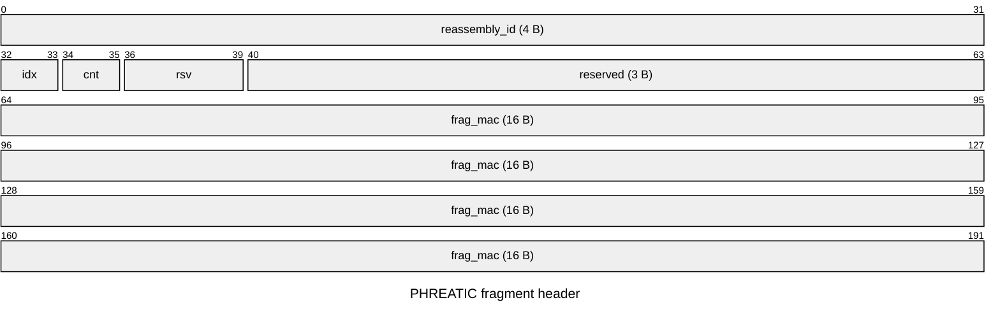
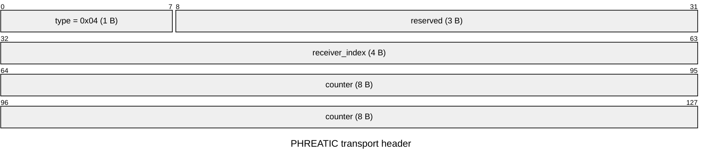

<!-- SPDX-License-Identifier: CC-BY-4.0 -->
# PHREATIC v1 — Protocol Specification

- **Status:** Draft 0.2 — Phase 1 deliverable, modeled but not externally reviewed
- **Date:** 2026-08-09
- **License:** CC-BY-4.0 with an irrevocable, royalty-free grant to implement
  in software under any license. Independent implementations are wanted.

> **Partially implementable.** §5, §6 and §9 are stable enough to build
> against; §14 lists what remains. All three Verifpal models verify; ProVerif
> verifies the base model and the X25519-broken variant, but the ML-KEM-broken
> variant **does not terminate** — see §13.3, and do not read ADR-0002's
> either-family claim as fully proved. **No external cryptographic review has
> happened**, and symbolic models say nothing about implementation behavior.
>
> §13 records four changes discovered while writing and modeling this
> document: a **static X25519 key added to node identity** (§13.1), `psk_epoch`
> **bound into the transcript** (§13.2), and two properties that are easy to
> implement wrongly — HandshakeInit is unauthenticated by design (§12.5), and
> the responder has no assurance until the first transport message (§12.6).

---

## 1. Introduction

PHREATIC is the handshake and transport protocol of Karst, a post-quantum mesh
VPN. It establishes mutually authenticated, forward-secret, post-quantum-secure
sessions between peers that have already been distributed each other's public
keys by a coordination server.

Its design goal is the one WireGuard has, under a constraint WireGuard does not
face: **1-RTT to first data packet, with a responder that allocates no state
until it has authenticated something** — while carrying key material roughly
twenty times larger.

### 1.1 Relationship to prior work

PHREATIC is a KEM-based Noise `IK`-shaped pattern, following **PQNoise** (Angel,
Dowling, Hülsing, Rösler, Schwabe, CCS 2022) for the KEM adaptation, with a
classical Diffie–Hellman mixed into the same chaining key. It owes
**PQ-WireGuard** (Hülsing et al., IEEE S&P 2021) its security-proof structure
and **Rosenpass** its approach to stateless responders under load. It is **not**
interoperable with WireGuard.

### 1.2 What this protocol does not do

- It does not hide traffic metadata beyond fixed-size padding buckets.
- It does not resist an adversary holding a CRQC *at the time of the handshake*
  (see `docs/THREAT-MODEL.md` §3, T9).
- It does not authorize peers. Authorization is the coordination server's job;
  PHREATIC only proves a peer holds the keys the netmap attributes to it.

---

## 2. Conventions

The key words MUST, MUST NOT, REQUIRED, SHALL, SHOULD, SHOULD NOT, MAY and
OPTIONAL are to be interpreted as in RFC 2119 / RFC 8174.

| Notation | Meaning |
|---|---|
| `a ‖ b` | Concatenation |
| `LE16/LE32/LE64(n)` | Unsigned little-endian integer |
| `HASH(x)` | Suite hash (SHA-512 in suites 1–2) |
| `HKDF(ck, ikm, n)` | HKDF with the suite hash; Extract with salt `ck`, Expand to `n` 32-byte outputs |
| `AEAD(k, n, ad, pt)` | Suite AEAD; `n` a 96-bit nonce, `ad` associated data |
| `X25519(sk, pk)` | RFC 7748 scalar multiplication |
| `KEM.Encaps(pk) → (ct, ss)` | ML-KEM encapsulation |
| `KEM.Decaps(sk, ct) → ss` | ML-KEM decapsulation |

All multi-byte integers on the wire are little-endian. Reserved fields MUST be
transmitted as zero and MUST be ignored on receipt — **not** rejected, which
preserves forward compatibility for suite additions.

---

## 3. Cryptographic suites

Per [ADR-0006](../docs/adr/0006-cryptographic-agility-layer.md), algorithms are
selected only as complete named suites from a fixed allowlist. Implementations
MUST reject unknown suite identifiers. There is no per-primitive negotiation and
no runtime-extensible registry.

| ID | Name | KEM | DH | Signature | AEAD | Hash | Category |
|---|---|---|---|---|---|---|---|
| `0x0001` | `KARST_1` | ML-KEM-768 | X25519 | ML-DSA-87 | AES-256-GCM | SHA-512 | 3 |
| `0x0002` | `KARST_2` | ML-KEM-1024 | — | ML-DSA-87 | AES-256-GCM | SHA-384 | 5 |

An implementation claiming a suite MUST run every algorithm the table names for
it. The suite is bound into the transcript before any secret is derived, so two
ends that disagree about any of them derive different keys and the handshake
fails rather than producing traffic mislabelled as one thing and encrypted with
another.

### 3.1 The registry was renumbered on 2026-08-25 — **amends this draft**

An earlier draft of this document defined three suites, with `KARST_1` running
ChaCha20-Poly1305. [ADR-0015](../docs/adr/0015-cnsa-2-0-as-a-mandate.md) item 7
removed it and reassigned the two survivors:

| Wire | Before | After |
|---|---|---|
| `0x0001` | `KARST_1` — ChaCha20-Poly1305 | `KARST_1` — AES-256-GCM (was `0x0002`) |
| `0x0002` | `KARST_2` — AES-256-GCM | `KARST_2` — the CNSA 2.0 profile (was `0x0003`) |
| `0x0003` | `KARST_3` — CNSA 2.0 | *unallocated* |

**ChaCha20-Poly1305 was removed for conformance, not for weakness.** It is
RFC 8439, an IETF specification, and is not a NIST algorithm: it cannot run
inside a FIPS 140-3 boundary and CNSA 2.0 does not name it. Once CNSA 2.0 became
a mandate rather than an option, a suite no mandated deployment could select was
a second code path and a second set of test vectors for nobody. The cost is
real and was accepted: a node without AES-NI or ARMv8 crypto extensions pays for
AES-256-GCM in software.

**Reusing `0x0001` and `0x0002` for different suites is something a deployed
registry must never do.** It was done here exactly once, while there was no
deployed base and therefore nothing to be incompatible with. Any document,
capture or test vector predating 2026-08-25 must be read against the "Before"
column. `0x0003` is left unallocated rather than recycled a second time.

Suite `0x0002` is the CNSA 2.0 profile and is **PQ-only** (no classical hybrid).
Per [ADR-0015](../docs/adr/0015-cnsa-2-0-as-a-mandate.md) it is a deliverable
rather than a demonstration, and it is implemented: ML-KEM-1024, AES-256-GCM
and SHA-384, with the three Diffie–Hellman operations of §7.1 and the `e_dh_pk`
fields of §6.1 and §6.2 **absent** rather than zero-filled. An implementation
MAY still decline to offer it; one that offers it MUST run all four algorithms.

**A node's suite class is fixed by its static KEM key, not chosen per session.**
`peer_id_hint` is derived from `S_pk` (§4), so a node holding both an
ML-KEM-768 and an ML-KEM-1024 static key would have two identities. An
implementation MUST refuse a suite whose KEM is not the parameter set of its own
`S`, and MUST refuse one whose KEM is not the parameter set of the resolved
peer's `S_pk`. The consequence is that a `0x0002` node and a `0x0001` node do
not interoperate; moving a deployment between them is a re-keying, not a
negotiation.

`0x0000` and `0xFFFF` are reserved and MUST NOT be used.

All sizes below are for suite `0x0001` unless stated otherwise.

---

## 4. Node identity

A Karst node holds **three** long-term keypairs:

| Key | Algorithm | Size (pk) | Purpose |
|---|---|---|---|
| Identity `I` | ML-DSA-87 | 2592 B | Signed by the Bedrock chain; establishes the node is authorized to exist |
| Static KEM `S` | ML-KEM-768 or ML-KEM-1024 | 1184 B or 1568 B | Post-quantum authentication in the handshake |
| Static DH `D` | X25519 | 32 B | Classical authentication in the handshake |

`I` is **not used by PHREATIC**. It serves Bedrock chain verification
(PLAN.md §4.5) and is listed for completeness. `D` is unused under suite
`0x0002`, which has no classical half; a node MAY hold one anyway so that one
key file serves either class.

The **peer identity hint** is

```
peer_id_hint = SHA-512("Karst peer-id v1" ‖ S_pk)[0..32]
```

32 bytes, unsalted and session-independent, per
[ADR-0005](../docs/adr/0005-identity-model-and-peer-presentation.md).

**SHA-512 here is fixed, not the suite hash.** A responder resolves the hint
before it knows which suite is in play — the suite is in the header, but a
responder maintains one precomputed table for its whole roster and a
suite-dependent hint would need one table per suite for no gain. The binding of
a peer's static key *into* a session is step 3 of §7.1, `MixHash(HASH(S_r_pk))`,
which does use the suite hash. The same reasoning fixes the fragment MAC key of
§9.2 at SHA-512: it is checked on fragments that do not carry the suite field at
all.

`S_pk` is 1184 bytes under suite `0x0001` and 1568 under `0x0002`, so
a node's hint changes if its suite class does. Changing class means every peer's
netmap entry must be updated with the new `S_pk`.

> **Normative note — do not session-bind the hint.** Deriving it as
> `MAC(ss, S_pk)` or any session-dependent function gains nothing (an attacker
> who can decrypt already holds `ss`) and converts the responder's O(1)
> precomputed lookup into **O(N) work per handshake after the cookie check** — a
> denial-of-service amplifier scaling with aquifer size. Implementations MUST
> derive the hint as specified.

A node MUST know, for every peer it may communicate with, that peer's
`peer_id_hint`, `S_pk`, `D_pk` and current per-pair PSK. These are distributed
in the netmap.

---

## 5. Datagram format

Every PHREATIC datagram is a single UDP payload subject to §10.



The variable-length fragment payload follows the header at bit 192.

- `reassembly_id` — sender-chosen, MUST be drawn from a CSPRNG.
- `idx` — 2 bits, 0-based fragment index.
- `cnt` — 2 bits, total fragment count minus one; maximum 4 fragments.
- `frag_mac` — 16 bytes, §9.2. **Authentication is per-fragment, not
  per-message**, so an invalid fragment is discarded before it can enter a
  reassembly buffer.

Header is 24 bytes. Against a 1280-byte IPv6 minimum MTU, 40 bytes of IPv6
header and 8 of UDP, maximum fragment payload is **1208 bytes**.

**The datagram budget is two-tier** (§13.6). A datagram whose header declares
`count > 1` MUST NOT exceed `HANDSHAKE_DATAGRAM_MAX` (1232 B of UDP payload);
receivers MUST reject one that does. A datagram with `count == 1` — a complete,
unfragmented message — MAY reach `TRANSPORT_DATAGRAM_MAX` (1336 B), which is
what lets a full-size tunnel packet travel without fragmenting. Because the
larger bound is available only to complete messages, nothing over 1208 bytes can
enter a reassembly buffer and §9.1's memory analysis is unaffected.

Implementations MUST NOT rely on IP-layer fragmentation and SHOULD set the IPv4
DF bit.

---

## 6. Handshake messages

### 6.1 HandshakeInit (`type = 0x01`) — 2378 bytes

| Offset | Size | Field |
|---|---|---|
| 0 | 1 | `type = 0x01` |
| 1 | 3 | reserved |
| 4 | 4 | `sender_index` |
| 8 | 2 | `suite_id` |
| 10 | 4 | `psk_epoch` |
| 14 | 1184 | `e_kem_pk` — initiator ephemeral ML-KEM public key |
| 1198 | 32 | `e_dh_pk` — initiator ephemeral X25519 public key |
| 1230 | 1088 | `ct_s` — `KEM.Encaps(S_r)` ciphertext |
| 2318 | 60 | `enc_ident` — AEAD over `peer_id_hint ‖ timestamp` (44 B plaintext + 16 B tag) |
| **2378** | | **total** |

`timestamp` is 12 bytes, TAI64N, for replay rejection.

Under suite `0x0002` the `e_dh_pk` row is **absent** — not zero-filled — and
`e_kem_pk` and `ct_s` are 1568 bytes each, giving 3210 (§6.5). A responder MUST
resolve and accept `suite_id` before reading any field whose length it decides.

### 6.2 HandshakeResponse (`type = 0x02`) — 2236 bytes

| Offset | Size | Field |
|---|---|---|
| 0 | 1 | `type = 0x02` |
| 1 | 3 | reserved |
| 4 | 4 | `sender_index` |
| 8 | 4 | `receiver_index` |
| 12 | 1088 | `ct_e` — `KEM.Encaps(e_kem_pk)` ciphertext |
| 1100 | 1088 | `ct_ss` — `KEM.Encaps(S_i)` ciphertext |
| 2188 | 32 | `e_dh_pk` — responder ephemeral X25519 public key |
| 2220 | 16 | `enc_empty` — AEAD tag over empty plaintext, confirming key agreement |
| **2236** | | **total** |

Under suite `0x0002` the `e_dh_pk` row is absent and both ciphertexts are 1568
bytes, giving 3164.

### 6.3 CookieReply (`type = 0x03`) — 64 bytes

| Offset | Size | Field |
|---|---|---|
| 0 | 1 | `type = 0x03` |
| 1 | 3 | reserved |
| 4 | 4 | `receiver_index` |
| 8 | 16 | `nonce` |
| 24 | 40 | `enc_cookie` — 24 B cookie + 16 B tag |

### 6.4 Size invariants — normative

Implementations MUST enforce, and test suites MUST assert:

1. **Anti-amplification:** `|HandshakeInit| > |HandshakeResponse|` — 2378 > 2236,
   a margin of **142 bytes**. A responder MUST NOT emit more bytes to an
   address-unvalidated source than it has received from it.
2. **Fragment budget:** `|HandshakeInit| ≤ 2 × 1208 = 2416`. Current headroom is
   **38 bytes**.

> **The 38-byte headroom is the tightest constraint in this specification.**
> Any field added to HandshakeInit larger than 38 bytes forces a third fragment,
> degrading loss behavior by roughly 50% and changing the DoS analysis.
> Proposals that grow HandshakeInit MUST be evaluated against this budget before
> anything else.

Both invariants are enforced as **compile-time assertions** in `karst-proto`,
not merely as tests, so a field addition that breaks either fails the build.

### 6.5 Suite `0x0002` needs three fragments

The two-fragment property is specific to suite `0x0001`. The CNSA 2.0
profile uses ML-KEM-1024 — 1568-byte encapsulation keys *and* ciphertexts — and
carries no X25519:

| Suite | HandshakeInit | HandshakeResponse | Fragments |
|---|---|---|---|
| `0x0001` | 2378 | 2236 | **2** |
| `0x0002` | 3210 | 3164 | **3** |

Anti-amplification still holds (3210 > 3164, margin 46 bytes) and three is
within the four-fragment cap, but the CNSA profile has **materially worse loss
behavior**: three fragments must arrive for a handshake to complete, so at 5%
path loss per-message success falls to roughly 86% against 90% for two.

This is a property of the parameter sizes, not a defect, and it is recorded
here so it is known before Phase 7 rather than discovered during it. An
operator enabling suite `0x0002` on a lossy link should expect more handshake
retries. `karst-crypto` computes message sizes from suite parameters rather
than tabulating them, and asserts the fragment cap for **every** suite, so a
future suite cannot silently exceed it.

Nothing else about §5 changes: the same 24-byte fragment header, the same
1208-byte payload bound, the same MAC, the same reassembler. Three fragments is
a count, not a different fragmentation.

---

## 7. Key schedule

Noise-style, over the suite hash.

```
PROTOCOL_LABEL = "Karst PHREATIC v1"

MixHash(d):         h  ← HASH(h ‖ d)
MixKey(x):          ck, k    ← HKDF(ck, x, 2)
MixKeyAndHash(x):   ck, t, k ← HKDF(ck, x, 3);  MixHash(t)
```

### 7.1 Initiator

```
 1.  h  ← HASH(PROTOCOL_LABEL);   ck ← h
 2.  MixHash(header_prefix)                  // all 14 header bytes — §13.4
 3.  MixHash(HASH(S_r_pk))                  // responder static, from netmap
 4.  MixHash(e_kem_pk);  MixHash(e_dh_pk)
 5.  (ct_s, ss_s) ← KEM.Encaps(S_r_pk)
     MixKey(ss_s);  MixHash(ct_s)           // PQ auth of responder
 6.  dh_es ← X25519(e_dh_sk, D_r_pk)
     MixKey(dh_es)                          // classical auth of responder
 7.  enc_ident ← AEAD(k, 0, h, peer_id_hint ‖ timestamp)
     MixHash(enc_ident)
     ── send HandshakeInit ──
 8.  ss_e  ← KEM.Decaps(e_kem_sk, ct_e);  MixKey(ss_e);  MixHash(ct_e)
 9.  ss_ss ← KEM.Decaps(S_i_sk, ct_ss);   MixKey(ss_ss); MixHash(ct_ss)
10.  dh_ee ← X25519(e_dh_sk, e_dh_r_pk);  MixKey(dh_ee)
11.  dh_se ← X25519(D_i_sk,  e_dh_r_pk);  MixKey(dh_se)
12.  MixKeyAndHash(psk[psk_epoch])          // PSK mixed LAST — gates the key
12a. MixHash(response_header)               // all 12 header bytes — §13.4
13.  verify enc_empty;  T_send, T_recv ← HKDF(ck, ε, 2)
```

The responder performs the mirrored operations.

**Under a suite with no classical half — `0x0002` — steps 6, 10 and 11 do not
exist**, and step 4 mixes only `e_kem_pk`. Nothing is substituted for them: a
zero or a placeholder mixed in their place would be a value both ends agree on
and neither derives, which reads as a contribution in the transcript and is
worth nothing in the key. `HASH` throughout is the suite hash, so `0x0002` runs
SHA-384 and its transcript is 48 bytes wide.

### 7.2 Why the ordering matters

- The PSK is mixed **last**, after every KEM and DH contribution, so it gates
  the final session key rather than seasoning an early chaining value
  ([ADR-0004](../docs/adr/0004-handshake-mtu-and-kem-selection.md) §3).
- The **entire header prefix** is bound at step 2, before any secret material,
  so a downgrade attempt — or tampering with any header field — invalidates the
  transcript ([ADR-0006](../docs/adr/0006-cryptographic-agility-layer.md),
  §13.4).
- Three KEM encapsulations and three DH operations pair off: `ss_s`/`dh_es`
  authenticate the responder, `ss_e`/`dh_ee` provide forward secrecy,
  `ss_ss`/`dh_se` authenticate the initiator. **Each property survives if either
  family holds** — the claim ADR-0002 makes, now structurally true for
  authentication as well as confidentiality (§13.1).
- **Suite `0x0002` gives that hedge up deliberately.** CNSA 2.0 does not call
  for a classical hybrid ([ADR-0015](../docs/adr/0015-cnsa-2-0-as-a-mandate.md)
  item 6), and a hedge a deployment is not permitted to rely on is 32 bytes of
  transcript for nothing. All three properties still hold on the lattice side,
  and the PSK still gates the final key under every suite. An operator choosing
  between the profiles is trading assumption diversity against conformance, and
  should know that is the trade.

### 7.3 PSK selection and fallback

`psk_epoch` selects the per-pair PSK. Responders MUST accept epoch *n* and
*n−1* and MUST reject any other. Epochs rotate every 86400 s and on any Bedrock
event.

If a node holds no PSK for a peer it MUST use 32 zero bytes and MUST mark the
session **lattice-only**. Such sessions MUST be reported to the coordination
server for the crypto posture view (PLAN.md §8.1) and SHOULD be surfaced
locally. Implementations MUST NOT silently treat a zero PSK as equivalent to a
real one.

> A downgrade-to-zero-PSK attack is the most obvious avenue against this design.
> The Verifpal and ProVerif models MUST model the fallback explicitly.

---

## 8. Transport phase



The variable-length AEAD ciphertext and its 16-byte tag follow the header at
bit 128.

- `counter` is a 64-bit little-endian nonce counter, never reused under a key.
- AEAD nonce is `LE32(0) ‖ LE64(counter)`.
- Replay rejection uses a sliding window of at least 2048 entries.
- Transport messages are **never fragmented**. A sender MUST refuse a packet
  whose sealed length would exceed `TRANSPORT_PAYLOAD_MAX` (1312 B) rather than
  split it; that is the interface MTU's job to prevent. Note this requires the
  larger datagram budget of §5 — a full-size tunnel packet does *not* fit the
  minimum-MTU bound, which is why the two tiers exist (§13.6).
- Plaintext MUST be padded to a multiple of 16 bytes. **The transport layer
  carries no length field**: the receiver recovers the unpadded length from the
  inner IP header, as WireGuard does. An implementation carrying payloads that
  are not self-describing MUST add its own framing — treating trailing padding
  as data is a parsing bug waiting to happen.
- **Authenticate before touching the replay window.** A receiver MUST verify
  the AEAD tag *before* recording the counter as seen. Recording first lets an
  attacker who can forge counter values burn window slots and lock out the
  legitimate peer — a denial-of-service with no cryptographic break required.

---

## 9. Denial-of-service mitigation

This section is where PHREATIC differs most from WireGuard and is the
highest-risk part of the protocol (`docs/THREAT-MODEL.md` R1).

### 9.1 Responder state discipline

A responder MUST NOT allocate reassembly state for an address-unvalidated source
while above `LOAD_THRESHOLD` outstanding handshakes. In that condition it MUST
discard the fragment and MAY emit a CookieReply — 64 bytes against ≥1208
received, an amplification ratio below 0.06.

Below the threshold a responder MAY buffer, subject to a global cap and a
per-source-address budget, with `REASSEMBLY_TIMEOUT` eviction.

A responder MUST NOT act on a partially reassembled message under any
circumstances.

**Only the final fragment may be short.** Every fragment with
`idx + 1 < count` MUST carry exactly `FRAGMENT_PAYLOAD_MAX` bytes, and a
responder MUST reject any that does not. Without this rule an attacker can send
undersized non-final fragments, leaving gaps in the reassembly buffer that are
never written; whether those gaps are then treated as zeroes or as stale
contents is an implementation accident, and neither is acceptable. The rule
also makes each fragment's offset a pure function of its index, so no
length-tracking arithmetic is needed on the pre-authentication path.

Entries MUST be keyed by **(source, `reassembly_id`)**, never by
`reassembly_id` alone: two peers may independently choose the same identifier,
and merging their fragments would corrupt both messages.

### 9.2 Fragment MAC

```
frag_mac = HMAC(mac_key, type ‖ reassembly_id ‖ idx ‖ cnt [‖ payload])
           truncated to the leftmost 16 bytes
```

**The payload is covered for `HandshakeInit` and `HandshakeResponse` only.**
For `CookieReply` and `TransportData` the MAC input is 7 bytes regardless of
packet size, so its cost is constant — see §13.8 for why that's the right
trade-off on the transport path. For the two handshake types the input is 7
bytes plus the fragment's payload — see §13.11 for why: §13.8 originally
removed payload coverage everywhere, and the adversarial reading §14 item 10
asked for found that didn't hold for `mac2`'s address validation on the
bounded handshake path, only for the high-volume transport path the original
measurement was against.

with **HMAC-SHA-512 under every suite** — see §13.9 for why this one is not the
suite hash — and

```
mac_key = HASH("Karst mac1 v1" ‖ S_r_pk)     before cookie validation
        = HASH("Karst mac2 v1" ‖ cookie)     after
```

where **`S_r` is the static key of the message's recipient** — not of the
handshake's responder. A receiver therefore verifies every inbound fragment
with a single key derived from its own static key, whatever the sender, session
or role. See §13.7; the distinction is load-bearing for §9.1, because a key that
depended on the session could not be selected until the datagram had already
been attributed to one.

This replaces WireGuard's message-level `mac1`/`mac2`. Comparison MUST be
constant-time.

**Why HMAC with the suite hash rather than keyed BLAKE2s.** WireGuard uses
keyed BLAKE2s, chosen for speed. Performance is not the binding constraint
here: a MAC over ≤1208 bytes costs on the order of 1–2 µs, against the 20–50 µs
ML-KEM decapsulation it gates, so any modern MAC is comfortably cheap enough.
Consistency therefore wins — one hash primitive per suite, no new primitive in
the agility registry (ADR-0006), and no additional construction in the audit
surface. 128-bit truncation is ample for both uses below.

> **What the fragment MAC is, and is not.** `mac1`'s key derives from `S_r_pk`,
> which is **public**. Anyone who knows the responder's static key can compute
> valid `mac1` values over any payload they choose, covered or not — it is a
> cheap filter against scanning and untargeted flooding — exactly WireGuard's
> `mac1` — **not** an authenticator, and it provides **no reassembly
> integrity**, regardless of §13.11's payload coverage. `mac2` is keyed by the
> secret cookie and therefore does authenticate, but only that the sender can
> receive at the claimed address — and it is specifically `mac2`, on the two
> handshake types, that payload coverage protects (§13.11): without it, an
> eavesdropper who captured one valid `mac2`'d fragment — never mind the
> cookie itself — could splice its header onto a payload of its own choosing.
>
> Integrity of the reassembled message comes solely from the message-level AEAD
> tag, for `CookieReply` and `TransportData`, and *additionally* from the
> per-fragment MAC for the two handshake types. Implementations MUST NOT treat
> a valid `frag_mac` as evidence about the sender's identity or about
> fragments belonging together for `CookieReply` or `TransportData` — that
> would be a vulnerability, and it is the most likely misreading of this
> section.

### 9.3 Cookies

Cookies are stateless: `cookie = MAC(R_secret, source_ip ‖ source_port)`, with
`R_secret` rotated every `COOKIE_ROTATION` seconds. The responder holds no
per-initiator state.

---

## 10. Constants

| Name | Value | Source |
|---|---|---|
| `DATAGRAM_MAX` | 1280 B | IPv6 minimum MTU; bounds the handshake |
| `HANDSHAKE_DATAGRAM_MAX` | 1232 B | §5 — UDP payload under `DATAGRAM_MAX` |
| `FRAGMENT_PAYLOAD_MAX` | 1208 B | §5 |
| `TRANSPORT_PAYLOAD_MAX` | 1312 B | §13.6 — sealed message, unfragmented only |
| `TRANSPORT_DATAGRAM_MAX` | 1336 B | §13.6 — UDP payload, unfragmented only |
| `MAX_FRAGMENTS` | 4 | ADR-0004 |
| `TUNNEL_MTU` | 1280 B | §13.6 — floor set by RFC 8200 §5 |
| `REASSEMBLY_TIMEOUT` | 3 s | ADR-0004 |
| `HANDSHAKE_RETRY_INITIAL` | 300 ms, jittered exponential backoff | ADR-0004 |
| `HANDSHAKE_RETRY_MAX` | 5 s — **cap on the backoff** | §13.5 |
| `HANDSHAKE_GIVE_UP` | 90 s | §13.5 |
| `REKEY_AFTER_TIME` | 120 s | PLAN.md §2.4 |
| `REKEY_AFTER_MESSAGES` | 2⁶⁰ | PLAN.md §2.4 |
| `REJECT_AFTER_TIME` | 180 s | |
| `PQ_REKEY_INTERVAL` | 600 s | PLAN.md §2.4 |
| `COOKIE_ROTATION` | 120 s | §9.3 |
| `PSK_EPOCH_DURATION` | 86400 s | ADR-0004 |
| `REPLAY_WINDOW` | ≥ 2048 | §8 |

---

## 11. Error handling

PHREATIC has **no error messages**. Every failure is a silent discard with local
logging only. In particular, a responder that cannot resolve a `peer_id_hint`
MUST discard the message silently and MUST NOT signal the miss — replying would
make every node a membership oracle for its own roster (ADR-0005).

The sole exception is CookieReply, which is a load-shedding signal rather than
an error.

---

## 12. Security considerations

1. **Identity confidentiality** degrades to *pseudonymity*, not identification:
   an adversary holding the responder's static key plus recorded traffic
   recovers `peer_id_hint`, a one-way function of a public key, not the key.
2. **The netmap is a secret.** It carries per-pair PSKs and, under §13.1, static
   DH keys. It MUST be encrypted at rest and MUST NOT appear in logs, traces or
   diagnostic bundles.
3. **The fragment reassembler is the pre-authentication attack surface.** It
   processes attacker-controlled bytes before any authentication and is the most
   security-critical code in an implementation. Continuous fuzzing is REQUIRED;
   a memory-safe language is strongly RECOMMENDED.
4. **A compromised coordination server** cannot decrypt traffic — it holds no
   KEM or DH private keys — but it derives the PSKs. Server compromise combined
   with a full lattice break is a total break (`docs/THREAT-MODEL.md` §5).
5. **HandshakeInit is unauthenticated by design.** `k2` derives from `ss_s` and
   `dh_es`, both computable by anyone holding the responder's *public* `S_r`
   and `D_r`. Any party can therefore fabricate a well-formed HandshakeInit.
   This is inherited from Noise `IK` and is equally true of WireGuard.
   Initiator authentication completes only after HandshakeResponse, when the
   initiator must decapsulate `ct_ss` and compute `dh_se`.

   The consequence is a denial-of-service requirement, not a secrecy one: a
   responder MUST NOT commit expensive state on HandshakeInit alone. This is
   what §9 exists for, and the Verifpal model confirms the cookie mechanism is
   load-bearing rather than defense in depth. Implementers who assume accepting
   a HandshakeInit means anything about peer identity will build a
   vulnerability.

6. **The responder has no assurance until the first transport message.** Having
   sent HandshakeResponse, a responder has derived session keys but has *no*
   evidence the initiator exists or completed — it has seen only a forgeable
   HandshakeInit (§12.5). Key agreement is confirmed only when a transport
   message authenticates under the derived key. ProVerif establishes this
   sharply: the agreement query is **false** if the responder claims completion
   on sending HandshakeResponse and **true** if it waits. A 1-RTT protocol
   cannot do better.

   Therefore a responder MUST NOT, on emitting HandshakeResponse:
   - tear down an existing working session with that peer;
   - record the session as established in audit or crypto-posture reporting;
   - count it against connection quotas or admission limits.

   All of these MUST wait for the first authenticated transport message.

---

## 13. Changes arising from this draft

### 13.1 Static X25519 key added to node identity — **amends ADR-0005**

[ADR-0005](../docs/adr/0005-identity-model-and-peer-presentation.md) defines node
identity as ML-DSA-87 plus a static ML-KEM-768 key. Writing §7 exposed a gap:
with no *static* X25519 key, the classical hybrid could only ever be
ephemeral–ephemeral, giving forward secrecy against a passive classical
adversary but **no classical authentication**.

Authentication would then rest entirely on ML-KEM — precisely the single point of
failure [ADR-0002](../docs/adr/0002-hybrid-key-agreement.md) claims to have
eliminated. An active adversary who broke ML-KEM would defeat authentication
*and*, through impersonation, confidentiality.

**Resolution:** node identity gains a static X25519 keypair `D` (§4). The
handshake performs three DH operations (`es`, `ee`, `se`) mirroring its three KEM
encapsulations, so each security property is protected by both families.

**Cost: zero wire bytes.** Static DH public keys come from the netmap, so message
sizes are unchanged at 2378/2236. The netmap grows 32 B per peer against roughly
3200 B already — under 1%.

ADR-0005 and PLAN.md §1.2 have been updated. This is exactly the kind of gap a
specification exists to surface, and it argues for drafting the ProVerif model
earlier than Phase 3.

### 13.2 `psk_epoch` bound into the transcript

Draft 0.1 mixed only `suite_id` at step 2, leaving `psk_epoch` — which travels
in cleartext at HandshakeInit offset 10 — unbound. An attacker flipping it
causes the parties to select different PSK epochs and the handshake to fail: an
availability problem rather than a compromise, since there is no wire signal
that selects the zero-PSK fallback (that is local state, §7.3). Binding it
costs nothing and removes an attacker-influenceable input to the key schedule.

Step 2 is now `MixHash(LE16(suite_id) ‖ LE32(psk_epoch))`.

### 13.4 The whole header is bound, not just `suite_id` and `psk_epoch`

Draft 0.2 bound only `suite_id` and `psk_epoch` at step 2. Implementing the
handshake and testing every byte of HandshakeInit for authentication showed
`sender_index` (offset 4) surviving a bit-flip undetected: nothing in the key
schedule covered `type`, the reserved bytes, or `sender_index`.

The consequence was bounded — an attacker rewriting `sender_index` would cause
the responder to address its reply to the wrong session index, which surfaces as
a demultiplexing failure rather than a compromise — but there is no reason to
leave any attacker-controlled header field outside the transcript.

**Both messages now bind their full header prefix**: 14 bytes for
HandshakeInit (step 2) and 12 for HandshakeResponse (step 12a). The responder
binds the bytes **as received**, including reserved fields, so a peer that sets
a reserved byte is detected rather than silently tolerated. This supersedes the
narrower rule in §13.2, which it subsumes.

This is the sort of gap a specification alone does not surface; it took a test
that flipped every byte and demanded rejection.

### 13.5 The retransmission backoff needs a cap and a give-up bound

Draft 0.2's §10 gave `HANDSHAKE_RETRY_INITIAL` as "300 ms, jittered exponential
backoff" and stopped there — no ceiling on the interval, and no total attempt
window. Both matter, and the deficiency only became visible in simulation.

Uncapped doubling from 300 ms reaches minutes within a few attempts, so any
bounded give-up window yields very few tries. Measured in the deterministic
harness: **6 attempts in 15 s, and 2 of 25 seeds failed to connect through 40%
per-datagram loss.** For a protocol whose handshake is two fragments — where a
single attempt needs four datagrams to survive — that is not acceptable
headroom.

Added: **`HANDSHAKE_RETRY_MAX` = 5 s** (the interval WireGuard uses) and
**`HANDSHAKE_GIVE_UP` = 90 s** (WireGuard's `REKEY_ATTEMPT_TIME`). That yields
roughly 20 attempts; at 36% per-attempt success the failure probability falls
from ~7% to ~1e-4, and all 25 seeds then connect.

Implementations MUST jitter the interval. The simulation deliberately does not,
so that runs stay reproducible — but synchronised retries after a shared outage
are a real failure mode on a production network.

### 13.6 The 1280-byte datagram cap applies to handshakes, not to data

Draft 0.2 set `DATAGRAM_MAX` = 1280 B as a universal bound and `TUNNEL_MTU` =
1280 B, while §8 promised that transport messages are never fragmented. **All
three cannot hold.** Sizing the TUN interface is what forced the arithmetic:

```
tunnel packet                        1280
+ transport header (§8)                16
+ AEAD tag                             16
+ fragment header (§5)                 24
                                   ------
UDP payload                          1336   >  1232 available under a 1280 B IP datagram
```

A full-size tunnel packet overflows a minimum-MTU datagram by 104 bytes, so
under Draft 0.2 every large data packet would have fragmented — contradicting
§8 and putting the reassembler, a pre-authentication data structure, on the
hot data path.

**Lowering the tunnel MTU is not available.** Nodes are assigned a ULA IPv6
address (PLAN.md §4.2), and RFC 8200 §5 requires every link carrying IPv6 to
have an MTU of at least 1280. The largest tunnel MTU that fits one 1208-byte
fragment is 1168; an interface at 1168 cannot carry IPv6 at all. Draft 0.2
inherited "1280, as Tailscale uses" without noting that Tailscale's 1280 is the
*inner* MTU sitting inside a ~1380-byte outer datagram, not inside a 1280-byte
one.

So the outer budget is what gives. Restated normatively:

- `HANDSHAKE_DATAGRAM_MAX` = **1232 B** of UDP payload bounds every handshake
  datagram and every datagram belonging to a fragmented message.
- `TRANSPORT_DATAGRAM_MAX` = **1336 B** of UDP payload (1384 B on the wire over
  IPv6) is permitted for an **unfragmented** message only.
- A receiver MUST reject a datagram larger than `HANDSHAKE_DATAGRAM_MAX` whose
  fragment header declares `count > 1`.

That last rule is what preserves §9. The denial-of-service analysis bounds
reassembly memory in units of `FRAGMENT_PAYLOAD_MAX`; because an oversize
datagram is legal only when it is a complete message, **no oversize datagram can
ever enter a reassembly buffer**, and the §9.1 budget is unchanged. Nor is
amplification affected: §6.4's margin is a property of the two handshake
messages, which still fit the minimum MTU.

The cost is real and is accepted here: a path with an MTU below 1384 will
black-hole full-size data packets while handshakes still succeed, which
presents as a working tunnel that stalls on large transfers. This is the classic
MTU black hole, and it is the same exposure Tailscale and WireGuard carry. Path
MTU discovery (PLAN.md Phase 6) is the fix; until then the tunnel MTU MUST be
operator-configurable, and the value MUST be reported by `karst status` so the
failure is diagnosable rather than mysterious.

### 13.7 The fragment MAC is keyed by the *recipient*, not by the responder

Draft 0.2's §9.2 gave

```
mac_key = HASH("Karst mac1 v1" ‖ S_r_pk)
```

and left `S_r` to be read as "the responder". Building the node agent showed
that reading is unimplementable, and that the tests had been quietly agreeing
with a variant of it that only works when one side never answers.

Under the responder reading, the key for a session depends on **who initiated
it**. A node with a mix of inbound and outbound sessions must then hold a
different verification key per peer, and — worse — it cannot know which to use
until it has attributed the datagram to a session, which for a `HandshakeInit`
means reassembling and decrypting it first. That inverts §9.1: the fragment MAC
exists precisely so a flood is discarded *before* any state is touched.

Under the recipient reading, every node verifies **every** inbound fragment with
one key, `HASH("Karst mac1 v1" ‖ own static key)`, computed once at startup and
independent of sender, session and role. That is also exactly what WireGuard
does — its `mac1` covers the receiver's static public key in both directions —
so the divergence was accidental rather than considered.

`S_r` therefore means **the recipient of the message**:

| Message | Direction | `mac_key` |
|---|---|---|
| `HandshakeInit` | initiator → responder | `HASH(… ‖ responder's static key)` |
| `HandshakeResponse` | responder → initiator | `HASH(… ‖ initiator's static key)` |
| `CookieReply`* | responder → initiator | `HASH(… ‖ initiator's static key)` |
| transport data | either | `HASH(… ‖ recipient's static key)` |

\* **Corrected by §13.10 — do not follow this row for `CookieReply`.** A
responder issuing one has not resolved the initiator's identity, so it cannot
key anything with a key it does not have; §13.10 gives the key it actually
uses.

**How this went unnoticed.** Every test to date drove the responder by hand
rather than through `Session`, and the hand-written side used the responder's
own key in both directions — so it agreed with itself and with an initiator that
never had to answer anything. The defect was unreachable until a node had to
play both roles, which is the first thing `karstd` does. The simulation harness
now drives both ends through real sessions, which is what closes the gap for
good; a hand-rolled counterparty tests the harness, not the protocol.

### 13.8 The fragment MAC does not cover the payload

> **This change needs review.** It is the only §13 item that alters a security
> construction on performance grounds rather than to fix a defect, and it should
> be on the external-review brief (§14).

Draft 0.2 computed `frag_mac` over the fragment payload. Profiling a node under
load found `sha512_compress` at **23.4% of CPU** — against 2.9% for ChaCha20 and
1.5% for Poly1305. **The filter cost roughly five times the AEAD it gates.**

> The measurement predates §3.1, so the AEAD it was measured against is one no
> suite runs any more. The conclusion only strengthens: AES-256-GCM on hardware
> with AES-NI is cheaper than ChaCha20-Poly1305 in software, so the ratio the
> argument rests on widens rather than narrows. On a node *without* AES-NI it
> narrows, and the finding should be re-measured there before anyone leans on
> the exact figure.

§9.2's own justification for HMAC over the suite hash reads:

> a MAC over ≤1208 bytes costs on the order of 1–2 µs, against the 20–50 µs
> ML-KEM decapsulation it gates, so any modern MAC is comfortably cheap enough

That arithmetic is sound **for the handshake** and was never re-examined for the
data path, where the same MAC runs on every transport packet and gates no
ML-KEM at all — only an AEAD several times cheaper than itself. Amortisation
against a cost that is not there.

**Why removing the payload loses nothing.** §9.2 already states what the MAC is:

> `mac1`'s key derives from `S_r_pk`, which is **public**. Anyone who knows the
> responder's static key can compute valid `mac1` values. It is a cheap filter
> against scanning and untargeted flooding […] **not** an authenticator, and it
> provides **no reassembly integrity**.

Each stated property survives:

| Property | Covered payload | Header only |
|---|---|---|
| Filter: forging needs the recipient's public key | yes | **yes** — the key is unchanged |
| Not an authenticator | stated | unchanged |
| No reassembly integrity | stated | unchanged |
| Message integrity | AEAD tag | AEAD tag |

An adversary holding the recipient's public static key could *already* forge a
valid MAC over any payload, because the key is derived from public material.
Against that adversary, hashing the payload bought nothing. Against one without
the key, a valid header MAC is still unforgeable.

**What does change.** An adversary who can *observe* traffic but could not
otherwise derive the key can now capture a valid `(header, mac)` pair and replay
it with a substituted payload, forcing an AEAD open. That is a real if narrow
regression — and note the defender's cost per attack packet still **falls**,
because the AEAD open they can now force is cheaper than the HMAC they
previously had to defeat. The filter was more expensive than the thing it was
filtering, which is the wrong way round for a denial-of-service control.

Accidental corruption is now caught by the AEAD rather than the MAC. Same
outcome, one step later, and the UDP checksum catches most of it first.

**Alternatives considered.** Keyed BLAKE2s (WireGuard's choice) would cut the
constant without changing the shape, but adds a primitive to the agility
registry (ADR-0006) that ADR-0006 exists to keep small. Covering only the
handshake's fragments would leave two rules where one suffices. Constant-cost is
better than cheap-per-byte when the property does not need the bytes.

### 13.9 The fragment MAC hash is fixed at SHA-512, not the suite hash

§9.2 previously said the fragment MAC used the suite hash — HMAC-SHA-512 for
`0x0001`/`0x0002` and HMAC-SHA-384 for the CNSA suite. Implementing it
(ADR-0015 item 1) made that worth a second look, and it does not survive one.

**It is derivable either way.** `mac_key = HASH("Karst mac1 v1" ‖ S_r_pk)` is
keyed by the *recipient's* static key (§13.7), and a node has exactly one static
KEM key whose parameter set fixes its suite class (§3, §4). Both ends therefore
know the recipient's class from `S_r_pk` alone, without reading `suite_id` — the
sender from the netmap, the recipient from its own key. So the suite-dependent
version was implementable; it was simply not worth implementing.

**It buys nothing.** §9.2 states plainly what this MAC is: a filter keyed by
public material, not an authenticator. Anyone holding `S_r_pk` can forge it.
The hash is not a security parameter of the construction, and SHA-512 is a
CNSA 2.0 algorithm in its own right, so a `0x0002` deployment running it is
conforming, not excepted.

**It costs something.** A suite-dependent MAC key means a branch on the
pre-authentication path, two key lengths (48 and 64 bytes) through a type that
exists to be precomputed once per session (§9.2's note on HMAC keying cost), and
a second reason for two nodes to disagree about a value neither can authenticate
anyway. §11 requires silent discard, so that disagreement would present as
handshakes vanishing with no error at either end.

Fixing it at SHA-512 puts it with the other two suite-independent SHA-512 uses:
`peer_id_hint` (§4) and this. All three are computed before, or without, a
suite; the values that protect data all follow the suite.

### 13.3 Formal verification results

Models in `spec/models/`. Both tools were pulled into Phase 1 — ProVerif was
originally Phase 3, moved forward because §13.1 and §13.2 were caught by hand
when a model should have caught them.

**Verifpal** (0.80.1, active attacker) — all passing:

| Model | Assumption | Result |
|---|---|---|
| `phreatic.vp` | Suite `KARST_1`, all primitives sound | 6/6 |
| `phreatic-nodh.vp` | Suite `KARST_2` (CNSA 2.0) — no classical DH, per §7.1/§7.2 | 6/6 |
| `phreatic-kem-broken.vp` | `KARST_1`, `KEM_ENCAP[weak]` — ML-KEM totally broken | 6/6 |
| `phreatic-dh-broken.vp` | `KARST_1`, `PUBKEY[weak]` — X25519 keys recovered | 6/6 |

`phreatic-nodh.vp` closes the gap this document itself flagged in §14 item 7's
resolution note: the no-DH key schedule is now modeled, not just implemented.
It has no broken-primitive companions of its own — suite `0x0002` deliberately
carries no classical hybrid to break, so there is nothing analogous to model.

**ProVerif** (2.05, unbounded sessions):

| Model | Assumption | Result |
|---|---|---|
| `phreatic.pv` | Suite `KARST_1`, all primitives sound | **4/4** |
| `phreatic-nodh.pv` | Suite `KARST_2` (CNSA 2.0) — no classical DH, per §7.1/§7.2 | **4/4**, 0.03 s |
| `phreatic-dh-broken.pv` | `KARST_1`, public `dlog` destructor — total X25519 break | **4/4** |
| `phreatic-kem-broken.pv` | `KARST_1`, public `break_kem` destructor | **does not terminate** |

`phreatic-nodh.pv` verifies faster than the base model, not slower: dropping
the three DH-derived chaining-key mixes shortens the same nesting
`phreatic-kem-broken.pv`'s divergence (§13.3 below) comes from, rather than
lengthening it.

ProVerif verifies transport confidentiality, PSK secrecy, **injective**
agreement on the transport message (so a replayed message cannot be accepted
twice), and session-key agreement.

**ADR-0002's "secure if either family holds" claim is not fully proved, and
should not be reported as such.** The classical-break direction *is* proved:
`phreatic-dh-broken.pv` passes 4/4 under a total X25519 break, which is the
harvest-now-decrypt-later case this project exists to address. The
lattice-break direction has Verifpal verification only (bounded, weaker);
`phreatic-kem-broken.pv` was killed at 50 minutes CPU without a summary, and
dropping its correspondence queries did not help.

That is a **limitation of the analysis, not a known weakness**: the `break_kem`
destructor makes nearly every term attacker-derivable and explodes ProVerif's
saturation, which is a normal outcome for rich equational theories and implies
nothing about security either way. Closing the gap — by restructuring the model
to avoid the universal destructor, or by taking it to Tamarin — belongs in the
external cryptographic review brief (`spec/models/README.md`).

**These are symbolic design checks, not proofs of an implementation.** They say
nothing about concrete security margins, side channels, or code behavior. In
particular neither tool reasons about denial of service, so §9 is unverified by
them and rests on the spoofed-source test suite instead.

### 13.10 `CookieReply`'s construction, and a correction to §13.7's table

§6.3 gives `CookieReply`'s wire layout but not `enc_cookie`'s key, and never
said so — an omission surfaced only when §9.1 was actually wired into a
running responder (GitHub issue [#76](https://github.com/karst-net/karst/issues/76)),
which is what implementing an underspecified message tends to do.

**Key derivation.** `enc_cookie = AEAD_ENC(k, nonce, LE32(receiver_index),
cookie)`, where `k = HASH("Karst cookie-reply v1" ‖ S_pk)` and `S_pk` is the
**issuing responder's own** static key — the same convention as `mac1_key`
(§9.2), and for the same reason: it must be computable by a node that has not
resolved anything about who it is answering. `receiver_index` is bound as
associated data so a captured reply cannot be spliced onto a different
attempt's cleartext `receiver_index` field. `nonce` is 16 bytes on the wire
(§6.3) but the suite-independent AEAD this construction uses (AES-256-GCM,
matching §13.9's reasoning for reaching a fixed primitive directly rather than
the suite's) takes 12; the low 12 bytes carry the caller's randomness and the
top 4 are reserved zero, per §2's convention for every other reserved field.

**`receiver_index` is the triggering fragment's `reassembly_id`, not a
message-level `sender_index`.** A responder issuing this under load has not
reassembled the message it answers, so a field that only exists inside the
reassembled body is not available to it; `reassembly_id` lives in the
24-byte fragment header every fragment carries on its own.

**§13.7's table is wrong for this one message type, and deliberately not
followed.** §13.7 gives `CookieReply`'s `frag_mac` as keyed by "the
initiator's static key" — correct for `HandshakeResponse`, where the
responder has by then resolved `peer_id_hint` and knows who it is answering,
but `CookieReply` is issued **before** that resolution; §9.1 exists precisely
so a responder under load need not decapsulate anything to answer a flood.
An implementation cannot sign with a key it does not have. `CookieReply`'s
`frag_mac` is therefore keyed by the **issuing responder's own** static key —
the same key the triggering fragment's `mac1` was already checked against —
and the initiator verifies an inbound `CookieReply` with the `mac1` key it
already holds for that peer, never with the key it verifies everything else
against. Implementations MUST follow this correction, not §13.7's general
row, for `CookieReply` specifically.

### 13.11 Handshake-type fragments cover the payload after all — a correction to §13.8

§14 item 10 asked for the adversarial reading of §13.8 that §13.8's own text
said it needed — a security construction changed on performance grounds,
never checked by anyone but its author. That reading, done during Phase 6's
internal cryptographic review (GitHub issue
[#81](https://github.com/karst-net/karst/issues/81)), found §13.8's argument
correct for `mac1` and for the transport data path, but not for `mac2` on the
two handshake types.

**Where §13.8 still holds.** `mac1`'s key derives from the recipient's
*public* static key, so an adversary who holds it could already forge a
valid `mac1` over any payload before §13.8, covered or not — hashing the
payload bought nothing against that adversary, on any message type.
`TransportData` is the path the 23%-CPU measurement was actually taken
against, and it runs at a volume — every packet of a live session, not a
handful of attempts — where that measurement's conclusion still applies.

**Where it didn't.** `mac2`'s key is the secret, per-source cookie
(§9.3) — the one case where the pre-§13.8 MAC protected something: an
eavesdropper without the cookie could only *replay* a captured `mac2`'d
fragment verbatim, since altering the payload without the key invalidated a
MAC that covered it. Under §13.8's header-only construction, that same
eavesdropper could keep a captured fragment's header and `mac2` bytes
unchanged and substitute *any payload it likes*, producing a fragment that
still verifies as address-validated but was never sent by, nor derivable by,
the address it claims to come from. Traced through the implementation: a
completed reassembly of such a fragment reaches the unconditional ML-KEM
decapsulation `HandshakeInit` processing performs before it resolves
anything about the sender — precisely the expensive operation §9.1's
`LOAD_THRESHOLD`/cookie mechanism exists to gate. §13.8's own regression
paragraph undersold this as merely "forcing an AEAD open"; above the load
threshold, it could force the decapsulation the whole apparatus exists to
prevent, without the eavesdropper ever learning the cookie.

**Resolution.** `HandshakeInit` and `HandshakeResponse` fragments cover the
payload again; `CookieReply` and `TransportData` do not, keeping §13.8's win
where it is actually justified. This costs nothing on the transport path and
is cheap on the handshake path precisely because that path is bounded —
2–3 fragments per attempt (§6.4/§6.5), nowhere near transport volume.
`CookieReply` needed no change: its 40-byte body is already AEAD-protected,
so a tampered one just fails that tag — exactly the narrow, accepted
regression §13.8 describes for the types it still applies to.

§9.2's normative construction and its "what the fragment MAC is, and is not"
note are updated to match. §13.8 is otherwise left as written — it remains
the correct argument for the two message types it was actually measured
against.

---

## 14. Open items — this draft is incomplete

| # | Item | Blocks |
|---|---|---|
| 1 | Verifpal model, including zero-PSK downgrade | Phase 1 exit |
| 2 | ProVerif model | **Release gate** (PLAN.md §2.5) |
| 3 | Test vectors for the full key schedule | Interoperability |
| 4 | `LOAD_THRESHOLD` — needs empirical tuning | Implementation |
| ~~5~~ | ~~Exact MAC construction~~ — **resolved:** HMAC with the suite hash, truncated to 16 B (§9.2) | — |
| 6 | Padding bucket sizes for the transport phase | Metadata posture |
| ~~7~~ | ~~The CNSA suite's key schedule with no DH contribution~~ — **resolved:** steps 6, 10 and 11 are absent, nothing substituted (§7.1); implemented and tested | — |
| 8 | Out-of-band-KEM variant (ADR-0004 §4) framing | Optional profile |
| 9 | Rekey state machine — precise transition table, **including simultaneous open** | Implementation |
| ~~10~~ | ~~§13.8 — fragment MAC no longer covers the payload.~~ — **resolved:** the adversarial reading found the argument doesn't hold for `mac2` on the two handshake types; §13.11 restores payload coverage there and leaves §13.8 as written for `CookieReply`/`TransportData` | — |

Items 1 and 2 are gates, not tasks; item 2's base model now passes (§13.3).
Item 5 is resolved, which unblocks implementation of the fragmentation layer.
Item 7 is resolved by ADR-0015 item 1, which made the CNSA suite a running one
rather than a reserved row — **the models in items 1 and 2 had a second key
schedule to cover**, and the no-DH variant is the one where a missing
contribution would be hardest to notice by reading. **Both halves are now
closed**: `phreatic-nodh.vp` and `phreatic-nodh.pv` (§13.3) model suite
`0x0002`'s key schedule with steps 6, 10 and 11 absent, found during Phase 6's
internal cryptographic review and closed together (GitHub issue
[#78](https://github.com/karst-net/karst/issues/78)) — Verifpal first, then
ProVerif, each run against the tool itself rather than merely written.

**Item 10 was the one to read most sceptically, and it did not fully survive
the reading.** Every other change in §13 fixed something that was wrong;
§13.8 changed a security construction because it was expensive, reasoning
that the property removed was one the construction never provided. That held
for `mac1` and the transport path, and did not hold for `mac2` on the two
handshake types — see §13.11 (GitHub issue
[#81](https://github.com/karst-net/karst/issues/81)), closed during Phase 6's
internal cryptographic review, the same pass that found item 10 needed
answering rather than left as a standing open item.

Item 4 (`LOAD_THRESHOLD`) cannot be settled on paper — it needs measurement
against a real responder under a spoofed-source flood, so it belongs with the
Phase 1 DoS suite rather than here.

**Item 9 grew a concrete gap on 2026-08-20.** Two nodes that each know the
other's endpoint dial *simultaneously*, which is not an edge case but the
standing behavior of any pair with reachable addresses on both sides. Each is
then initiator and responder at once, and this draft says nothing about it —
§12.6 covers what a responder must not do to a **working** session and is
silent on a handshake in flight. An implementation that resolves it by
discarding its own outstanding handshake produces two ends that both report
success and cannot decrypt each other (GitHub issue [#39](https://github.com/karst-net/karst/issues/39)).

Keeping both handshakes is correct and is what the implementation now does, but
it leaves the pair with two coexisting sessions: each end seals with its own
initiator keys and reads the peer's through the slot a rekey vacates. That
works indefinitely and costs a second AEAD attempt per inbound datagram.
Converging on one session needs a **tie-break both ends can evaluate without
another round trip** — the two static public keys are the obvious candidate,
since each end holds both — and that is a normative rule, so it belongs in this
document rather than in an implementation. The transition table item 9 asks for
should state it.
